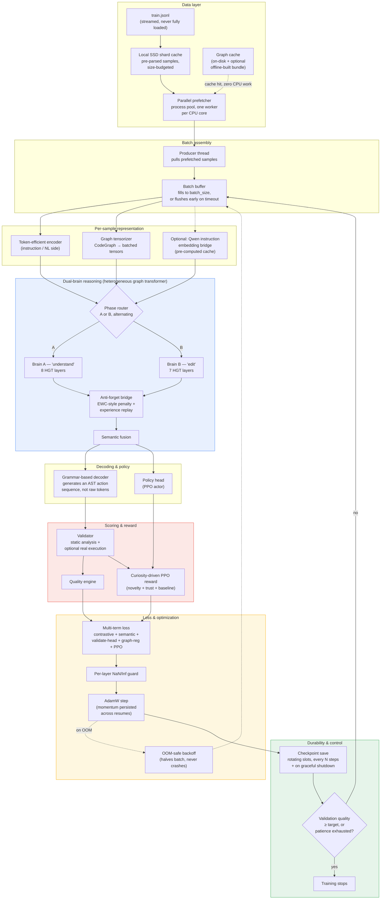
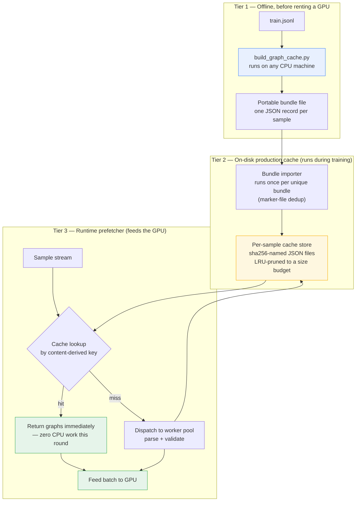
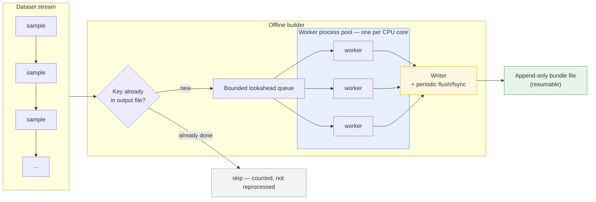

# CodeMind — Full Training Architecture, In Depth

**A self-hosted, multi-language code-understanding and code-generation system, trained end-to-end on a single rented GPU instance**

This document explains the complete training pipeline: what happens to a single training sample from the moment it's read off disk to the moment it updates model weights, what the major subsystems are, which of them were substantially rebuilt from an earlier, simpler version under the *same name*, the concrete parameters the model is trained with, and the hardware it's designed against.

---

## 0. Target hardware and scale

The system is explicitly sized for one specific rented configuration:

| Resource | Spec |
|---|---|
| GPU | 1× H100 SXM, 80 GB VRAM |
| vCPU | 20 |
| System RAM | 125 GB |
| Local SSD cache | 50 GB |
| OS | Linux (RunPod) |

The model itself lands at **~3.29 billion parameters**, arrived at by cross-checking two independent constraints rather than picking a round number: a data-volume-based estimate (roughly 90 GB of code text, effectively passed over twice by the dual-brain design, worked out against a standard compute-optimal token-to-parameter ratio) and a VRAM-ceiling estimate (80 GB, minus a reserved margin for activations/PPO buffers/optional instruction-embedding bridge/CUDA overhead, divided by the per-parameter memory cost of bf16 weights + bf16 gradients + fp32 master weights + fp32 Adam optimizer state). Both approaches converge on roughly the same number, which is what actually sets the model's width and depth below — not an arbitrary target.

An earlier iteration of this same codebase was originally built and tested against a single RTX 3060 (12 GB VRAM) on a Windows machine with 16 GB RAM. That code path is intentionally still present as a fallback (Windows-specific handling, CPU-only degradation, smaller default sizing) — it isn't dead code, it's what the project runs on when the H100 isn't available — but the numbers described below are the current defaults, tuned specifically for the H100 box.

## 1. The full training loop, end to end

The loop above runs once per micro-batch, and the whole dataset is swept multiple times ("rounds" — four by default). Two things make repeated rounds cheap instead of ruinous: the **graph cache** (Data layer, above — covered in full detail in the companion document on the offline graph-cache builder) means the CPU-heavy parsing step only ever happens once per unique sample across all rounds, and the **dual-brain alternation** (A/B phases below) means those rounds aren't simply "the same thing four times" — they're structured as alternating passes between two different reasoning roles.

## 2. Data layer, in more depth

Three caching layers sit between the raw dataset and the model, each solving a different problem:

- **The SSD shard cache** exists because converting a raw JSON line into a structured, typed sample is itself non-trivial work, and re-doing that for the same lines on every pass is wasteful in the same way re-parsing is. Pre-parsed shards are written once and reused, budgeted so they never exceed a configured size.
- **The graph cache** stores the actual output of static analysis — the code property graphs and validation results — keyed by a content hash of the sample so identical content always resolves to the identical cache entry regardless of where it sits in the file. This is the layer the standalone offline builder (described separately) populates ahead of time, before any GPU is rented.
- **The parallel prefetcher** is what actually drives both of the above during training: a pool of worker *processes* (not threads — the parsing and validation work is pure-Python CPU work, which a thread pool would serialize behind the interpreter's global lock; separate processes genuinely run on separate cores) kept several batches ahead of what the GPU is currently consuming, so the GPU is never waiting on CPU work that could have been done in advance.

Batches aren't filled strictly to a fixed count before being sent to the GPU, either. A producer thread pulls finished samples and fills a buffer; if the buffer hasn't reached full size within a short timeout, a partial batch is flushed anyway rather than let the GPU sit idle waiting for a full batch that a temporarily slow sample is holding up.

## 3. The dual-brain design

The model doesn't have one graph-reasoning module — it has two, referred to as Brain A ("understand") and Brain B ("edit"), each a heterogeneous graph transformer (HGT) stack of its own depth (currently 8 layers for A, 7 for B), operating on the same typed node/edge graph representation but trained on an alternating schedule rather than jointly on every sample.

The reason two separate stacks exist instead of one is to give the "editing" behavior room to specialize without overwriting what the "understanding" behavior has already learned — a known failure mode in models that get pushed toward two related-but-different skills over a long training run is that gains in one erode the other. The **anti-forget bridge** between the two brains is where that trade-off is actively managed:

- It applies an **EWC-style penalty** (elastic weight consolidation — a term that discourages phase-B updates from moving too far from what phase-A previously anchored) rather than leaving the two phases completely free to drift apart.
- It maintains an **experience replay buffer**, so phase-B training periodically revisits phase-A-style examples instead of only ever seeing edit-style examples in long uninterrupted stretches.
- It computes a **bridge reward** — a signal fed back into the reinforcement-learning side of training that reflects how well the fused representation preserves what phase A understood.

Which phase runs on any given round is controlled by an alternation setting (`dual_two_rounds`), and each phase's sample count is tracked independently so the system knows exactly how much of the dataset each brain has actually seen.

## 4. From graph to code: the decoder

Once the dual-brain stack and semantic fusion have produced a representation of "what should be generated," the decoder doesn't emit plain text tokens the way a typical code-generation model would. It emits a sequence of **AST construction actions** — a grammar-constrained action codec that describes *build a function node*, *attach this statement*, *this is a call to that*, and so on — which is then rendered back into source code deterministically. This was a deliberate move away from an earlier static-vocabulary text sampler: generating structurally-valid actions instead of free-form tokens means the decoder can't produce something that *looks* like code but is syntactically broken in the way an unconstrained token sampler occasionally can — the action grammar itself rules that out.

Generation has a hard ceiling on how many actions it will emit before abstaining rather than guessing further — a deliberate choice to have the model say "I don't have a confident answer" past a certain length rather than degrade into low-quality continuation.

## 5. Validation, reward, and reinforcement learning

Every generated (or ground-truth target, during supervised phases) piece of code passes through a **validator** that performs static analysis and — when explicitly enabled — actually executes the code to check real correctness, not just plausible-looking structure. The validator also checks for **integrity**: whether the output is genuinely code, or a hollow stub (`pass`, `...`, `raise NotImplementedError` with nothing else), or prose mixed in with code, or a copy of the prompt disguised as an answer. A model that produces well-formatted nonsense should score badly here even if it "looks" plausible.

On top of raw validation, a **curiosity-driven reward** feeds the PPO (Proximal Policy Optimization) reinforcement-learning loop: it isn't just "did the code pass," but a combination of novelty (has the policy already mastered very similar samples, in which case there's less to learn here), a trust signal that adjusts how much weight to put on the model's own recent behavior, and a running baseline that reward is measured against rather than an absolute fixed target. This is what lets the training signal keep being useful even after the model is already fairly good — a flat pass/fail reward stops discriminating once most outputs pass, but a novelty/trust-adjusted reward keeps distinguishing "boring, already-mastered" outputs from "hard, still-improving" ones.

## 6. Loss composition and optimization mechanics

The total training loss is not one number — it's a weighted combination of (at least) five distinct terms: a contrastive term, a semantic-alignment term, a term tied to the validator head's own prediction, a graph-structure regularization term, and a PPO policy term. All five are tracked and reported separately, per pass, specifically so that a *falling total loss* can't hide one component that's actually stagnant or getting worse — an earlier version of this reporting only surfaced the breakdown when something was already flagged as stagnant, which meant a healthy-looking single number could be quietly propped up by one term while another sat flat for an entire pass without anyone noticing until much later.

Optimization runs with gradient accumulation — a modest micro-batch is accumulated over several forward/backward passes before every optimizer step, giving a much larger *effective* batch size than what actually has to fit in VRAM at once. If a given micro-batch size turns out to be too large for available VRAM at runtime, an automatic backoff halves it on the fly rather than crashing and losing the rented GPU session outright. Every optimizer step also runs through a per-layer NaN/Inf guard, so a numerical blow-up in one layer gets caught and handled at the layer it happened in, rather than surfacing as a mysterious loss explosion several steps later with no indication of where it started.

## 7. Same names, rebuilt internals

Several components kept their original names across the project's history but had their actual internal behavior substantially replaced. This is worth calling out explicitly, because "same class name" does not mean "same implementation" anywhere in this list:

- **The graph-structure detector.** Originally, non-Python languages were checked for structural correctness using a shallow heuristic — bracket-balance counting and a handful of safety regexes. That approach can't tell the difference between code that's merely bracket-balanced and code that's actually syntactically valid (`functoin foo() {}` sails through a bracket counter untouched). It was replaced with a real parser (tree-sitter-backed) for those languages, so structural errors are now caught with the same precision Python already had via its own native parser — the class and its call sites are unchanged; what happens inside for a non-Python file is not.
- **The parsing/validation concurrency model.** Originally a thread pool. Pure-Python CPU work doesn't parallelize under threads the way it looks like it should, because of the interpreter's global lock — a thread pool "parsing on 8 threads" was, for this kind of work, running on effectively one core the whole time. It was replaced with a process pool, where each worker genuinely owns a core; the code-level *shape* of "submit work, collect results" is the same, but the actual parallelism only started existing after this change.
- **The generation decoder.** Originally a static-vocabulary sampler predicting tokens against a fixed vocabulary. It's now a grammar-constrained action-sequence generator (see Section 4) — the decoder module still occupies the same architectural slot in the pipeline, but what it predicts and how its output is turned into code changed completely.
- **Checkpointing.** Originally saved model weights only. Two categories of state were missing and have since been added into the same checkpoint mechanism: the optimizer's own momentum state (without it, every resume effectively restarted Adam's momentum from zero, causing a visible loss spike right after every resume that a smoothly-continuing training curve should never show), and a graceful-shutdown path so a process-manager-issued stop signal triggers an orderly checkpoint save instead of losing however many steps had accumulated since the last scheduled save.
- **The "reduce memory usage" story.** A separate monitoring/diagnostics layer (unrelated to this repo, referenced only because it was initially assumed to reduce VRAM usage) turned out to help *utilize* available VRAM more efficiently and diagnose pressure faster, but does not and cannot make more VRAM exist or make an oversized graph fit that otherwise wouldn't. The actual VRAM reduction in this system comes from a direct, structural change: capping the maximum number of nodes considered per graph, which is a real, linear-ish reduction in tensor size per step — a different mechanism entirely from the monitoring layer, even though both get discussed under "memory management."
- **An FP8 storage path that was quietly a no-op.** A configuration flag and supporting module existed, implying trained weights could be compressed to 8-bit storage. On inspection, the cast only ever happened transiently inside a forward pass during evaluation and was converted straight back before any matmul — nothing about how a parameter is actually stored on disk or in memory was ever affected by it. It produced no VRAM or disk savings while giving the impression that it did, which is arguably worse than not having the feature at all. It has since been removed outright rather than left in a half-working state, with old saved configs that still reference the flag simply ignored instead of erroring.

## 8. Key parameters as currently configured

| Parameter | Value | What it controls |
|---|---|---|
| Hidden dimension | 1664 | Width shared across both brains and the decoder |
| Brain A depth | 8 HGT layers | "Understand" reasoning depth |
| Brain B depth | 7 HGT layers | "Edit" reasoning depth (intentionally close to, but slightly shallower than, A) |
| Attention heads | 64 | Attention granularity |
| Max graph nodes | 4096 | Per-sample graph size cap (larger graphs are subsampled) |
| Decoder depth | 9 layers | Action-sequence generation depth |
| Decoder attention heads | 16 | — |
| Decoder max sequence length | 2048 actions | Generation length ceiling |
| Generation abstain ceiling | 2600 actions | Past this, the model abstains rather than guessing |
| Dropout | 0.1 | Applied across brain and decoder |
| Routing experts (instruction router) | 6 | Diversity across language families |
| PPO replay buffer size | 16 | Policy-gradient stability |
| Total parameters | ≈3.29B | Across both brains, decoder, encoder, and RL/bridge overhead |
| Training rounds over the dataset | 4 (configurable) | Multiplies raw CPU parsing cost if not cached — see the graph-cache document |
| Micro-batch size | 128 | Auto-backs off on OOM |
| Gradient accumulation | 8 steps | Effective batch size = 1024 |
| Learning rate | 2e-4 | With warmup + decay, correctly resumed across restarts |
| Quality target (early stop) | 85% validation quality | Training stops once reached |
| Early-stop patience | 3 passes without improvement | — |
| Checkpoint interval | Every 200 steps, plus on shutdown signal | Bounded progress loss on interruption |
| Checkpoint rotation | 3 rolling slots | Disk-budget vs. rollback depth trade-off |

## 9. What this adds up to

None of the individual pieces above are exotic in isolation — process pools, gradient accumulation, EWC-style regularization, and PPO are all standard tools. What defines this system is how they're wired together around one central constraint: everything that *can* run cheaply, ahead of time, or in parallel with the GPU, has been deliberately pulled out of the GPU's critical path, and everything that touches durability (checkpoints, resumability, graceful shutdown, OOM handling) is built to fail toward "lose the least possible amount of expensive compute time" rather than toward silent correctness risk or an outright crash.

---

# Appendix: The Offline Graph-Cache Builder (Data-layer detail)

The "Graph cache" box in Section 2 above is populated by a standalone script that can run entirely separately from training, on ordinary CPU hardware, before any GPU is even rented. The rest of this appendix explains that script on its own.

**Part of the CodeMind project — a self-hosted, multi-language code-understanding and code-generation system**

This document explains, in depth, one specific subsystem of CodeMind's training pipeline: the mechanism that pre-computes and reuses *code property graphs* (CPGs) across training, and the standalone offline tool that lets this work happen before a GPU is even rented. It is written to be read on its own, without access to the source, and to actually explain the mechanics — not just gesture at them.

---

## 1. The actual problem: it's not "parsing is slow," it's "parsing is repeated"

CodeMind doesn't train on raw text. Every sample — a `(source, target, language)` triple, optionally accompanied by a whole multi-file project — is first turned into a **unified CPG**: a single heterogeneous graph that merges several structural views of the code (control flow, data flow, call relationships, and cross-file/cross-language linkage) into one typed node/edge structure. Every edge is typed as a triple — `(source_node_type, relation, destination_node_type)` — which is what lets the model reason about, for example, a Python function calling into a C extension, or a config file wiring a value into a shell script: these show up as distinct, explicit edge types (`cross_lang`, `hosts`, `binds`, `wires`, `same_family`, `coexists`, and others) inside one graph rather than as separate, disconnected parses.

Building that graph is real CPU work: full AST-level parsing (or tree-sitter for non-Python languages), construction of multiple structural layers on top of it, and — bundled into the same step — running the code **validator**, which performs static analysis and, depending on configuration, can actually execute the code to check correctness. None of this touches a GPU. All of it is Python-and-subprocess CPU work.

The part that makes this expensive isn't that any single sample is slow to process — it's that **training does not look at each sample once**. The pipeline runs multiple full passes over the dataset (a "rounds" setting, four by default, adjustable), and every one of those samples would need the *exact same* parse-and-validate work redone on every single pass, because the naive training loop has no memory of having seen a sample before. Since the transformation from `(source, target, language, project_files, run_test)` to `(graph, graph, validation_result)` is **fully deterministic** — same input, same output, always — redoing it on every pass isn't extra safety, it's pure waste. At four rounds, that's roughly a 4x multiplier on CPU work that produces byte-identical results every time.

That waste happens to live on the same billing meter as the GPU, because in a naive setup it runs inline, blocking the training loop from moving forward. That's the actual economic problem this subsystem solves — not "parsing exists," but "the same parsing work was being paid for at GPU-instance rates, up to four times per sample."

## 2. Three tiers, one shared engine

The critical design decision tying all three tiers together: **there is exactly one function that turns a sample into graphs, and every tier calls it — nobody reimplements it.** The offline builder, the runtime worker pool, and the on-disk cache's write path all funnel through the same worker-level routine. This is what makes the whole scheme trustworthy: a graph produced offline, days before any GPU is rented, is *guaranteed* to be byte-for-byte what training would have computed on its own, because it's not a re-derivation — it's a memoized call to the identical code path.

## 3. What actually makes a cache key

A sample's identity is **content-derived**, not positional. It's a SHA-256 hash (truncated to 16 hex characters) of the concatenation of its source text, target text, language tag, and — for multi-file project samples — the sorted list of file paths involved. This has a concrete, useful property: two samples with identical content always resolve to the identical ID regardless of where they sit in the dataset or how many times the dataset has been rebuilt or re-shuffled. There's no dependency on line numbers or array indices, which means the cache survives dataset reordering, deduplication passes, or appending new data at the end without invalidating anything that already exists.

That content hash alone isn't the full cache key, though. One more bit is folded in: whether the validator was run in "execute the code for real" mode or a static-only mode. These two modes can legitimately produce different validation results for the same code, so treating them as the same cache entry would be silently wrong. The final key is therefore `{content_hash}|rt{0 or 1}` — meaning a cache built with one setting is structurally incapable of being mistaken for a cache built with the other. If the two ever disagree — say, a cache was built with static-only validation but training runs with full execution — every affected entry simply doesn't match, is treated as an ordinary cache miss, and gets rebuilt fresh with the correct settings. It's a silent, safe fallback rather than a silent, wrong result.

## 4. Two very different kinds of "source"

One detail that matters more than it looks: the `source` field of a sample is not always code. In the common case it's a natural-language instruction ("write a function that…"), and in another case (multi-file projects) it's real source that needs project-wide linking. Feeding a natural-language instruction through the *code* parser produces a nearly useless, near-constant stub graph — a handful of nodes regardless of what the instruction actually says — because a code parser has no idea what to do with English prose. The pipeline branches on this explicitly: plain single-file samples treat `source` through an instruction-aware path built for natural language, while project-mode samples parse the entire set of provided files together and merge them into one unified cross-file graph. Getting this branch wrong would mean the model effectively never sees meaningful structure for the "what was asked for" side of a huge fraction of samples — a subtle failure mode that wouldn't show up as a crash, just as a model that never quite learns to condition on instructions.

## 5. Why worker *processes*, not threads

An earlier version of this pipeline used a thread pool for parsing. That doesn't actually parallelize much here, because the heavy lifting — `ast.parse`, tree-sitter calls, regex-heavy static analysis — is CPU-bound pure Python, and pure Python CPU work is serialized by the interpreter's global lock no matter how many threads you throw at it. Multiple threads doing this kind of work compete for the same lock and end up running on effectively one core.

Separate OS processes don't share that lock. Each worker process builds its own parser and validator instance exactly once, when the process starts (not once per sample — that would defeat the point by paying setup cost repeatedly), and from then on every sample submitted to that worker runs on its own core, genuinely in parallel with every other worker. The validator was deliberately moved into this same worker call for the same reason: it used to run serially on the main thread, one sample at a time, *after* a batch had already come back from the GPU — which meant the GPU sat idle waiting for single-core Python validation to finish before it could receive its next batch. Running validation inside the same parallel worker call as parsing means both costs are absorbed across every core, concurrently with the GPU processing the *previous* batch, instead of stacking serially in the GPU's critical path.

## 6. The runtime cache: what's actually on disk

The production, always-on cache used during training stores one JSON file per sample, named by the SHA-256 hash of its cache key (not the human-readable key itself — this keeps filenames constant-length and filesystem-friendly regardless of dataset size). Each file holds exactly the three things worker computes: the source graph, the target graph, and the validation result, serialized as plain JSON — deliberately not a binary/tensor format, since none of these objects contain tensors; using a heavier serialization format here would be pure overhead with no benefit.

Two housekeeping behaviors are worth calling out because they reflect a "never let the cache be a liability" philosophy that runs through the whole design:

- **Corrupt entries are silently treated as cache misses.** If a cache file was left half-written (process killed mid-write, disk pressure, etc.), reading it and failing simply falls back to "not cached" and the sample gets reparsed and the entry overwritten — never a crash, never a poisoned training run.
- **Size is bounded with LRU eviction.** The store has a configurable size budget (tens of gigabytes by default, deliberately generous since this cache lives for the full multi-round run rather than just one epoch). Every so often, when new entries have been written, it checks whether it's over budget and — if so — deletes the least-recently-touched files first, using each file's modification time as a stand-in for "last used." A read touches the file (refreshing that timestamp) so still-relevant entries survive pruning even if they were written long ago.

## 7. How the offline bundle plugs into that cache

The offline builder produces something structurally different from the runtime cache: not thousands of individually named files, but one flat, append-only file where every line is a self-contained JSON record: a key, plus the same three serialized fields. This is intentionally a portable, single-artifact format — easy to move between machines, easy to version, easy to inspect or `grep`.

At the start of a training run, before touching any actual sample, that bundle file — if present — gets **imported** into the real per-sample cache store described above, one line at a time. This import step has its own layer of resilience worth detailing precisely, because it's a good example of the project's general error-handling posture:

- **It only runs once per distinct bundle.** A marker file, named from a hash of the bundle's resolved path plus its exact modification time and size, records that a given bundle version has already been fully imported. Re-running training against the same, unchanged bundle skips the import step entirely rather than re-reading and re-writing potentially gigabytes of cached data every single run. If the bundle is regenerated — new samples added offline, timestamp changes — the marker no longer matches and a fresh import happens automatically.
- **A single corrupt line never aborts the import.** Each line is parsed independently; if one is malformed, it's skipped, and that one sample simply behaves as if the bundle never covered it — falling through to ordinary on-the-fly parsing later. A batch job that ran for hours and got interrupted mid-write on its very last line doesn't cost you the other hundred thousand lines that came before it.
- **It never overwrites a fresher entry.** If the runtime cache already has a given key (for instance, from an earlier partial import, or a sample that got parsed live before the bundle was imported), the bundle import step skips it rather than blindly overwriting.

The upshot: whatever this offline tool computes on a cheap CPU box becomes, from the training run's point of view, indistinguishable from having already trained one full round on that data — every covered sample is a cache hit from the very first training step, without a single AST parse or validator call happening on the metered GPU machine.

## 8. Inside the offline tool itself

Mechanically, the tool:

1. **Attaches to the exact same worker function and serialization helpers** the runtime pipeline uses, rather than shipping any parallel copy of them — this is the guarantee from Section 2 made concrete.
2. **Streams the dataset line by line** instead of loading it into memory, converting each raw record into a structured sample using the same conversion logic training uses.
3. **Checks each sample's key against what's already in the output file** before doing any work — reading that file once at startup into a set of completed keys, so a killed-and-restarted run skips everything already durably written and only continues from where it stopped.
4. **Keeps a bounded queue of in-flight jobs** (a multiple of the worker count) submitted to a process pool sized to the machine's core count, so every core stays busy without unbounded memory growth on very large datasets.
5. **Writes each finished result as one JSON line**, and **explicitly flushes and fsyncs the file every couple hundred records** — a deliberate durability choice: if the process is killed by, say, a spot instance being reclaimed, everything already flushed is guaranteed to be on disk, not sitting in an OS buffer that vanishes with the process.
6. **Isolates per-sample failures.** If one sample throws (malformed input, an edge case in parsing), that failure is counted and logged, and the run continues — it does not abort a multi-hour job over one bad record.
7. **Reports live, continuously-recalculated throughput and an ETA**, rather than a static estimate, so the numbers stay meaningful even as sample complexity varies across the dataset.

## 9. The one setting you must not get wrong

There's exactly one operational trap in this design, and it's worth stating plainly rather than burying it: the offline tool must be run with the *same* execution/validation mode flag that training will actually use. This is the `run_test` bit folded into the cache key described in Section 3. Get it right, and the bundle is a perfect stand-in for a live-computed cache. Get it wrong — build the bundle in one mode, train in the other — and the keys simply won't line up, so every sample "covered" by the bundle silently reverts to being computed live instead. Nothing breaks and no wrong data gets used; you just quietly get zero benefit from the offline work, which after hours of CPU time on a rented cloud box is its own kind of expensive mistake worth avoiding on purpose rather than discovering by surprise.

## 10. Net effect, stated precisely

Without this subsystem: every sample gets parsed, structurally linked, and validated **once per training round** — by default, four times over the life of a run, on hardware billed by the GPU-hour.

With it: the identical, deterministic CPU work happens **once**, ever, per unique sample — either offline ahead of time via this tool, or on the first live encounter during training, whichever comes first — and every subsequent encounter of that same sample, in that same run or a future one, is a cache lookup instead of a recomputation. The offline tool exists specifically to move as much of that "once" as possible off the GPU-hour clock entirely, onto whatever CPU-only hardware is cheapest and most convenient.
