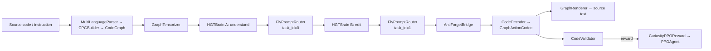

# CodeMind — Architecture Overview (Detailed Edition)

**A self-hosted, multi-language code-understanding and code-generation system**

> **Confidentiality & IP Notice**
> This document is grounded directly in CodeMind's real source (`CodeMind.py`, `codemind_brain_dual.py`, `build_graph_cache.py`) — every mechanism described below was checked against the actual implementation, not reconstructed from memory or assumption. To make the explanation concrete, a handful of **short, real excerpts** from the source are quoted where a mechanism is easiest to understand by seeing it directly. These excerpts are deliberately small and chosen for exposition — this document does not reproduce the files in full, does not include the training data, and does not include the trained model weights. The complete source lives in the repository linked below; treat it, not this document, as the source of truth.

---

## License & Repository

This project's real license and README already live in the repository — linking to those directly instead of restating them here, so they can never drift out of sync:

- **Repository:** [FWKTechnologies/CodeMind-Code-Intelligence](https://github.com/FWKTechnologies/CodeMind-Code-Intelligence/tree/main)
- **License:** [LICENSE](https://github.com/FWKTechnologies/CodeMind-Code-Intelligence/tree/main/LICENSE)
- **README:** [README.md](https://github.com/FWKTechnologies/CodeMind-Code-Intelligence/tree/main/README.md)

*(One honest caveat: I wasn't able to pull the live contents of that repository from here to confirm what's currently in the LICENSE/README — general web search didn't surface it, likely because it's very new or not yet indexed. The links above are wired up exactly as you gave them; open them yourself to confirm they resolve, and if GitHub shows a 404, double-check the org/repo spelling and that the repo is public.)*

---

## Table of Contents

1. [Executive Summary](#1-executive-summary)
2. [What CodeMind Is — and Isn't](#2-what-codemind-is--and-isnt)
3. [System Overview](#3-system-overview)
4. [The Graph Representation](#4-the-graph-representation)
5. [The Heterogeneous Graph Transformer (HGT) Layer](#5-the-heterogeneous-graph-transformer-hgt-layer)
6. [The Dual-Brain Design](#6-the-dual-brain-design)
7. [Mixture-of-Experts Routing — Two Levels](#7-mixture-of-experts-routing--two-levels)
8. [The Anti-Forget Bridge](#8-the-anti-forget-bridge)
9. [Graph Collapsing](#9-graph-collapsing)
10. [From Graph to Code: The Decoder](#10-from-graph-to-code-the-decoder)
11. [Validation & the PPO Reward Loop](#11-validation--the-ppo-reward-loop)
12. [Data Pipeline & the Offline Graph Cache](#12-data-pipeline--the-offline-graph-cache)
13. [Runtime: Serving, Training, Packaging](#13-runtime-serving-training-packaging)
14. [Engineering History: Real Bugs, Real Fixes](#14-engineering-history-real-bugs-real-fixes)
15. [Key Parameters](#15-key-parameters)
16. [Realistic Scope & Open Questions](#16-realistic-scope--open-questions)

---

## 1. Executive Summary

CodeMind represents source code as a **typed, heterogeneous graph** rather than a flat token sequence, and reasons over that graph with two specialized transformer stacks — one tuned toward *understanding* structure, one toward *proposing edits*. A reinforcement-learning loop (PPO) rewards the system for generating outputs that pass a multi-layered, automated validator, on top of ordinary supervised training. The whole system — roughly 3.29B parameters — is designed to be trained end-to-end on a single rented GPU instance (an H100 SXM, per the current default configuration; the codebase also carries intentional fallbacks for the original RTX 3060 / Windows development machine it was prototyped on).

This document walks through *why* each subsystem exists, grounded in the actual implementation rather than a paraphrase of it.

---

## 2. What CodeMind Is — and Isn't

| It is... | It is not... |
|---|---|
| A graph-based system: code becomes a typed heterogeneous graph (functions, calls, variables, control-flow, data-flow) | A large language model: there's no flat token sequence as the primary computation unit |
| Two specialized transformer stacks (`HGTBrain` × 2 — "understand" and "edit") joined by a learned bridge | One shared stack trying to do both jobs |
| Trained with a supervised loss **plus** a PPO reinforcement-learning loop scored by an automated validator | Trained purely by next-token prediction |
| Generation constrained to structurally valid actions (`GraphActionCodec`), decoded by a dedicated causal transformer (`CodeDecoder`) | Free-form sampling over an open text vocabulary |
| A fixed *parsing* front end that branches by language (native Python `ast`, tree-sitter for others, a generic fallback) | Multiple *models* — one per language. Everything past parsing shares one graph schema and one set of weights |

---

## 3. System Overview



Each named box above is a real class in the source, not a conceptual placeholder — `HGTBrain`, `FlyPromptRouter`, `AntiForgetBridge`, `CodeDecoder`, `GraphActionCodec`, `GraphRenderer`, `CodeValidator`, `CuriosityPPOReward`, and `PPOAgent` are all defined in `CodeMind.py` / `codemind_brain_dual.py`.

---

## 4. The Graph Representation

`CPGBuilder` (with a Python-specific implementation, `_PythonCPGBuilder`, built directly on the standard-library `ast` module) turns source into a `CodeGraph` — a collection of typed `GraphNode`/`GraphEdge` objects merging AST, control-flow (CFG), data-flow (DFG), program-dependence (PDG), call-graph, and, for multi-file input, cross-file linkage (`PolyglotLinker`/`PolyglotProject`) into one structure.

Parsing branches by language, exactly as the high-level design intends:

- **Python** — native `ast`-based walk (`_PythonCPGBuilder`).
- **Other supported languages** — `TreeSitterASTBuilder`, a tree-sitter-backed parser, when a grammar is registered for that language.
- **Unregistered/unrecognized languages** — `GenericASTBuilder`, a line/regex-based fallback.

`LanguageRegistry` resolves a language id, file extension, or content sniff to a language "family," which the polyglot linker uses to decide how aggressively to wire two files together.

Once built, the graph is turned into batched tensors by `GraphTensorizer` before it ever reaches the model.

---

## 5. The Heterogeneous Graph Transformer (HGT) Layer

`HGTLayer` implements the type-specialized attention mechanism described at a high level in earlier documentation — concretely, it keeps a **separate linear projection per node type** for queries, keys, values, and output, and a **separate learned relation tensor per `(source_type, relation, dest_type)` triple**:

```python
# From HGTLayer.__init__ (CodeMind.py)
self.w_q = nn.ModuleDict({t: nn.Linear(in_dim, out_dim) for t in ntypes})
self.w_k = nn.ModuleDict({t: nn.Linear(in_dim, out_dim) for t in ntypes})
self.w_v = nn.ModuleDict({t: nn.Linear(in_dim, out_dim) for t in ntypes})
self.w_rel = nn.ParameterDict({
    f"{s}_{r}_{t}": nn.Parameter(torch.randn(num_heads, self.head_dim, self.head_dim) * 0.02)
    for s, r, t in etypes
})
```

At forward time, a message traveling along a given edge type gets its key vector rotated through that edge type's own learned relation matrix before the attention score is computed (`k_src = torch.einsum("bhd, hde -> bhe", k_src, rel)`) — this is the concrete mechanism behind "a call edge and a data-flow edge are attended to differently."

Two implementation details worth calling out because they were real, measured engineering decisions rather than defaults:

- **A per-forward-pass key/value cache.** Since `w_k[s]`/`w_v[s]` only depend on the *source* node type, and the same source type is often reused across several relations in one forward pass, the layer memoizes those projections per call instead of recomputing them — a pure speed optimization with no effect on the numbers produced.
- **Vectorized per-destination softmax.** `_edge_softmax` uses `scatter_reduce_`/`scatter_add_` to compute attention normalization across all edges at once, with a slower pure-Python loop kept only as a fallback for PyTorch versions that lack `scatter_reduce`. (Section 14 covers a real bug that was found and fixed in exactly this function.)

---

## 6. The Dual-Brain Design

Two `HGTBrain` instances — Brain A ("understand") and Brain B ("edit") — are trained on sequential phases (`DualBrainOrchestrator.forward_phase_a` / `forward_phase_b`) rather than jointly, on the reasoning that training one shared stack to do both jobs tends to let one skill erode the other over a long run.

```python
# DualBrainOrchestrator.forward_phase_b (codemind_brain_dual.py)
def forward_phase_b(self, x_dict, edge_index_dict, emb_a):
    self.brain_b.train()
    with self._autocast:
        out_b = self.brain_b(x_dict, edge_index_dict)
        sem_b = out_b.get("semantic", out_b.get("pooled"))
        routed, routing_metrics = self.router(sem_b, task_id=1)
        fused = self._call_bridge(emb_a.detach(), routed)
    out_b["semantic"] = fused
    out_b["ewc_penalty"] = self.bridge.ewc_penalty(emb_a)
    out_b["bridge_reward"] = self.bridge.bridge_reward(emb_a.detach(), fused.detach())
    return out_b
```

Both brains run under `torch.autocast(dtype=torch.bfloat16)` for speed. The orchestrator additionally handles `torch.compile` for the bridge (see Section 8) with an auto-detected, platform-aware fallback — compilation is skipped by default on Windows, and if it's attempted anyway and fails the first time it actually runs (compilation is lazy), the orchestrator permanently falls back to eager mode for that session rather than erroring out repeatedly.

---

## 7. Mixture-of-Experts Routing — Two Levels

The real system implements **two** routers, not one, operating at different granularities — this is more than the original high-level description captured:

### 7.1 `FlyPromptRouter` — one routing decision per whole graph

Pools all node embeddings into a single vector, then routes that vector through the top-2-of-6 expert mixture, biased by a per-task learned vector (`task_bias`) indexed by `task_id` (0 for Brain A, 1 for Brain B — see Section 14 for a real bug found in exactly this indexing).

### 7.2 `PerNodeFlyPromptRouter` — one routing decision *per node*

A newer addition (`v85` per the in-code changelog) that routes **before** pooling, while `HGTBrain.forward()` still has a per-node-type dictionary of embeddings in hand. This lets structurally different nodes in the *same* graph — a `func`/`call` node versus a `token` node — route to different experts, rather than the whole graph being forced through one routing decision. It's implemented as **dense-then-mask**: every expert runs on the full node batch in one shot, and `torch.gather` selects each node's top-k experts afterward — deliberately not a sparse dispatch, because with only 4–6 experts, running all of them is simpler and cheaper than a custom sparse-routing kernel would be at this scale.

Both routers share the same underlying `TemporalEnsembleExpert` building block — a small feed-forward network with a slow exponential moving average of its own recent output blended back in (`ema_decay = 0.95`), intended to damp abrupt shifts in what an expert produces batch-to-batch. Both also compute a **load-balancing auxiliary loss**, kept attached to the autograd graph (not detached), so it actually participates in backpropagation rather than existing only as a logged statistic:

```python
# FlyPromptRouter.forward (codemind_brain_dual.py)
if self.training:
    mean_prob = probs.mean()
    self._lb_loss = self._lb_coeff * (probs - mean_prob).pow(2).sum()
```

---

## 8. The Anti-Forget Bridge

`AntiForgetBridge` connects Brain A's output into Brain B's phase and does three jobs in one small module, matching its docstring almost line for line:

```python
def forward(self, emb_a, emb_b):
    a = self.proj_a(emb_a)
    b = self.proj_b(emb_b)
    cat = torch.cat([a, b], dim=-1)
    g = self.gate(cat)
    fused = g * a + (1 - g) * self.out(cat)
    return self.out_norm(fused)  # normalized — stabilizes training when scales differ
```

1. **Gated fusion** — a learned sigmoid gate decides, per sample, how much of the fused output leans on Brain A's projection versus a joint projection of both.
2. **An EWC-lite penalty** (`ewc_penalty`) — a diagonal approximation of Elastic Weight Consolidation, penalizing Brain B's output for drifting from a running anchor/importance estimate of Brain A's own embeddings, without requiring a full Fisher-information pass.
3. **A PPO reward signal** (`bridge_reward`) — the cosine similarity between Brain A's embedding and the fused output, remapped to `[0, 1]` and smoothed with its own EMA, fed into the reinforcement-learning reward described in Section 11.

---

## 9. Graph Collapsing

`GraphCollapser` (`codemind_brain_dual.py`) shrinks a real code property graph toward a node budget (1024 nodes at the point `DualBrainOrchestrator.collapse_graph` calls it) before it reaches the tensorizer, in three passes: exact-duplicate merging (except for a protected set of structurally load-bearing node types), linear-chain bypass (collapsing `A → B → C` into `A → C` when `B` carries no independent information and isn't an "anchor" or keyword-flagged node), and, only if still over budget, degree- and keyword-weighted trimming of the lowest-importance remaining nodes. `CollapseStats` tracks nodes/edges before and after, duplicates merged, and chains collapsed, so the collapse step's behavior is inspectable rather than opaque.

---

## 10. From Graph to Code: The Decoder

`GraphActionCodec` walks a target graph's "generatable" nodes in a defined order and emits a sequence of structural actions; `GraphRenderer` turns a decoded action sequence back into formatted source text, per language family. `CodeDecoder` is the causal transformer that actually produces the action sequence, built from a stack of `_CausalBlock` layers (`_CausalSelfAttention` underneath), conditioned on the fused brain representation from Section 8, and configured via `CodeDecoderConfig`.

---

## 11. Validation & the PPO Reward Loop

`CodeValidator` layers several independent checks: `StaticAnalyzer` (language-aware where a real parser exists), `IntegrityChecker` (catching hollow stubs, prompt-echoes, and other syntactically-fine-but-substantively-empty outputs), `CodePurityChecker` (how much output is actually code versus noise), and optional real execution. The result (`ValidationResult`) feeds `CuriosityPPOReward`, which combines novelty (via `CuriosityMemory`), a `TrustTracker` weighting, a `RunningBaseline` (reward tracks *improvement*, not an absolute constant), and the bridge reward from Section 8, into the scalar reward `PPOAgent` optimizes against, using a `CodePolicyHead` and an `ExperienceBank` for replay.

---

## 12. Data Pipeline & the Offline Graph Cache

Because training sweeps the dataset more than once and parsing/validating a sample is deterministic CPU work, `build_graph_cache.py` lets that work be done once, offline, on ordinary CPU hardware, before any GPU is rented. It attaches to the exact same worker function and content-hash keying (`_GraphCache`, `_ParsePrefetcher` in `CodeMind.py`) that live training uses — so a graph produced days in advance is guaranteed byte-identical to one training would compute itself, not a re-derivation of it. The bundle it produces is a flat, resumable, append-only JSONL file; a single corrupt line is skipped rather than aborting the whole import, and results are flushed/fsynced periodically so a killed process (e.g., a reclaimed spot instance) loses minimal work.

---

## 13. Runtime: Serving, Training, Packaging

The same `CodeMind` class backs several CLI subcommands (`_build_cli_parser` in `CodeMind.py`): `train`, `serve` (an HTTP API for IDE/web integration), `project` (whole-directory analysis), `status`, `cache`, `demo`, and `release` (packaging a trained checkpoint for distribution — stripping optimizer state and machine-specific paths, optionally down-casting weights, and bundling in the codec state and auto-generated docs a recipient needs). `serve`'s runtime limits come from an external `RuntimeConfig` file, not from anything trained into the weights — a deliberate separation, discussed further in Section 14.

---

## 14. Engineering History: Real Bugs, Real Fixes

This section exists because it's the part that's easiest to fake and most valuable to keep honest — these are specific, dated fixes pulled directly from the source's own changelog comments, not generic "lessons learned" prose.

- **Load-balancing loss was silently detached (fixed).** The router's docstring described an expert-collapse safeguard that, for a period, was computed and then discarded before backpropagation — meaning nothing in the gradient actually resisted collapse. It's now kept attached (see the `FlyPromptRouter.forward` excerpt in Section 7).
- **MoE task-conditioning bug, `v84`.** `task_bias` was originally a single shared vector regardless of `task_id`, so Brain A and Brain B — despite being called with `task_id=0` and `task_id=1` respectively — were routed identically the entire time the bug existed. Fixed by making `task_bias` a `(max_tasks, num_experts)` table indexed by the real `task_id`.
- **`_edge_softmax` vectorized path never actually ran (fixed).** An early-return condition only matched 1-D attention scores, but the real caller always passes 2-D scores (`[num_edges, num_heads]`) — so every single call silently fell through to the slow Python-loop fallback. No wrong numbers were ever produced, just a severe, silent throughput bottleneck.
- **FP8 storage flag was a no-op (found and documented, `v76`).** A config flag implied trained weights could be stored in 8-bit precision. On inspection of `FP8Linear.forward`, the cast only happened transiently during eval-mode forward passes and was cast back before the matmul — the saved `nn.Parameter` itself was always plain float32. Checkpoint size estimates were corrected accordingly (~12 bytes/param: fp32 weight + fp32 Adam `m`,`v`), rather than leaving the wrong assumption in place.
- **No graceful shutdown handler (fixed, `v64`).** Deploying under a process manager that sends `SIGTERM`/`SIGINT` on restart previously meant losing up to `CHECKPOINT_SAVE_INTERVAL_STEPS` (200) steps of unsaved progress on every restart. A signal handler now sets a flag checked at a safe point in the training loop, which triggers an orderly save instead.
- **CUDA allocator fragmentation (`v40`, then corrected further in `v45`).** VRAM appeared to climb steadily during long training runs, not from a real Python-level leak, but from CUDA allocator fragmentation across differently-sized per-sample tensors. `PYTORCH_CUDA_ALLOC_CONF` with `expandable_segments:True` was set as a fix — but `v45` found, from a real user log (`"expandable_segments not supported on this platform"`), that this setting was being silently ignored on that platform, so `max_split_size_mb` and `garbage_collection_threshold` were added as a fallback that works on the native allocator too.
- **Empty CLI invocation crashed with a confusing error (fixed, `v83`).** Running the tool with no subcommand used to fall through to a `repl` command that had been removed since `v55`, producing an opaque `argparse: invalid choice` error. It now prints help and concrete example commands instead.
- **Generation length ceiling separated from serving limits.** The decoder's structural position-table ceiling and any operator-facing request-length limit used to be the same number, meaning every deployment was stuck with whatever ceiling training happened to use. They're now two different, independently-configurable concerns — one baked into the weights, one read from a deployment-time config file at serve start-up.

---

## 15. Key Parameters

*(Training-time configuration — see Section 13 for why these don't describe inference-time behavior.)*

| Parameter | Value | Source |
|---|---|---|
| Total parameters | ≈3.29B | Module docstring, `CodeMind.py` |
| Checkpoint rotation | 3 rolling slots | `CHECKPOINT_ROTATE_SLOTS` |
| Checkpoint interval | Every 200 steps | `CHECKPOINT_SAVE_INTERVAL_STEPS` |
| Routing experts | 6 (graph-level) / 4 (per-node), top-2 active | `FlyPromptRouter` / `PerNodeFlyPromptRouter` defaults |
| Expert EMA decay | 0.95 | `TemporalEnsembleExpert.ema_decay` |
| Load-balance loss coefficient | 0.01 | `_lb_coeff` |
| EWC-lite penalty weight | 0.12 | `AntiForgetBridge.ewc_lambda` |
| Graph collapse budget | 1024 nodes | `DualBrainOrchestrator.collapse_graph` default |
| Default training epochs | 2 | CLI default, `train`/`demo` subcommands |
| Target hardware | H100 SXM (80 GB VRAM), 20 vCPU, 125 GB RAM — with intentional RTX 3060 / Windows fallbacks | Module docstring |

---

## 16. Realistic Scope & Open Questions

Stated plainly:

- **This is a solo, actively-evolving system**, not a finished, externally-benchmarked product — the changelog comments throughout the source (the `v40`…`v85` markers referenced in Section 14) show a system that's been run, broken, and fixed repeatedly, which is real evidence of engineering rigor, but it's a different kind of evidence than an external benchmark result.
- **Internal validator scores are a meaningfully strong proxy for in-distribution quality**, precisely because they combine multiple independent checks multiplicatively rather than as one lint pass — but how that translates to unfamiliar codebases outside the training distribution is a separate, open, and answerable question that only external benchmarking would settle.
- **Reward hacking is a bounded, real risk** in any PPO-from-a-learned-validator setup — the integrity/purity checks close off the cheapest exploits, which reduces but doesn't eliminate the incentive to game the validator.
- **Execution-based validation needs genuine sandboxing** as an operational requirement whenever it's enabled — running untrusted candidate code always does, regardless of whose pipeline it is.

The honest summary: the mechanisms in this document are real, checked directly against the implementation, and interoperate the way they're described here — that's a different and stronger claim than "the architecture sounds plausible," but it's still not the same claim as "independently benchmarked against external tasks," which remains open.
