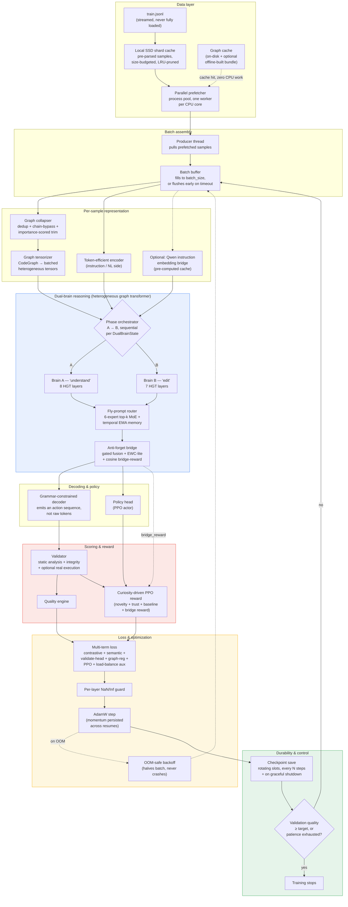
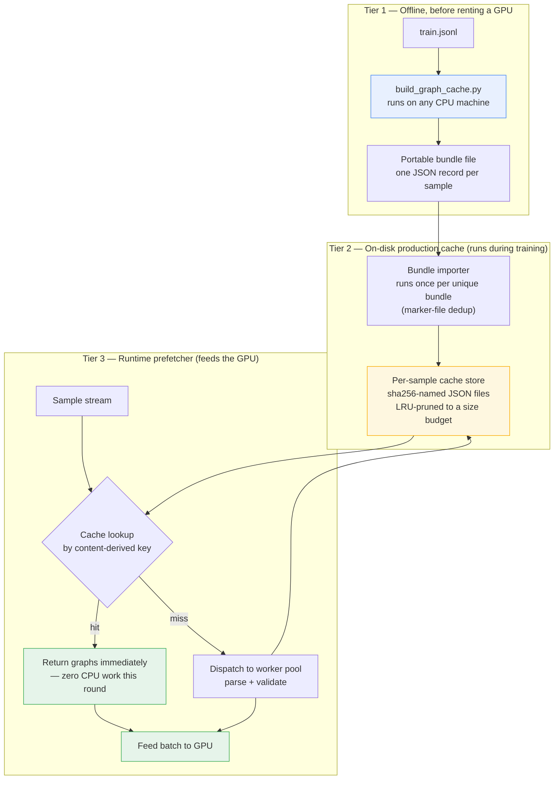

# CodeMind — Full Training Architecture, In Depth

**A self-hosted, multi-language code-understanding and code-generation system, trained end-to-end on a single rented GPU instance**

This is an expanded pass over the original architecture document. The goal here is depth: not just naming a subsystem, but explaining *why* it exists, *what specifically it does*, and *where it can fail* — so the design can be understood and extended by someone who has never read the source. In line with that goal, this document describes behavior, data flow, and design rationale; it does not reproduce implementation code, exact formulas, or file-level internals.

---

## 0. Target hardware and scale

| Resource | Spec |
|---|---|
| GPU | 1× H100 SXM, 80 GB VRAM |
| vCPU | 20 |
| System RAM | 125 GB |
| Local SSD cache | 50 GB |
| OS | Linux (RunPod) |

The model lands at **~3.29 billion parameters**, derived from two independent estimates that are cross-checked against each other rather than trusted individually:

1. **Data-volume estimate.** Roughly 90 GB of code text, effectively seen twice over because the dual-brain design means the same underlying dataset is used to train two distinct reasoning roles (not because the data is duplicated on disk), worked out against a standard compute-optimal token-to-parameter ratio.
2. **VRAM-ceiling estimate.** 80 GB, minus a reserved margin for activations, PPO buffers, an optional instruction-embedding bridge, and CUDA overhead, divided by the per-parameter memory cost of holding bf16 weights, bf16 gradients, fp32 master weights, and fp32 Adam optimizer state simultaneously — the standard mixed-precision-with-Adam memory profile.

Both approaches converge on the same rough figure, and that convergence — not an arbitrary round number — is what actually sets the width and depth described in Section 8.

An earlier iteration of the same codebase was originally developed and tested against a single RTX 3060 (12 GB VRAM) on a Windows machine with 16 GB system RAM. That code path is deliberately still present as a fallback — Windows-specific handling, CPU-only degradation, smaller default sizing, and (see Section 3) automatically disabling GPU-kernel compilation on Windows — because it's what the project runs on when a rented GPU isn't available, not because it's dead weight. Every hardware-dependent decision in the system is resolved through runtime detection (available VRAM, OS, CPU core count) rather than a hardcoded assumption about which machine it's running on, specifically so the same codebase works correctly on both ends of that spectrum without a manual config edit.

## 1. The full training loop, end to end

The whole dataset is swept multiple times ("rounds" — four by default). Two things make repeated rounds cheap instead of ruinous: the **graph cache** means CPU-heavy parsing only ever happens once per unique sample across all rounds, and the **dual-brain alternation** means those rounds aren't "the same thing four times" — Brain A finishes its pass over the phase-A schedule before Brain B begins, structured as sequential phases with their own independent sample counters, rather than jointly training both roles on every sample.

## 2. Data layer, in depth

Three caching layers sit between the raw dataset and the model:

- **The SSD shard cache** stores the result of turning a raw JSON line into a structured, typed sample — itself non-trivial work — keyed and budgeted so it never exceeds a configured size, with least-recently-used entries evicted first once that budget is exceeded.
- **The graph cache** stores the output of static analysis: the code property graphs and validation results, keyed by a content hash of the sample so identical content always resolves to the identical cache entry regardless of where it sits in the file (see the Appendix for the full mechanics of how this is populated offline).
- **The parallel prefetcher** drives both of the above during training: a pool of worker *processes* — not threads, since the parsing and validation work is CPU-bound pure Python, which a thread pool would serialize behind the interpreter's global lock — kept several batches ahead of what the GPU is currently consuming.

A producer thread pulls finished samples and fills a batch buffer; if the buffer hasn't reached full size within a short timeout, a partial batch is flushed anyway rather than let the GPU idle waiting for a temporarily slow sample.

### 2.1 Graph collapsing — trimming a CPG down before it reaches the model

Real codebases produce graphs far larger than any fixed per-sample node budget (Section 8: 4096 nodes at the tensorizer stage, with an additional, tighter collapse step earlier in the pipeline). Simply truncating a graph at an arbitrary node count would risk losing exactly the structure the model most needs — an entry point, a call edge, a data-flow chain — while keeping incidental nodes that happened to appear first. The collapse step instead runs in three deliberate passes:

1. **Exact-duplicate merge.** Nodes that share the same type and an identical (truncated) label are folded into one, *except* for a protected set of structurally load-bearing node types (functions, calls, control-flow, data-flow, program-dependence, statement, and AST nodes) which are never merged away regardless of apparent duplication.
2. **Linear-chain bypass.** A node with exactly one incoming and one outgoing edge, that isn't one of a small set of "anchor" types (function, call, data-flow, dependence nodes) and whose label doesn't match an "important" keyword pattern (`main`, `init`, `handler`, `dispatch`, `entry`, and similar), is treated as a pass-through link rather than meaningful structure — its neighbors are reconnected directly and the node itself is dropped. This is analogous to collapsing `A → B → C` into `A → C` when `B` isn't carrying independent information.
3. **Degree- and keyword-weighted trimming**, only if the graph is *still* over budget after the first two passes: every remaining node gets an importance score built from (a) whether its type is in the protected set, (b) whether its label matches the "important" keyword pattern, and (c) how connected it is (capped, so one extremely high-degree hub can't dominate the ranking). The lowest-scoring nodes are dropped until the graph fits, and edges are remapped so nothing points at a node that no longer exists.

The result is a graph that's shrunk toward a target size while preferentially keeping entry points, call structure, and data/control-flow edges over incidental syntactic nodes — closer to "the CPG's skeleton" than a first-N-nodes truncation would produce. Basic before/after node and edge counts are tracked (nodes/edges before and after, how many nodes were merged as duplicates, how many chains were collapsed) so pipeline health is inspectable without re-running the collapse.

## 3. The dual-brain design, in depth

The model has two separate heterogeneous-graph-transformer (HGT) stacks — Brain A ("understand", 8 layers) and Brain B ("edit", 7 layers) — operating on the same typed node/edge graph representation but trained on alternating, sequential phases rather than jointly on every sample. Two related-but-different skills sharing one stack tend to erode each other over a long run; separating them gives the "editing" behavior room to specialize without quietly overwriting what "understanding" already learned.

### 3.1 Instruction/embedding routing — a small mixture-of-experts layer

Between each brain's raw HGT output and the rest of the pipeline sits a routing layer: a pool of 6 lightweight expert sub-networks, of which only the top-2 (by learned gate score, with light exploration noise injected during training) are actually applied to any given sample and blended by their gate weights. This keeps per-sample compute bounded regardless of how many experts exist, while letting different experts specialize toward different kinds of input the gate learns to separate.

Two refinements sit on top of the base top-k mechanism:

- **Per-expert temporal memory.** Each expert keeps a slow exponential moving average of its own recent output and blends a small amount of that average back into its current output. The intent is to damp abrupt shifts in what an expert produces from one batch to the next — a lightweight, per-expert form of "don't forget what you were just doing" that sits below the brain-to-brain anti-forgetting mechanism described next.
- **A load-balancing auxiliary loss.** Mixture-of-experts routers have a well-known failure mode where the gate collapses onto a small subset of experts early in training and never recovers, because an under-used expert never gets enough gradient signal to become competitive. A small penalty term, proportional to how far the routing distribution deviates from uniform, is added into the total loss specifically to keep gradient flowing to under-used experts. This term has to remain part of the differentiable graph (not detached for logging only) to have any effect — a router with the penalty computed-but-detached would show the *statistic* of collapse without anything in the gradient actually resisting it.

Routing entropy, the load-balance penalty value, and per-chosen-expert weights are all logged as scalar metrics per step, which is what makes expert collapse (or its absence) something that can be observed rather than only inferred after the fact from output quality.

### 3.2 The anti-forget bridge

The bridge that connects Brain A's output into Brain B's phase does three distinct jobs, all live inside the same small module:

1. **Gated fusion.** Brain A's and Brain B's (post-routing) embeddings are each projected, concatenated, and combined through a learned gate — not a fixed weighted average — so the network itself decides, per sample, how much of the fused representation should lean on the "understand" signal versus the "edit" signal. The fused output is normalized before leaving the bridge specifically because the two input embeddings can sit at different scales, and an un-normalized combination of differently-scaled signals is a common source of training instability.
2. **An EWC-lite consolidation penalty.** Elastic Weight Consolidation is a standard technique for penalizing a model for moving too far, on dimensions that mattered most for a previous task, away from where it was anchored on that task. Here it's implemented as a lightweight, diagonal approximation: an anchor point (Brain A's own mean embedding, refreshed periodically) and an importance weighting per dimension (approximated from the second moment of that same embedding) are kept as running buffers rather than computed from a full Fisher-information pass, which would be far more expensive to maintain continuously. The penalty grows with how far Brain B's fused output has drifted from that anchor, scaled per-dimension by the importance weighting, and is added into the total loss — discouraging phase-B training from moving in directions phase-A had committed to, without freezing Brain B outright.
3. **A reward signal for PPO.** The bridge also computes a scalar "bridge reward": the cosine similarity between Brain A's anchor embedding and the fused output, remapped onto a 0–1 range and smoothed with its own exponential moving average to reduce step-to-step noise. This isn't used for the loss directly — it's fed into the curiosity-driven PPO reward described in Section 5, giving the reinforcement-learning side of training a direct signal for "did fusing in Brain B's edit-oriented representation preserve what Brain A understood, or did it wash it out."

An engineering detail worth calling out because it shapes what "the bridge" even means at runtime: the bridge module is compiled (via a graph-mode JIT compiler) for kernel fusion, since its forward pass is pure matrix-multiply-and-elementwise work with no data-dependent branching — exactly what that kind of compilation is good at. The routing layer next to it is deliberately left uncompiled, because its forward pass indexes into a list of expert modules using a Python integer pulled out of a tensor inside a loop — data-dependent control flow that forces the compiler to re-specialize on every new combination of chosen experts, which under a CUDA-graph-based compilation mode is actively counterproductive rather than merely unhelpful. Compilation failures (observed in practice on Windows) are caught at first real invocation — since this kind of compilation is lazy, the failure doesn't show up until the compiled function actually runs — and the system falls back to the uncompiled path permanently for that run rather than erroring out or retrying every step.

## 4. Multi-language parsing and the unified graph

Every sample — a `(source, target, language)` triple, optionally with a whole multi-file project attached — is turned into one heterogeneous graph merging several structural views: control flow, data flow, call relationships, and, for multi-file input, cross-file and cross-language linkage. Every edge is typed as a `(source_node_type, relation, destination_node_type)` triple, which is what lets the graph represent, say, a Python function calling into a C extension or a config file wiring a value into a shell script as distinct, explicit edge types inside one graph instead of separate, disconnected parses.

Parsing itself branches by how much language-specific tooling is available:

- **Python** gets a native path built directly on Python's own `ast` module — walking the real, first-party syntax tree rather than an approximation of it, and building control-flow, data-flow, call, and program-dependence layers directly from that walk.
- **Other supported languages** go through a tree-sitter-backed parser when a grammar is available for that language, giving the same category of real, grammar-aware structural correctness as the Python path.
- **Unrecognized or unregistered languages** fall back to a generic, line-and-regex-based structural builder — good enough to avoid a hard failure on an unexpected input, but understood to be a strictly lower-fidelity fallback rather than a substitute for the two paths above.

A language registry resolves a language identifier (or a source file's extension, or a best-effort content sniff when neither is given) to a language "family" — used elsewhere in the pipeline to decide, for instance, whether two files are close enough in language to be worth linking directly. For multi-file input, a dedicated linker normalizes file paths into a canonical route representation and merges the individual per-file graphs into one project-wide graph, wiring in the cross-file edges that a single-file parse could never see.

One branch matters more than it looks: the `source` field of a sample is not always code. In the common single-file case it's a natural-language instruction ("write a function that…"); feeding that straight through the code parser would produce a near-constant, nearly information-free stub graph, because a code parser has no idea what to do with English prose. The pipeline routes plain single-file samples' `source` field through a separate, instruction-aware representation path built for natural language, while multi-file project samples get their actual source files parsed and linked as described above. Getting this branch wrong wouldn't crash anything — it would just mean the model never sees meaningful structure for the "what was asked for" side of most samples, a failure mode that looks like a model that never quite learns to condition on instructions rather than an error anyone would notice quickly.

## 5. From graph to code: representation and decoding

Two distinct action-based codecs exist in the system, covering different parts of the generation surface:

- A **grammar-constrained AST codec** that encodes Python source as a sequence of discrete actions over the real Python grammar (built by enumerating Python's own AST node classes), with a constrained-generation mode that only ever offers the decoder actions that are grammatically valid at the current position — ruling out "looks like code but is syntactically broken" by construction rather than by post-hoc filtering.
- A **graph-action codec** that works over the unified CPG itself rather than raw source text: it walks the "generatable" nodes of a target graph in a defined traversal order and emits a sequence of node/label actions, with both a standard constrained-generation mode and a variant built specifically for the reinforcement-learning path. A companion renderer turns a decoded action sequence back into source text for whichever language it targets.

The decoder that actually produces these action sequences is a causal transformer (9 layers, 16 attention heads, a 2048-action generation window) conditioned on the fused brain representation. It supports both a straightforward full-sequence forward pass for computing training loss, and a separate cached-generation path that reuses past key/value tensors across decoding steps rather than recomputing the whole prefix on every new action — the standard technique for making autoregressive generation tractable at scale. Sampling includes a banned-n-gram guard against short repeated loops (a known degenerate mode of autoregressive generation), and a hard abstain ceiling set above the normal generation window: past a certain action count, the model is made to stop and report low confidence rather than keep guessing — a deliberate choice to fail visibly rather than degrade silently into a long, low-quality continuation.

## 6. Validation, integrity, and reward

Generated (or ground-truth, during supervised phases) code passes through a validator that layers several independent checks rather than relying on any single signal:

- **Static analysis** (language-specific where a real parser is available, generic pattern checks otherwise), producing categorized issues by severity, plus a dedicated safety-pattern check independent of general lint severity.
- **An integrity check**, distinct from static analysis, aimed specifically at catching outputs that are syntactically fine but substantively empty or dishonest: a hollow stub (bare `pass`, `...`, a bare `raise NotImplementedError`), prose mixed into what's supposed to be code, or a near-copy of the prompt returned as if it were an answer.
- **A purity score**, a separate signal from integrity, measuring how much of the output is actually code versus surrounding noise.
- **Optional real execution**, when explicitly enabled, including — when a ground-truth reference is available — actually running both the candidate and the reference and comparing behavior, not just checking that the candidate merely runs without crashing. Whether the candidate ran versus whether it ran *correctly* are tracked as separate outcomes precisely so a "ran but gave the wrong answer" case doesn't get scored the same as a genuinely correct one.
- **Optional structural similarity**, when a reference graph is available, comparing the candidate's own parsed graph against the ground truth's — a softer, non-execution-based proxy for correctness that still works on languages or samples where real execution isn't practical.

These signals are combined into one bounded score rather than reported as a raw sum: syntax errors and safety issues subtract from a base score, but that base is then *multiplicatively* scaled by the integrity and purity findings — so an output that's structurally clean but flagged as a hollow stub or prompt-echo can't reach a high score just because the linter had nothing to complain about. Execution success and, when available, a blended behavioral/structural correctness score are folded in on top, weighted so a genuine behavioral match (when execution was possible) counts for more than the structural proxy alone. Certain conditions force an outright abstain recommendation regardless of the numeric score — most errors, a detected cheating pattern, a hollow-but-non-executing stub, or a demonstrably wrong-but-running answer — because there are failure categories a single scalar threshold shouldn't be trusted to catch reliably on its own.

On top of raw validation, a **curiosity-driven reward** feeds the PPO loop: not just "did the code pass," but a combination of novelty (has the policy already mastered very similar samples — if so, there's less to learn here), a trust signal weighting how much to lean on the model's own recent behavior, a running baseline the reward is measured against rather than a fixed target, and the bridge reward from Section 3.2. This is what keeps the training signal discriminating even once the model is already fairly good — a flat pass/fail reward stops distinguishing outputs once most of them pass, while a novelty/trust-adjusted reward keeps telling "boring, already-mastered" apart from "hard, still-improving." An experience-replay bank retains past samples and their outcomes so the policy continues to be exposed to a mix of prior experience rather than only the most recent batch of behavior.

## 7. Loss composition and optimization mechanics

The total training loss is a weighted combination of several independently-tracked terms — contrastive, semantic-alignment, validator-head, graph-structure regularization, PPO policy, EWC-lite consolidation, and the router's load-balancing auxiliary term — reported separately per pass specifically so a falling total can't hide one component that's actually flat or worsening.

Mixed-precision training runs under a precision manager that selects an initial autocast mode from detected hardware and can downgrade precision at runtime if VRAM pressure crosses a threshold, rather than assuming a fixed precision setting is safe for the whole run regardless of what else is competing for memory. Gradient accumulation lets a modest micro-batch be accumulated over several forward/backward passes before every optimizer step, giving a larger effective batch size than what has to fit in VRAM at once; if a micro-batch size turns out to be too large at runtime, an automatic backoff halves it on the fly rather than crashing and losing the rented GPU session. Every optimizer step runs through a per-layer NaN/Inf guard, so a numerical blow-up is caught and attributed to the layer where it happened rather than surfacing as an unexplained loss explosion several steps later.

## 8. Same names, rebuilt internals

Several components kept their original names across the project's history but had their internal behavior substantially replaced — worth calling out explicitly, because "same class name" doesn't mean "same implementation" anywhere in this list:

- **The graph-structure detector**, for non-Python languages, moved from a shallow bracket-balance-and-regex heuristic (which can't tell `functoin foo() {}` from valid code, since brackets alone still balance) to a real tree-sitter-backed parser, giving those languages the same structural precision Python already had natively.
- **The parsing/validation concurrency model** moved from a thread pool — which doesn't meaningfully parallelize CPU-bound pure Python, since the interpreter's global lock serializes it regardless of thread count — to a process pool, where each worker genuinely owns a core.
- **The generation decoder** moved from a static-vocabulary token sampler to the grammar/graph-action codecs described in Section 5 — same architectural slot in the pipeline, completely different notion of what it predicts and how that becomes code.
- **The routing layer's load-balancing safeguard** existed in name and docstring before it existed in the gradient: the auxiliary loss term was, for a period, computed and then immediately detached for logging only, meaning nothing was actually resisting expert collapse despite the mechanism being documented as active. It now stays attached to the graph so it participates in backpropagation.
- **Checkpointing** moved from saving model weights only to also persisting the optimizer's own momentum state (without it, every resume effectively restarted Adam's momentum from zero, producing a visible loss spike right after every resume) and adding a graceful-shutdown path so a stop signal triggers an orderly save instead of losing unsaved steps.
- **A "reduce memory usage" story that was actually two different mechanisms.** A monitoring/diagnostics layer helps *utilize* available VRAM more efficiently and diagnose pressure faster, but cannot make more VRAM exist or make an oversized graph fit. The actual VRAM reduction comes from a direct, structural change — capping graph size via the collapser in Section 2.1 — a different mechanism entirely from the monitoring layer, even though both get discussed under "memory management."
- **An FP8 storage path that was quietly a no-op.** A configuration flag implied trained weights could be compressed to 8-bit storage; on inspection, the cast only ever happened transiently inside a forward pass during evaluation and was converted back before any matmul, so nothing about on-disk or in-memory storage was ever affected. It has since been removed outright, with old saved configs that still reference the flag simply ignored rather than erroring.

## 9. Runtime surface: serving and tooling

Beyond the training loop itself, the same codebase exposes a command-line interface covering training (`train`), a lightweight HTTP serving mode (`serve`) with its own request handler, status reporting (`status`), cache management (`cache`), a scripted demo mode (`demo`), and whole-project analysis (`project`) that walks a directory, discovers relevant source files up to a cap, and runs them through the same parser/validator stack used during training — so "understand this project" and "learn from this sample" are backed by the same underlying machinery rather than two parallel implementations. A dedicated large-code handler and multi-project connector extend that same path to inputs that don't fit the single-file/single-sample shape the core training loop otherwise assumes.

## 10. Key parameters as currently configured

| Parameter | Value | What it controls |
|---|---|---|
| Hidden dimension | 1664 | Width shared across both brains and the decoder |
| Brain A depth | 8 HGT layers | "Understand" reasoning depth |
| Brain B depth | 7 HGT layers | "Edit" reasoning depth |
| Attention heads | 64 | Attention granularity |
| Max graph nodes (tensorizer) | 4096 | Per-sample graph size cap before subsampling |
| Routing experts | 6, top-2 active | Diversity across language/task families |
| Decoder depth | 9 layers | Action-sequence generation depth |
| Decoder attention heads | 16 | — |
| Decoder max sequence length | 2048 actions | Generation length ceiling |
| Generation abstain ceiling | 2600 actions | Past this, the model abstains rather than guessing |
| Dropout | 0.1 | Applied across brain and decoder |
| PPO replay buffer size | 16 | Policy-gradient stability |
| Total parameters | ≈3.29B | Across both brains, decoder, encoder, and RL/bridge overhead |
| Training rounds over the dataset | 4 (configurable) | Multiplies raw CPU parsing cost if not cached |
| Micro-batch size | 128 | Auto-backs off on OOM |
| Gradient accumulation | 8 steps | Effective batch size = 1024 |
| Learning rate | 2e-4 | With warmup + decay, correctly resumed across restarts |
| Quality target (early stop) | 85% validation quality | Training stops once reached |
| Early-stop patience | 3 passes without improvement | — |
| Checkpoint interval | Every 200 steps, plus on shutdown signal | Bounded progress loss on interruption |
| Checkpoint rotation | 3 rolling slots | Disk-budget vs. rollback depth trade-off |

## 11. What this adds up to

None of the individual pieces above are exotic in isolation — process pools, gradient accumulation, EWC-style regularization, mixture-of-experts routing, and PPO are all standard tools. What defines the system is how they're wired together around one central constraint: everything that *can* run cheaply, ahead of time, or in parallel with the GPU has been deliberately pulled out of the GPU's critical path, and everything touching durability — checkpoints, resumability, graceful shutdown, OOM handling, precision downgrade — is built to fail toward "lose the least possible amount of expensive compute time" rather than toward silent correctness risk or an outright crash.

---

# Appendix: The Offline Graph-Cache Builder (Data-layer detail)

The "Graph cache" box in Section 1 is populated by a standalone script that runs entirely separately from training, on ordinary CPU hardware, before any GPU is even rented.

## A.1 The actual problem: it's not "parsing is slow," it's "parsing is repeated"

Building a sample's unified CPG is real CPU work — full AST-level or tree-sitter parsing, construction of multiple structural layers on top of it, and running the validator (which can, depending on configuration, actually execute the code). None of this touches a GPU. The expense isn't that any single sample is slow — it's that training sweeps the dataset multiple times (four rounds by default), and since the transformation from `(source, target, language, project_files, run_test)` to `(graph, graph, validation_result)` is fully deterministic, redoing it on every pass produces byte-identical results every time. At four rounds, that's roughly a 4x multiplier on CPU work paid for at GPU-instance billing rates unless it's cached.

## A.2 Three tiers, one shared engine

The design decision tying all three tiers together: there is exactly one function that turns a sample into graphs, and every tier calls that same routine — nobody reimplements it. A graph produced offline, days before any GPU is rented, is guaranteed to be byte-for-byte what training would have computed on its own, because it's a memoized call to the identical code path, not a re-derivation of it.

## A.3 What makes a cache key

A sample's identity is content-derived, not positional: a SHA-256 hash (truncated to 16 hex characters) of its source text, target text, language tag, and — for multi-file project samples — the sorted list of involved file paths. Two samples with identical content resolve to the identical ID regardless of position, which means the cache survives dataset reordering, deduplication, or new data appended later without invalidating anything already built.

One more bit is folded into the key: whether the validator ran in "execute the code for real" mode or a static-only mode, since these can legitimately disagree on the same code. The final key is `{content_hash}|rt{0 or 1}`, so a cache built with one setting can't be mistaken for a cache built with the other — a mismatch is treated as an ordinary cache miss and rebuilt fresh, a silent-but-safe fallback rather than a silent-and-wrong result.

## A.4 Why worker processes, not threads

The heavy lifting — AST parsing, tree-sitter calls, regex-heavy static analysis — is CPU-bound pure Python, serialized by the interpreter's global lock regardless of thread count. Separate OS processes don't share that lock; each worker builds its own parser and validator instance once, at process start, and every sample submitted afterward runs on its own core in genuine parallel. The validator runs inside the same worker call as parsing for the same reason: running it serially afterward, on the main thread, would mean the GPU sits idle waiting for single-core validation between batches.

## A.5 The runtime cache, and how the offline bundle plugs into it

The always-on runtime cache stores one JSON file per sample, named by the hash of its cache key rather than the human-readable key itself, holding the source graph, target graph, and validation result. Corrupt entries (a half-written file from a killed process, disk pressure) are silently treated as cache misses rather than crashing the run, and the store is size-bounded with LRU eviction using file modification time as the "last used" signal, refreshed on read so still-relevant entries survive pruning even if written long ago.

The offline builder itself produces something structurally different: one flat, append-only file where every line is a self-contained JSON record — portable, easy to move between machines, easy to `grep`. At the start of a training run, that bundle — if present — gets imported into the real per-sample cache store, one line at a time, with its own resilience layer:

- **It only runs once per distinct bundle version**, tracked via a marker keyed on the bundle's resolved path, modification time, and size; an unchanged bundle skips reimport entirely.
- **A single corrupt line never aborts the import** — it's skipped, and that one sample falls through to ordinary on-the-fly parsing later.
- **It never overwrites a fresher entry** already present in the runtime cache from an earlier partial import or a live parse.

## A.6 Mechanically, the offline tool

1. Attaches to the exact same worker function and serialization helpers the runtime pipeline uses, rather than shipping a parallel copy of them.
2. Streams the dataset line by line instead of loading it fully into memory, using the same conversion logic training uses to turn a raw record into a structured sample.
3. Checks each sample's key against what's already durably written to the output file before doing any work, so a killed-and-restarted run resumes from where it stopped.
4. Keeps a bounded queue of in-flight jobs (a multiple of the worker count) submitted to a process pool sized to the machine's core count.
5. Writes each finished result as one JSON line and explicitly flushes and fsyncs every couple hundred records, so a process killed mid-run (a reclaimed spot instance, for example) loses nothing that was already flushed.
6. Isolates per-sample failures — one bad record is counted and logged, not fatal to the run.
7. Reports live, continuously-recalculated throughput and ETA rather than a static estimate.

An interrupt (Ctrl+C) cancels not-yet-started queued work immediately and shuts down cleanly, rather than blocking until every already-in-flight job in the lookahead queue finishes — results written before the interrupt remain intact and resumable on the next run.

## A.7 The one setting that must match exactly

The offline tool must be run with the same execution/validation mode flag (`run_test`) that training will actually use — the bit folded into the cache key in Section A.3. Get it right, and the bundle is a perfect stand-in for a live-computed cache. Get it wrong, and every sample "covered" by the bundle silently reverts to being computed live instead: nothing breaks and no wrong data gets used, but hours of offline CPU work quietly produce zero benefit — a mistake worth avoiding on purpose rather than discovering by surprise.

## A.8 Net effect

Without this subsystem: every sample gets parsed, structurally linked, and validated once per training round — four times over the life of a run, on hardware billed by the GPU-hour. With it: the identical, deterministic CPU work happens once, ever, per unique sample — either offline ahead of time or on first live encounter during training, whichever comes first — and every subsequent encounter, in that run or a future one, is a cache lookup instead of a recomputation.
