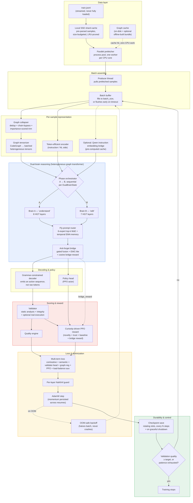
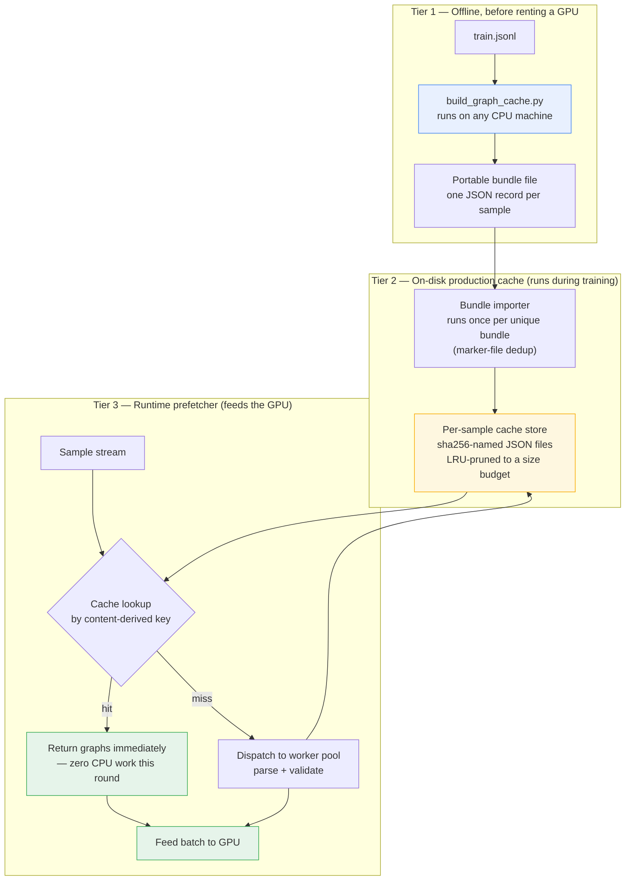

# CodeMind — Full Training Architecture, In Depth

**A self-hosted, multi-language code-understanding and code-generation system, trained end-to-end on a single rented GPU instance**

This is an expanded pass over the original architecture document. The goal here is depth: not just naming a subsystem, but explaining *why* it exists, *what specifically it does*, and *where it can fail* — so the design can be understood and extended by someone who has never read the source. In line with that goal, this document describes behavior, data flow, and design rationale; it does not reproduce implementation code, exact formulas, or file-level internals.

---

## 0. What this system is — and isn't

Readers of the earlier version of this document tended to walk away with a few specific misreadings. Before anything else, it's worth closing those off directly, because they change how every later section should be read.

**This is not an LLM, and it doesn't work like one.** A conventional large language model is a single decoder-only transformer that consumes and produces a flat sequence of text tokens, trained almost entirely by next-token prediction over that sequence. CodeMind does not do this. There is no single stack, no flat token sequence as the primary unit of computation, and no pure next-token objective:

- Its primary input representation is a **typed heterogeneous graph** (Section 4) — nodes and edges carrying explicit structural roles (a call, a data-flow edge, a control-flow branch) — not a token stream. Text only re-enters the picture at the edges: as the natural-language instruction on one side, and as decoded source text rendered back out from an *action sequence* on the other (Section 5).
- It has **two separate transformer stacks with different jobs** (Section 3) — one specialized toward understanding structure, one toward proposing edits — rather than one stack doing everything.
- Training combines a supervised loss with a **reinforcement-learning loop (PPO)** driven by a validator and a curiosity-style reward (Section 6), not supervised next-token loss alone.
- Generation is **constrained to grammatically/structurally valid actions** at each step (Section 5), not free sampling over an open vocabulary.

None of this makes CodeMind "better than an LLM" in some general sense — it makes it a *different kind* of system, purpose-built for structured code transformation rather than open-ended text generation, with different failure modes and different things worth checking when something goes wrong. Comparisons to LLM behavior (hallucination patterns, prompt sensitivity, context-window scaling) mostly don't transfer here, because the underlying mechanism isn't the same.

**"Language-specific parsing" is not "language-specific model."** Section 4 describes three parsing tiers that branch by which language a sample is written in (a native path for Python, tree-sitter for other supported languages, a generic fallback otherwise). This is real, and it is a deliberate, fixed dispatch — but it is easy to misread as "the model itself is hardcoded per language" or "adding a language means retraining a different model." Neither is true. The branching happens **only at the parsing front-end**, before anything reaches the model: its job is to turn arbitrary source text into the same unified typed-graph representation regardless of which path produced it. Everything downstream of that point — the dual-brain HGT stacks, the router, the bridge, the decoder, the PPO loop — operates on that one shared graph schema and has no branch, flag, or parameter that is specific to any one language. A new language with a tree-sitter grammar available slots into the *existing* fallback tier of the dispatch without touching the model at all; only if it needed native-parser-level fidelity (the way Python has) would that require new front-end work, and even then nothing about the model architecture changes. The fixed part is "how do we get a graph out of this text," not "what can this model understand."

**Training-time configuration and runtime usage are two different regimes, not one.** Section 10's parameter table (hidden dimension, layer counts, batch size, learning rate, PPO buffer size, and so on) describes what the *training run* is configured with — the knobs that shape how the model's weights come to be what they are. None of those numbers describe what happens when a trained checkpoint is later used to actually understand or edit code. That's a separate regime, covered in Section 9 and expanded in Section 9.1: a fixed set of already-trained weights, exercised through inference-only code paths (`serve`, `project`, `demo`) that do not touch the optimizer, the PPO loop, the loss terms, or any of the training-only bookkeeping (checkpoint rotation, gradient accumulation, OOM backoff). Conflating the two is a common and understandable mistake, because both regimes run the *same* graph-construction and dual-brain-and-bridge code — but "runs the same forward pass" is not "is configured the same way" or "does the same job." A production request against a served model never runs an optimizer step, never computes a PPO reward, and is not affected by the batch size or learning rate that produced the weights it's using.

---

## 1. The full training loop, end to end

The whole dataset is swept multiple times ("rounds" — four by default). Two things make repeated rounds cheap instead of ruinous: the **graph cache** means CPU-heavy parsing only ever happens once per unique sample across all rounds, and the **dual-brain alternation** means those rounds aren't "the same thing four times" — Brain A finishes its pass over the phase-A schedule before Brain B begins, structured as sequential phases with their own independent sample counters, rather than jointly training both roles on every sample.

Everything in this section — the process pool, the batch buffer, the loss terms, the optimizer step, checkpoint rotation — belongs to the **training regime only**. See Section 9.1 for what's left once training is done and a checkpoint is actually being used.

## 2. Data layer, in depth

Three caching layers sit between the raw dataset and the model:

- **The SSD shard cache** stores the result of turning a raw JSON line into a structured, typed sample — itself non-trivial work — keyed and budgeted so it never exceeds a configured size, with least-recently-used entries evicted first once that budget is exceeded.
- **The graph cache** stores the output of static analysis: the code property graphs and validation results, keyed by a content hash of the sample so identical content always resolves to the identical cache entry regardless of where it sits in the file (see the Appendix for the full mechanics of how this is populated offline).
- **The parallel prefetcher** drives both of the above during training: a pool of worker *processes* — not threads, since the parsing and validation work is CPU-bound pure Python, which a thread pool would serialize behind the interpreter's global lock — kept several batches ahead of what the GPU is currently consuming.

A producer thread pulls finished samples and fills a batch buffer; if the buffer hasn't reached full size within a short timeout, a partial batch is flushed anyway rather than let the GPU idle waiting for a temporarily slow sample.

### 2.1 Graph collapsing — trimming a CPG down before it reaches the model

Real codebases produce graphs far larger than any fixed per-sample node budget (Section 8: 4096 nodes at the tensorizer stage, with an additional, tighter collapse step earlier in the pipeline). Simply truncating a graph at an arbitrary node count would risk losing exactly the structure the model most needs — an entry point, a call edge, a data-flow chain — while keeping incidental nodes that happened to appear first. The collapse step instead runs in three deliberate passes:

1. **Exact-duplicate merge.** Nodes that share the same type and an identical (truncated) label are folded into one, *except* for a protected set of structurally load-bearing node types (functions, calls, control-flow, data-flow, program-dependence, statement, and AST nodes) which are never merged away regardless of apparent duplication.
2. **Linear-chain bypass.** A node with exactly one incoming and one outgoing edge, that isn't one of a small set of "anchor" types (function, call, data-flow, dependence nodes) and whose label doesn't match an "important" keyword pattern (`main`, `init`, `handler`, `dispatch`, `entry`, and similar), is treated as a pass-through link rather than meaningful structure — its neighbors are reconnected directly and the node itself is dropped. This is analogous to collapsing `A → B → C` into `A → C` when `B` isn't carrying independent information.
3. **Degree- and keyword-weighted trimming**, only if the graph is *still* over budget after the first two passes: every remaining node gets an importance score built from (a) whether its type is in the protected set, (b) whether its label matches the "important" keyword pattern, and (c) how connected it is (capped, so one extremely high-degree hub can't dominate the ranking). The lowest-scoring nodes are dropped until the graph fits, and edges are remapped so nothing points at a node that no longer exists.

The result is a graph that's shrunk toward a target size while preferentially keeping entry points, call structure, and data/control-flow edges over incidental syntactic nodes — closer to "the CPG's skeleton" than a first-N-nodes truncation would produce. Basic before/after node and edge counts are tracked (nodes/edges before and after, how many nodes were merged as duplicates, how many chains were collapsed) so pipeline health is inspectable without re-running the collapse.

## 3. The dual-brain design, in depth

### 3.1 What "heterogeneous graph transformer" actually means here

It's worth being explicit about this term rather than treating it as a label, because both halves of it matter and are easy to gloss over.

A plain **graph neural network** passes messages between neighboring nodes and updates each node's representation based on what its neighbors look like — but a plain GNN typically treats every node and every edge the same way, as if a "calls" edge and a "assigns to" edge were interchangeable, and as if a `Function` node and a `Variable` node needed the same transformation applied to them. A **graph transformer** replaces simple neighbor-averaging with attention — each node can weigh which neighbors matter more, and can, depending on design, attend beyond its immediate neighborhood — but on its own still doesn't distinguish node or edge *types*.

**Heterogeneous** is the piece that fixes that: every node carries a type (function, call-site, variable, statement, control-flow branch, and so on, per Section 4), every edge carries a `(source_type, relation, destination_type)` triple, and the transformer's weight matrices are specialized *per type combination* rather than shared indiscriminately across all of them. Concretely, this means a message traveling along a "function calls function" edge is transformed by different learned weights than a message traveling along a "statement depends-on statement" edge, even though both might connect what look like similar-looking nodes elsewhere in the graph. This is what lets the same architecture meaningfully represent a code property graph — which is not one kind of relationship repeated everywhere, but several distinct structural views (control flow, data flow, calls, program dependence) merged into one graph — without collapsing those distinct relationships into a single undifferentiated "connected to" edge and losing the information that made building a CPG worthwhile in the first place.

Two brains — Brain A ("understand", 8 layers) and Brain B ("edit", 7 layers) — are each a stack of these heterogeneous attention layers, operating on the *same* typed graph schema but trained on alternating, sequential phases rather than jointly on every sample. Two related-but-different skills sharing one stack tend to erode each other over a long run; separating them gives the "editing" behavior room to specialize without quietly overwriting what "understanding" already learned. Note that "two brains" does not mean "two separate models with separate parsers or separate graph formats" — both consume the identical graph produced by Section 4's pipeline; what differs is only which stack of type-specialized attention weights processes it and what objective that stack is being pushed toward during its phase.

### 3.2 Instruction/embedding routing — a small mixture-of-experts layer

Between each brain's raw HGT output and the rest of the pipeline sits a routing layer: a pool of 6 lightweight expert sub-networks, of which only the top-2 (by learned gate score, with light exploration noise injected during training) are actually applied to any given sample and blended by their gate weights. This keeps per-sample compute bounded regardless of how many experts exist, while letting different experts specialize toward different kinds of input the gate learns to separate.

Two refinements sit on top of the base top-k mechanism:

- **Per-expert temporal memory.** Each expert keeps a slow exponential moving average of its own recent output and blends a small amount of that average back into its current output. The intent is to damp abrupt shifts in what an expert produces from one batch to the next — a lightweight, per-expert form of "don't forget what you were just doing" that sits below the brain-to-brain anti-forgetting mechanism described next.
- **A load-balancing auxiliary loss.** Mixture-of-experts routers have a well-known failure mode where the gate collapses onto a small subset of experts early in training and never recovers, because an under-used expert never gets enough gradient signal to become competitive. A small penalty term, proportional to how far the routing distribution deviates from uniform, is added into the total loss specifically to keep gradient flowing to under-used experts. This term has to remain part of the differentiable graph (not detached for logging only) to have any effect — a router with the penalty computed-but-detached would show the *statistic* of collapse without anything in the gradient actually resisting it.

Routing entropy, the load-balance penalty value, and per-chosen-expert weights are all logged as scalar metrics per step, which is what makes expert collapse (or its absence) something that can be observed rather than only inferred after the fact from output quality.

### 3.3 The anti-forget bridge

The bridge that connects Brain A's output into Brain B's phase does three distinct jobs, all live inside the same small module:

1. **Gated fusion.** Brain A's and Brain B's (post-routing) embeddings are each projected, concatenated, and combined through a learned gate — not a fixed weighted average — so the network itself decides, per sample, how much of the fused representation should lean on the "understand" signal versus the "edit" signal. The fused output is normalized before leaving the bridge specifically because the two input embeddings can sit at different scales, and an un-normalized combination of differently-scaled signals is a common source of training instability.
2. **An EWC-lite consolidation penalty.** Elastic Weight Consolidation is a standard technique for penalizing a model for moving too far, on dimensions that mattered most for a previous task, away from where it was anchored on that task. Here it's implemented as a lightweight, diagonal approximation: an anchor point (Brain A's own mean embedding, refreshed periodically) and an importance weighting per dimension (approximated from the second moment of that same embedding) are kept as running buffers rather than computed from a full Fisher-information pass, which would be far more expensive to maintain continuously. The penalty grows with how far Brain B's fused output has drifted from that anchor, scaled per-dimension by the importance weighting, and is added into the total loss — discouraging phase-B training from moving in directions phase-A had committed to, without freezing Brain B outright.
3. **A reward signal for PPO.** The bridge also computes a scalar "bridge reward": the cosine similarity between Brain A's anchor embedding and the fused output, remapped onto a 0–1 range and smoothed with its own exponential moving average to reduce step-to-step noise. This isn't used for the loss directly — it's fed into the curiosity-driven PPO reward described in Section 6, giving the reinforcement-learning side of training a direct signal for "did fusing in Brain B's edit-oriented representation preserve what Brain A understood, or did it wash it out."

An engineering detail worth calling out because it shapes what "the bridge" even means at runtime: the bridge module is compiled (via a graph-mode JIT compiler) for kernel fusion, since its forward pass is pure matrix-multiply-and-elementwise work with no data-dependent branching — exactly what that kind of compilation is good at. The routing layer next to it is deliberately left uncompiled, because its forward pass indexes into a list of expert modules using a Python integer pulled out of a tensor inside a loop — data-dependent control flow that forces the compiler to re-specialize on every new combination of chosen experts, which under a CUDA-graph-based compilation mode is actively counterproductive rather than merely unhelpful. Compilation failures (observed in practice on Windows) are caught at first real invocation — since this kind of compilation is lazy, the failure doesn't show up until the compiled function actually runs — and the system falls back to the uncompiled path permanently for that run rather than erroring out or retrying every step.

### 3.4 Why this is more flexible than a plain GNN, or a homogeneous graph transformer

This is worth spelling out concretely rather than asserting, because "more flexible" is otherwise just an adjective. The comparison is against three real, named alternatives, not a strawman:

- **A plain message-passing GNN (GCN, GraphSAGE, GIN, and similar).** These share one weight matrix across every edge in the graph, full stop. A "calls" edge and a "reads-from" edge get the exact same linear transformation applied to whatever is flowing along them, because the architecture has no concept of an edge having a *type* at all — it only sees "there is an edge here." For a CPG, which is deliberately built by merging several *structurally different* relations (control flow, data flow, call graph, program dependence) into one graph specifically to capture the fact that these are different kinds of relationships, forcing them through a single shared transformation throws away exactly the distinction the CPG was built to preserve. The model would have to *infer*, purely from node content, that this edge behaves like a call and that one behaves like a data dependency — no such information is given to it structurally.
- **A relational GNN (e.g. R-GCN-style architectures) without attention.** These fix the worst of the above by giving each relation type its own weight matrix — real progress — but they still combine neighbor messages by a fixed aggregation (typically a sum or mean), so every neighbor of a given relation type contributes equally regardless of whether it's actually relevant to the node in question. A function with forty call-sites doesn't get to weigh "the three call-sites that matter for this particular edit" more heavily than the other thirty-seven.
- **A homogeneous graph transformer (attention over graph edges, but no type-awareness).** This fixes the aggregation problem — attention lets a node weigh its neighbors instead of averaging them uniformly — but drops back to a single shared query/key/value projection for every edge regardless of type, reintroducing the first problem: a "calls" edge and a "reads-from" edge are attended to using the identical learned notion of relevance, when what makes one relevant is not the same as what makes the other relevant.

The heterogeneous graph transformer used here is the combination that keeps both properties at once: **per-relation-type attention**, where the query/key/value projections themselves are specialized by the `(source_type, relation, destination_type)` triple (Section 4), so the model can learn a genuinely different notion of "what matters" for a call edge than for a data-flow edge, *and* it still gets to weigh individual neighbors by learned relevance within that type rather than aggregating them uniformly. Concretely, that means the same architecture can, in principle, learn that for a "function contains statement" edge the position in the function matters a lot, while for a "variable flows-into variable" edge what matters is more about matching variable roles than position — two different attention behaviors, on two different edge types, inside one model, rather than one compromise behavior applied everywhere.

This is also why the flexibility doesn't stop at the HGT layers themselves — it composes with two other mechanisms already described:

- **The MoE router (Section 3.2)** adds a second, orthogonal axis of specialization *on top of* type-aware attention: even after a node's representation has been shaped by relation-type-specific attention, different *samples* (a Python data-processing script versus a C memory-management routine, say) can still route to different combinations of experts, without needing separate per-language weights (Section 0) and without the compute cost of activating all experts on every sample.
- **The dual-brain split (Section 3.1)** adds a third axis: the same typed-attention machinery is instantiated twice, once tuned toward "understand" and once toward "edit," rather than asking a single stack to represent both objectives with one set of weights. A plain GNN or homogeneous transformer has no natural seam at which to make that kind of role split without either doubling the whole model naively or blending both objectives into one confused signal.

None of this is claimed as a guarantee of better results on any specific benchmark — architecture flexibility is a capacity argument, not an outcome argument, and the actual outcome still depends on data, training stability, and everything else in this document. It's a specific, mechanical answer to "why HGT over a plain GNN" grounded in what the attention weights are actually specialized over, not a general claim that the architecture is superior in the abstract.

### 3.5 Where this actually departs from the original HGT design — and why those changes are real fixes, not decoration

Section 3.4 argued for heterogeneous, type-specialized attention over plain GNNs and homogeneous graph transformers in general terms. It's worth being just as concrete about the other comparison: this isn't the original Heterogeneous Graph Transformer design (Hu et al., the type-attention formulation this system's HGT layers are built on) used unmodified — several real limitations in that original setting were identified and specifically engineered around, and each of the changes below is solving a problem the original design genuinely had, not adding complexity for its own sake.

The original HGT formulation was built for a different problem than this system faces: a *single*, largely *static* heterogeneous graph — the running example in that line of work is something like an academic graph of papers, authors, and venues — trained under one ordinary supervised objective (node classification, link prediction) in one pass. That setting has no notion of two different reasoning roles that need to stay separated, no notion of chaining one trained phase into a differently-trained second phase without the second phase overwriting the first, and no notion of per-sample expert specialization layered on top of the type-aware attention itself. Taking that formulation as-is and pointing it at this system's actual problem — dual-role code understanding-and-editing, trained across sequential phases, feeding a downstream RL loop — would have hit exactly those gaps. What got built on top of the original mechanism directly answers each one:

- **The dual-brain phase split (Section 3.1) didn't exist in the original design at all**, because the original problem never needed two different specialized roles operating on the same graph. Where a single HGT stack would have had to represent both "understand this structure" and "propose an edit to it" with one shared set of weights — the exact objective-interference problem Section 3.1 calls out — this system instead instantiates the type-aware attention mechanism *twice*, once per role, and only then faces the genuinely new problem the split creates: how does Brain B's phase avoid quietly overwriting what Brain A's phase already learned. That problem, and its solution, didn't need to exist in the original formulation and had to be engineered from scratch here.
- **The anti-forget bridge (Section 3.3) is a purpose-built addition with no equivalent in the original design**, for the same reason: a single-phase, single-graph training setup has nothing analogous to forget in the first place. Gated fusion, the EWC-lite consolidation penalty anchored to Brain A's own embedding statistics, and the cosine bridge-reward fed into PPO are all mechanisms built specifically to make a *sequential two-phase* training regime viable without the second phase eroding the first — a problem this system's dual-brain structure creates and then has to solve, rather than one inherited from the original architecture.
- **The MoE routing layer (Section 3.2) sits on top of the type-aware attention output, not inside the original formulation.** The original design's capacity comes entirely from stacking more type-specialized attention layers; there's no mechanism in it for per-sample specialization beyond what the graph's own type structure already encodes. Adding top-2-of-6 expert routing after each brain's HGT output is a genuine capability the base formulation didn't have: different samples — a tight recursive algorithm versus a straightforward data-transformation script, say — can route toward different expert combinations without either paying the compute cost of a much larger dense stack or requiring separate per-language weights (Section 0). The per-expert temporal EMA memory and the load-balancing auxiliary loss are refinements on top of that addition, and Section 8 already documents one concrete bug this system found and fixed in its own router: the load-balancing penalty was, for a period, computed and then detached before backpropagation, meaning the safeguard existed in name only. Catching and reattaching that term to the actual gradient graph is a genuine correctness fix on top of a mechanism the original HGT paper never included at all.
- **The relation-type taxonomy itself was rebuilt for this domain rather than reused.** The original design's node and edge types are shaped around its own example domain — papers, authors, venues, citations. None of that transfers to code. Every type this system's attention specializes over — function, call-site, variable, statement, control-flow branch, and the control-flow/data-flow/call/program-dependence relations connecting them — had to be defined from scratch to match what a CPG actually contains, which is a real domain-adaptation effort, not a drop-in relabeling of the original schema.
- **Feeding a PPO-trained decoder is a downstream requirement the original design was never evaluated against.** The original formulation is trained and scored under ordinary supervised losses computed once per graph. Here, the same type-aware attention output also has to serve as a stable state representation for a policy being updated under PPO (Section 6.1) — which is a materially different demand on how consistent and well-behaved the representation needs to be across training, since a noisy or unstable upstream representation would directly destabilize the policy-gradient updates riding on top of it. Making the bridge's fused output normalized and its EWC-lite anchoring stable enough to support that (Section 3.3) was engineering done specifically because of this downstream requirement, not because the original attention mechanism needed it for its own sake.

What was *kept*, deliberately, is the one part of the original design that was already sound for this purpose: the core idea of specializing attention weights per `(source_type, relation, destination_type)` triple rather than sharing them globally. That mechanism wasn't the limiting factor — the limiting factor was everything the original formulation had no reason to include, because it was never built for a sequential, dual-role, RL-integrated system in the first place. The five points above are where the real engineering work went, and each one is answering a specific, identifiable gap rather than being added for its own sake.

## 4. Multi-language parsing and the unified graph

Every sample — a `(source, target, language)` triple, optionally with a whole multi-file project attached — is turned into one heterogeneous graph merging several structural views: control flow, data flow, call relationships, and, for multi-file input, cross-file and cross-language linkage. Every edge is typed as a `(source_node_type, relation, destination_node_type)` triple, which is what lets the graph represent, say, a Python function calling into a C extension or a config file wiring a value into a shell script as distinct, explicit edge types inside one graph instead of separate, disconnected parses.

Parsing itself branches by how much language-specific tooling is available — and, per Section 0, this branching is confined to this front-end stage only; nothing about the dual-brain model, the router, the bridge, or the decoder differs by language:

- **Python** gets a native path built directly on Python's own `ast` module — walking the real, first-party syntax tree rather than an approximation of it, and building control-flow, data-flow, call, and program-dependence layers directly from that walk.
- **Other supported languages** go through a tree-sitter-backed parser when a grammar is available for that language, giving the same category of real, grammar-aware structural correctness as the Python path.
- **Unrecognized or unregistered languages** fall back to a generic, line-and-regex-based structural builder — good enough to avoid a hard failure on an unexpected input, but understood to be a strictly lower-fidelity fallback rather than a substitute for the two paths above.

A language registry resolves a language identifier (or a source file's extension, or a best-effort content sniff when neither is given) to a language "family" — used elsewhere in the pipeline to decide, for instance, whether two files are close enough in language to be worth linking directly. For multi-file input, a dedicated linker normalizes file paths into a canonical route representation and merges the individual per-file graphs into one project-wide graph, wiring in the cross-file edges that a single-file parse could never see.

One branch matters more than it looks: the `source` field of a sample is not always code. In the common single-file case it's a natural-language instruction ("write a function that…"); feeding that straight through the code parser would produce a near-constant, nearly information-free stub graph, because a code parser has no idea what to do with English prose. The pipeline routes plain single-file samples' `source` field through a separate, instruction-aware representation path built for natural language, while multi-file project samples get their actual source files parsed and linked as described above. Getting this branch wrong wouldn't crash anything — it would just mean the model never sees meaningful structure for the "what was asked for" side of most samples, a failure mode that looks like a model that never quite learns to condition on instructions rather than an error anyone would notice quickly.

## 5. From graph to code: representation and decoding

Two distinct action-based codecs exist in the system, covering different parts of the generation surface:

- A **grammar-constrained AST codec** that encodes Python source as a sequence of discrete actions over the real Python grammar (built by enumerating Python's own AST node classes), with a constrained-generation mode that only ever offers the decoder actions that are grammatically valid at the current position — ruling out "looks like code but is syntactically broken" by construction rather than by post-hoc filtering.
- A **graph-action codec** that works over the unified CPG itself rather than raw source text: it walks the "generatable" nodes of a target graph in a defined traversal order and emits a sequence of node/label actions, with both a standard constrained-generation mode and a variant built specifically for the reinforcement-learning path. A companion renderer turns a decoded action sequence back into source text for whichever language it targets.

The decoder that actually produces these action sequences is a causal transformer (9 layers, 16 attention heads, a 2048-action generation window) conditioned on the fused brain representation. It supports both a straightforward full-sequence forward pass for computing training loss, and a separate cached-generation path that reuses past key/value tensors across decoding steps rather than recomputing the whole prefix on every new action — the standard technique for making autoregressive generation tractable at scale. Sampling includes a banned-n-gram guard against short repeated loops (a known degenerate mode of autoregressive generation), and a hard abstain ceiling set above the normal generation window: past a certain action count, the model is made to stop and report low confidence rather than keep guessing — a deliberate choice to fail visibly rather than degrade silently into a long, low-quality continuation.

## 6. Validation, integrity, and reward

Generated (or ground-truth, during supervised phases) code passes through a validator that layers several independent checks rather than relying on any single signal:

- **Static analysis** (language-specific where a real parser is available, generic pattern checks otherwise), producing categorized issues by severity, plus a dedicated safety-pattern check independent of general lint severity.
- **An integrity check**, distinct from static analysis, aimed specifically at catching outputs that are syntactically fine but substantively empty or dishonest: a hollow stub (bare `pass`, `...`, a bare `raise NotImplementedError`), prose mixed into what's supposed to be code, or a near-copy of the prompt returned as if it were an answer.
- **A purity score**, a separate signal from integrity, measuring how much of the output is actually code versus surrounding noise.
- **Optional real execution**, when explicitly enabled, including — when a ground-truth reference is available — actually running both the candidate and the reference and comparing behavior, not just checking that the candidate merely runs without crashing. Whether the candidate ran versus whether it ran *correctly* are tracked as separate outcomes precisely so a "ran but gave the wrong answer" case doesn't get scored the same as a genuinely correct one.
- **Optional structural similarity**, when a reference graph is available, comparing the candidate's own parsed graph against the ground truth's — a softer, non-execution-based proxy for correctness that still works on languages or samples where real execution isn't practical.

These signals are combined into one bounded score rather than reported as a raw sum: syntax errors and safety issues subtract from a base score, but that base is then *multiplicatively* scaled by the integrity and purity findings — so an output that's structurally clean but flagged as a hollow stub or prompt-echo can't reach a high score just because the linter had nothing to complain about. Execution success and, when available, a blended behavioral/structural correctness score are folded in on top, weighted so a genuine behavioral match (when execution was possible) counts for more than the structural proxy alone. Certain conditions force an outright abstain recommendation regardless of the numeric score — most errors, a detected cheating pattern, a hollow-but-non-executing stub, or a demonstrably wrong-but-running answer — because there are failure categories a single scalar threshold shouldn't be trusted to catch reliably on its own.

### 6.1 Why PPO, and what it's actually doing here

It's worth unpacking this rather than treating "PPO" as a fixed phrase, since it's doing real, specific work in this system rather than being a generic add-on.

**The problem PPO solves.** Supervised training on a fixed dataset can only ever push the model toward *reproducing the target it was shown*. But "matches the target" and "is a correct, high-quality edit" are not the same thing — there can be more than one valid way to fix a bug or implement a function, and a dataset target is only one of them. A pure supervised objective has no way to reward a *different-but-also-correct* output, and no way to punish an output that happens to match superficially but is subtly wrong in a way the target-matching loss can't see. Reinforcement learning closes that gap by scoring the model's *own generated output* — via the validator in the first half of this section — rather than only ever comparing against one fixed reference.

**What PPO specifically is.** Proximal Policy Optimization treats the decoder (Section 5) as a policy: at each step it chooses an action (part of the generation), and the whole finished action sequence gets a scalar reward once it's complete (from the validator and the curiosity-driven reward below). The "proximal" part is the specific thing that makes PPO more stable than naively pushing the policy toward whatever got a high reward: it constrains each update so the policy doesn't change too drastically in one step relative to the policy that actually generated the experience being learned from, via a clipped objective. Without that constraint, a policy-gradient method can overreact to a single unusually high- or low-reward episode and destabilize training; PPO's clipping is specifically the mechanism that prevents that overreaction while still letting the policy move meaningfully over many steps.

**Why the reward is "curiosity-driven" rather than plain pass/fail.** A flat pass/fail reward has a specific failure mode late in training: once the model is already fairly good, most of its outputs pass, and a flat reward stops distinguishing "an easy sample it's already mastered" from "a genuinely hard sample it barely got right." The curiosity-driven reward is built to keep discriminating past that point by combining several signals rather than one:
   - **Novelty** — whether the policy has already mastered very similar samples before; if so, there's comparatively little left to learn from seeing it again, and the reward reflects that.
   - **Trust** — a weighting on how much to lean on the model's own recent behavior as a signal, rather than treating every single episode's outcome as equally reliable.
   - **A running baseline**, rather than a fixed target — the reward is measured against how the policy has recently been doing, not against an arbitrary constant, so "reward" tracks *improvement* rather than *absolute score*.
   - **The bridge reward** from Section 3.3 — whether Brain B's edit-oriented fusion preserved what Brain A understood.

An experience-replay bank retains past samples and their outcomes so the policy continues to be exposed to a mix of prior experience rather than only the most recent batch of behavior, which is standard practice for keeping an RL loop from overfitting to whatever happened most recently.

**Where PPO sits relative to everything else.** PPO's contribution is one term inside the larger multi-term loss (Section 7) — it doesn't replace the supervised objective, it supplements it. The supervised terms teach the model what correct output generally looks like from labeled examples; the PPO term additionally rewards the model's *own* generated attempts when they're independently judged good by the validator, including attempts that don't match the training target verbatim. Both operate on the same decoder; they're two different pressures shaping the same set of weights, tracked as separate loss components specifically so one can't silently mask the other going wrong.

## 7. Loss composition and optimization mechanics

The total training loss is a weighted combination of several independently-tracked terms — contrastive, semantic-alignment, validator-head, graph-structure regularization, PPO policy, EWC-lite consolidation, and the router's load-balancing auxiliary term — reported separately per pass specifically so a falling total can't hide one component that's actually flat or worsening.

Mixed-precision training runs under a precision manager that selects an initial autocast mode from detected hardware and can downgrade precision at runtime if VRAM pressure crosses a threshold, rather than assuming a fixed precision setting is safe for the whole run regardless of what else is competing for memory. Gradient accumulation lets a modest micro-batch be accumulated over several forward/backward passes before every optimizer step, giving a larger effective batch size than what has to fit in VRAM at once; if a micro-batch size turns out to be too large at runtime, an automatic backoff halves it on the fly rather than crashing and losing the rented GPU session. Every optimizer step runs through a per-layer NaN/Inf guard, so a numerical blow-up is caught and attributed to the layer where it happened rather than surfacing as an unexplained loss explosion several steps later.

## 8. Same names, rebuilt internals

Several components kept their original names across the project's history but had their internal behavior substantially replaced — worth calling out explicitly, because "same class name" doesn't mean "same implementation" anywhere in this list:

- **The graph-structure detector**, for non-Python languages, moved from a shallow bracket-balance-and-regex heuristic (which can't tell `functoin foo() {}` from valid code, since brackets alone still balance) to a real tree-sitter-backed parser, giving those languages the same structural precision Python already had natively.
- **The parsing/validation concurrency model** moved from a thread pool — which doesn't meaningfully parallelize CPU-bound pure Python, since the interpreter's global lock serializes it regardless of thread count — to a process pool, where each worker genuinely owns a core.
- **The generation decoder** moved from a static-vocabulary token sampler to the grammar/graph-action codecs described in Section 5 — same architectural slot in the pipeline, completely different notion of what it predicts and how that becomes code.
- **The routing layer's load-balancing safeguard** existed in name and docstring before it existed in the gradient: the auxiliary loss term was, for a period, computed and then immediately detached for logging only, meaning nothing was actually resisting expert collapse despite the mechanism being documented as active. It now stays attached to the graph so it participates in backpropagation.
- **Checkpointing** moved from saving model weights only to also persisting the optimizer's own momentum state (without it, every resume effectively restarted Adam's momentum from zero, producing a visible loss spike right after every resume) and adding a graceful-shutdown path so a stop signal triggers an orderly save instead of losing unsaved steps.
- **A "reduce memory usage" story that was actually two different mechanisms.** A monitoring/diagnostics layer helps *utilize* available VRAM more efficiently and diagnose pressure faster, but cannot make more VRAM exist or make an oversized graph fit. The actual VRAM reduction comes from a direct, structural change — capping graph size via the collapser in Section 2.1 — a different mechanism entirely from the monitoring layer, even though both get discussed under "memory management."
- **An FP8 storage path that was quietly a no-op.** A configuration flag implied trained weights could be compressed to 8-bit storage; on inspection, the cast only ever happened transiently inside a forward pass during evaluation and was converted back before any matmul, so nothing about on-disk or in-memory storage was ever affected. It has since been removed outright, with old saved configs that still reference the flag simply ignored rather than erroring.

## 9. Runtime surface: serving and tooling

Beyond the training loop itself, the same codebase exposes a command-line interface covering training (`train`), a lightweight HTTP serving mode (`serve`) with its own request handler, status reporting (`status`), cache management (`cache`), a scripted demo mode (`demo`), and whole-project analysis (`project`) that walks a directory, discovers relevant source files up to a cap, and runs them through the same parser/validator stack used during training — so "understand this project" and "learn from this sample" are backed by the same underlying machinery rather than two parallel implementations. A dedicated large-code handler and multi-project connector extend that same path to inputs that don't fit the single-file/single-sample shape the core training loop otherwise assumes.

### 9.1 What "runtime" actually excludes

Because Section 9's commands run through the same graph-construction and dual-brain-and-bridge modules as training, it's easy to assume more of the training machinery is "live" during serving than actually is. It isn't. Concretely, once a checkpoint is loaded for `serve`, `project`, or `demo`:

- **No optimizer step ever runs.** The AdamW state, gradient accumulation, and OOM-triggered batch-size backoff (Section 7) exist only inside the `train` command's loop; a served request never touches them.
- **No PPO reward is computed for its own sake.** The validator (Section 6) still runs — it's what makes `project`-mode analysis and abstain-versus-answer decisions meaningful at inference time — but its output there is *read directly* as a quality signal, not folded into a policy-gradient update. There is no policy update happening during serving; the weights are frozen for the duration of the request.
- **No checkpoint rotation, no graceful-shutdown save.** These exist to protect in-progress training state; a serving process has no training state to protect.
- **The load-balancing auxiliary loss, the EWC-lite penalty, and every other loss term in Section 7 are not evaluated at all.** They're loss terms — they only exist as part of a backward pass, and there is no backward pass during inference.
- **Batch size, gradient accumulation, and learning rate (Section 10) have no meaning here.** They shaped how the loaded weights came to be what they are; they say nothing about how many requests `serve` handles at once or how quickly it responds, which are separate, ordinary serving-infrastructure concerns instead.

What *is* shared, and genuinely identical, between training and runtime: the language dispatch and graph-construction pipeline (Section 4), the graph collapser (Section 2.1), the dual-brain-and-bridge forward pass (Section 3), and the decoder's forward/generation pass (Section 5) — all run unmodified in both regimes, which is precisely what makes `project`-mode's "understand this project" trustworthy as a preview of what the trained model actually learned, rather than a separately-maintained approximation of it.

## 10. Key parameters as currently configured

The table below describes **training-time configuration only** — see Section 9.1 for why none of it carries over to how a trained checkpoint behaves once it's actually being used.

| Parameter | Value | What it controls |
|---|---|---|
| Hidden dimension | 1664 | Width shared across both brains and the decoder |
| Brain A depth | 8 HGT layers | "Understand" reasoning depth |
| Brain B depth | 7 HGT layers | "Edit" reasoning depth |
| Attention heads | 64 | Attention granularity |
| Max graph nodes (tensorizer) | 4096 | Per-sample graph size cap before subsampling |
| Routing experts | 6, top-2 active | Diversity across language/task families |
| Decoder depth | 9 layers | Action-sequence generation depth |
| Decoder attention heads | 16 | — |
| Decoder max sequence length | 2048 actions | Generation length ceiling |
| Generation abstain ceiling | 2600 actions | Past this, the model abstains rather than guessing |
| Dropout | 0.1 | Applied across brain and decoder |
| PPO replay buffer size | 16 | Policy-gradient stability |
| Total parameters | ≈3.29B | Across both brains, decoder, encoder, and RL/bridge overhead |
| Training rounds over the dataset | 4 (configurable) | Multiplies raw CPU parsing cost if not cached |
| Micro-batch size | 128 | Auto-backs off on OOM |
| Gradient accumulation | 8 steps | Effective batch size = 1024 |
| Learning rate | 2e-4 | With warmup + decay, correctly resumed across restarts |
| Quality target (early stop) | 85% validation quality | Training stops once reached |
| Early-stop patience | 3 passes without improvement | — |
| Checkpoint interval | Every 200 steps, plus on shutdown signal | Bounded progress loss on interruption |
| Checkpoint rotation | 3 rolling slots | Disk-budget vs. rollback depth trade-off |

## 11. What this adds up to

None of the individual pieces above are exotic in isolation — process pools, gradient accumulation, EWC-style regularization, mixture-of-experts routing, and PPO are all standard tools. What defines the system is how they're wired together around one central constraint: everything that *can* run cheaply, ahead of time, or in parallel with the GPU has been deliberately pulled out of the GPU's critical path, and everything touching durability — checkpoints, resumability, graceful shutdown, OOM handling, precision downgrade — is built to fail toward "lose the least possible amount of expensive compute time" rather than toward silent correctness risk or an outright crash.

It's also, per Section 0, worth restating plainly rather than leaving implicit: this is a graph-structured, dual-stack, RL-assisted code-transformation system with a fixed *parsing* dispatch and a language-agnostic *model*, evaluated and served through the same code path it was trained through — not a large language model, not a system whose model weights are specific to any one language, and not a system whose training-time knobs describe how it behaves once deployed.

Concretely, several of the choices documented above are the kind of engineering that only shows up when a system has actually been run, broken, and fixed — not just designed on paper. The load-balancing loss that was silently detached from the gradient (Section 8) was caught because someone was checking whether the router's *behavior* matched its *documentation*, not just trusting the docstring. The offline graph-cache builder's resumability (Appendix A.6) — truncating a corrupted trailing line, tracking done-keys by content hash rather than position, fsyncing every couple hundred records — reads like a checklist written by someone who has actually lost work to a killed process, because that's what it's for. The validator's insistence on treating "ran" and "ran correctly" as separate outcomes (Section 6), and on multiplicatively gating the score by integrity and purity rather than just adding a bonus for them, is the kind of design that comes from having watched a naive scoring scheme get gamed by a hollow-but-syntactically-clean output. None of this is decoration: it's the difference between an architecture diagram and a system that has actually had its assumptions tested against real failure modes and adjusted in response — which is precisely why Section 12's open questions are framed as things worth *measuring next*, not as reasons to doubt that the underlying engineering is solid.

## 12. Realistic scope: what to actually expect from this, and where the open questions are

Architecture description alone doesn't tell a reader what to expect in practice, and the honest answer sits between two extremes: this isn't a toy, and it isn't a claim to frontier general-purpose capability either. This section is a proportionate read of what the design and scale actually support, and a direct separation between what's a deliberate design choice versus what genuinely still needs outside measurement to say with confidence.

**Realistic capability given scale and specialization.** ≈3.29B parameters trained on roughly 100–120 GB of code, run through a graph-plus-validator-plus-PPO loop rather than plain next-token supervision, is a design proportioned for a specific job: structural, in-distribution code transformation — fixes, edits, and generations that resemble the shape of what the training data actually contains, on the languages the parsing tiers actually cover well. Within that scope, a model this size trained this way is a reasonable, credible target — it is not undersized for that job the way it would be undersized for the much broader job of open-ended, any-language, any-codebase general coding assistance the way a frontier general-purpose model is scoped and resourced to attempt. That's the honest comparison: not "3.29B vs. frontier scale" as if both were aiming at the same target, but "a specialized model sized for a specialized, narrower target" — and the target being narrower is a design decision made up front (Section 0's compute-budget derivation), not a shortfall discovered after the fact.

**What the 85% figure is likely worth, and what it isn't yet.** The internal validator (Section 6) isn't a single cheap check — it layers static analysis, a dedicated integrity/purity check aimed specifically at hollow or dishonest output, and optionally real execution comparison, combined multiplicatively rather than additively so a clean-looking-but-empty output can't coast on syntax alone. A composite score built that way, reaching 85% on in-distribution validation data, is a meaningfully stronger signal than a bare pass/fail or a lint score would be — it's a reasonable proxy for "this output is genuinely usable" *for samples that look like what the model was trained on*. What it does not yet establish is how that number translates to unseen repositories, unfamiliar coding styles, or the specific task formulations of external benchmarks like HumanEval, MBPP, SWE-bench, RepoBench, or CodeContests — those measure a different thing (generalization to problems the model has never been shaped around) than an in-distribution training validator does, and only running them would answer that question. The realistic claim is: 85% is credible evidence of real, structured quality within the training distribution; it is an open, separate, and answerable question — not yet answered here — how that carries outside it.

**Reward hacking is a real, bounded risk, not a hypothetical one.** Because the PPO reward and the early-stop target share the same validator, a policy has a standing incentive to satisfy that validator by any means available, which is the generic failure mode of any RL-from-a-learned-judge setup. The multiplicative integrity/purity scaling and the forced-abstain conditions in Section 6 close off the cheapest ways to hack a single-signal reward (a hollow stub that's syntactically clean, a near-copy of the prompt), which meaningfully raises the bar — but raising the bar is not the same as removing the incentive, and it should be expected that continued training or a different data distribution could surface hacking modes the current checks don't yet catch. Treating the validator's own score as fully self-certifying would be the mistake here; treating it as strong-but-not-final evidence, worth periodically checking against held-out human or external judgment, is the realistic posture.

**Graph collapsing is a targeted trade-off, not a general weak spot.** The 4096-node budget and the three-pass collapse (Section 2.1) are sized around the kind of sample the system is actually trained and used on — function- and file-scale edits, where the real CPG rarely approaches that ceiling in the first place. For that realistic, in-scope input size, the collapse logic mostly isn't binding at all; it becomes a live concern specifically at the outlier end — a genuinely enormous multi-file project graph — where the importance-weighted trim does have to drop real structure, and a low-degree, non-keyword dependency could plausibly be among what's dropped. That's a known, bounded edge case tied to input size, not a general property of how the system handles ordinary samples.

**Natural-language instruction handling is scoped to match the task, not outsourced by default.** The instruction-aware path and the optional Qwen embedding bridge (Section 1, Section 4) are sized for the kind of instruction this system's training data actually contains — short, fairly direct task descriptions ("write a function that…", "fix the off-by-one in…") rather than open-ended conversational requirements-gathering. Within that register, a lighter instruction-side representation trained on the system's own data is a reasonable, proportionate choice rather than a gap; it would become a real limitation specifically if the system were pointed at long, ambiguous, or multi-turn natural-language requirements substantially outside that register, which is a different and broader task than the one it's built around.

**Execution-based validation needs real sandboxing as an operational deployment requirement.** This one is unambiguous and worth stating without hedging: running arbitrary candidate code, even for validation purposes, requires genuine process isolation, resource and time limits, and no unchecked filesystem or network access — this is standard practice for anyone executing untrusted code, not a CodeMind-specific caveat, and enabling this validator mode without that isolation in place is a real operational risk rather than an architectural detail this document can resolve on paper.

Put together: the mechanisms in Sections 1–11 are real, implemented, and interoperate as described, and the in-distribution internal validation results are genuine evidence of working, structured behavior — not a marketing number decoupled from what's actually happening underneath. What remains open is exactly the set of questions external benchmarking and broader deployment would answer: how the in-distribution numbers generalize, and how the specific edge cases above behave at the input sizes and task types the training distribution doesn't already cover.

---

# Appendix: The Offline Graph-Cache Builder (Data-layer detail)

The "Graph cache" box in Section 1 is populated by a standalone script that runs entirely separately from training, on ordinary CPU hardware, before any GPU is even rented.

## A.1 The actual problem: it's not "parsing is slow," it's "parsing is repeated"

It's worth being precise about what claim this appendix is actually making, since "CPU is a bottleneck" is easy to over-read as if it were a novel discovery about this system specifically. It isn't. Any pipeline that builds real structural graphs from source code — AST construction, tree-sitter parsing, static analysis — is CPU-bound pure Python work by nature, and that's true industry-wide for graph-based code representation learning generally, not a property unique to, or a limitation specific to, CodeMind. A GPU has nothing to do until a graph already exists; building that graph is ordinary CPU work regardless of whose pipeline it is. This appendix isn't claiming to have discovered or eliminated that CPU cost — it's documenting one specific, narrower fix: avoiding *paying that same fixed CPU cost redundantly, once per training round, for input that doesn't change between rounds*. That's a caching problem, not an architectural breakthrough, and it's presented here as exactly that.

Building a sample's unified CPG is real CPU work — full AST-level or tree-sitter parsing, construction of multiple structural layers on top of it, and running the validator (which can, depending on configuration, actually execute the code). None of this touches a GPU. The expense isn't that any single sample is slow — it's that training sweeps the dataset multiple times (four rounds by default), and since the transformation from `(source, target, language, project_files, run_test)` is fully deterministic, redoing it on every pass produces byte-identical results every time. At four rounds, that's roughly a 4x multiplier on CPU work paid for at GPU-instance billing rates unless it's cached — and even with caching in place, the *first* pass over any given sample still pays the full CPU cost once; caching removes the redundancy across rounds, not the underlying cost of parsing itself.

## A.2 Three tiers, one shared engine

The design decision tying all three tiers together: there is exactly one function that turns a sample into graphs, and every tier calls that same routine — nobody reimplements it. A graph produced offline, days before any GPU is rented, is guaranteed to be byte-for-byte what training would have computed on its own, because it's a memoized call to the identical code path, not a re-derivation of it. Note that this offline builder, like everything in Section 4's dispatch, is still purely a **parsing/graph-construction** step — it never touches the dual-brain model and produces exactly the same graph schema regardless of which of the three language tiers a given sample went through.

## A.3 What makes a cache key

A sample's identity is content-derived, not positional: a SHA-256 hash (truncated to 16 hex characters) of its source text, target text, language tag, and — for multi-file project samples — the sorted list of involved file paths. Two samples with identical content resolve to the identical ID regardless of position, which means the cache survives dataset reordering, deduplication, or new data appended later without invalidating anything already built.

One more bit is folded into the key: whether the validator ran in "execute the code for real" mode or a static-only mode, since these can legitimately disagree on the same code. The final key is `{content_hash}|rt{0 or 1}`, so a cache built with one setting can't be mistaken for a cache built with the other — a mismatch is treated as an ordinary cache miss and rebuilt fresh, a silent-but-safe fallback rather than a silent-and-wrong result.

## A.4 Why worker processes, not threads

The heavy lifting — AST parsing, tree-sitter calls, regex-heavy static analysis — is CPU-bound pure Python, serialized by the interpreter's global lock regardless of thread count. Separate OS processes don't share that lock; each worker builds its own parser and validator instance once, at process start, and every sample submitted afterward runs on its own core in genuine parallel. The validator runs inside the same worker call as parsing for the same reason: running it serially afterward, on the main thread, would mean the GPU sits idle waiting for single-core validation between batches.

## A.5 The runtime cache, and how the offline bundle plugs into it

The always-on runtime cache stores one JSON file per sample, named by the hash of its cache key rather than the human-readable key itself, holding the source graph, target graph, and validation result. Corrupt entries (a half-written file from a killed process, disk pressure) are silently treated as cache misses rather than crashing the run, and the store is size-bounded with LRU eviction using file modification time as the "last used" signal, refreshed on read so still-relevant entries survive pruning even if written long ago.

The offline builder itself produces something structurally different: one flat, append-only file where every line is a self-contained JSON record — portable, easy to move between machines, easy to `grep`. At the start of a training run, that bundle — if present — gets imported into the real per-sample cache store, one line at a time, with its own resilience layer:

- **It only runs once per distinct bundle version**, tracked via a marker keyed on the bundle's resolved path, modification time, and size; an unchanged bundle skips reimport entirely.
- **A single corrupt line never aborts the import** — it's skipped, and that one sample falls through to ordinary on-the-fly parsing later.
- **It never overwrites a fresher entry** already present in the runtime cache from an earlier partial import or a live parse.

## A.6 Mechanically, the offline tool

1. Attaches to the exact same worker function and serialization helpers the runtime pipeline uses, rather than shipping a parallel copy of them.
2. Streams the dataset line by line instead of loading it fully into memory, using the same conversion logic training uses to turn a raw record into a structured sample.
3. Checks each sample's key against what's already durably written to the output file before doing any work, so a killed-and-restarted run resumes from where it stopped.
4. Keeps a bounded queue of in-flight jobs (a multiple of the worker count) submitted to a process pool sized to the machine's core count.
5. Writes each finished result as one JSON line and explicitly flushes and fsyncs every couple hundred records, so a process killed mid-run (a reclaimed spot instance, for example) loses nothing that was already flushed.
6. Isolates per-sample failures — one bad record is counted and logged, not fatal to the run.
7. Reports live, continuously-recalculated throughput and ETA rather than a static estimate.

An interrupt (Ctrl+C) cancels not-yet-started queued work immediately and shuts down cleanly, rather than blocking until every already-in-flight job in the lookahead queue finishes — results written before the interrupt remain intact and resumable on the next run.

## A.7 The one setting that must match exactly

The offline tool must be run with the same execution/validation mode flag (`run_test`) that training will actually use — the bit folded into the cache key in Section A.3. Get it right, and the bundle is a perfect stand-in for a live-computed cache. Get it wrong, and every sample "covered" by the bundle silently reverts to being computed live instead: nothing breaks and no wrong data gets used, but hours of offline CPU work quietly produce zero benefit — a mistake worth avoiding on purpose rather than discovering by surprise.

## A.8 Net effect

Without this subsystem: every sample gets parsed, structurally linked, and validated once per training round — four times over the life of a run, on hardware billed by the GPU-hour. With it: the identical, deterministic CPU work happens once, ever, per unique sample — either offline ahead of time or on first live encounter during training, whichever comes first — and every subsequent encounter, in that run or a future one, is a cache lookup instead of a recomputation.
