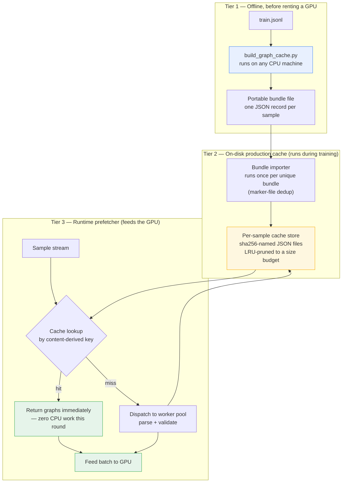
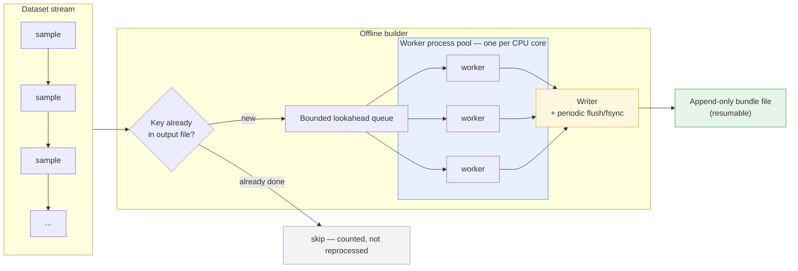

# Offline Graph Cache Builder — A Deep Technical Reference

**Part of the CodeMind project — a self-hosted, multi-language code-understanding and code-generation system**

This document explains, in depth, one specific subsystem of CodeMind's training pipeline: the mechanism that pre-computes and reuses *code property graphs* (CPGs) across training, and the standalone offline tool that lets this work happen before a GPU is even rented. It is written to be read on its own, without access to the source, and to actually explain the mechanics — not just gesture at them.

---

## 1. The actual problem: it's not "parsing is slow," it's "parsing is repeated"

CodeMind doesn't train on raw text. Every sample — a `(source, target, language)` triple, optionally accompanied by a whole multi-file project — is first turned into a **unified CPG**: a single heterogeneous graph that merges several structural views of the code (control flow, data flow, call relationships, and cross-file/cross-language linkage) into one typed node/edge structure. Every edge is typed as a triple — `(source_node_type, relation, destination_node_type)` — which is what lets the model reason about, for example, a Python function calling into a C extension, or a config file wiring a value into a shell script: these show up as distinct, explicit edge types (`cross_lang`, `hosts`, `binds`, `wires`, `same_family`, `coexists`, and others) inside one graph rather than as separate, disconnected parses.

Building that graph is real CPU work: full AST-level parsing (or tree-sitter for non-Python languages), construction of multiple structural layers on top of it, and — bundled into the same step — running the code **validator**, which performs static analysis and, depending on configuration, can actually execute the code to check correctness. None of this touches a GPU. All of it is Python-and-subprocess CPU work.

The part that makes this expensive isn't that any single sample is slow to process — it's that **training does not look at each sample once**. The pipeline runs multiple full passes over the dataset (a "rounds" setting, four by default, adjustable), and every one of those samples would need the *exact same* parse-and-validate work redone on every single pass, because the naive training loop has no memory of having seen a sample before. Since the transformation from `(source, target, language, project_files, run_test)` to `(graph, graph, validation_result)` is **fully deterministic** — same input, same output, always — redoing it on every pass isn't extra safety, it's pure waste. At four rounds, that's roughly a 4x multiplier on CPU work that produces byte-identical results every time.

That waste happens to live on the same billing meter as the GPU, because in a naive setup it runs inline, blocking the training loop from moving forward. That's the actual economic problem this subsystem solves — not "parsing exists," but "the same parsing work was being paid for at GPU-instance rates, up to four times per sample."

## 2. Three tiers, one shared engine

The critical design decision tying all three tiers together: **there is exactly one function that turns a sample into graphs, and every tier calls it — nobody reimplements it.** The offline builder, the runtime worker pool, and the on-disk cache's write path all funnel through the same worker-level routine. This is what makes the whole scheme trustworthy: a graph produced offline, days before any GPU is rented, is *guaranteed* to be byte-for-byte what training would have computed on its own, because it's not a re-derivation — it's a memoized call to the identical code path.

## 3. What actually makes a cache key

A sample's identity is **content-derived**, not positional. It's a SHA-256 hash (truncated to 16 hex characters) of the concatenation of its source text, target text, language tag, and — for multi-file project samples — the sorted list of file paths involved. This has a concrete, useful property: two samples with identical content always resolve to the identical ID regardless of where they sit in the dataset or how many times the dataset has been rebuilt or re-shuffled. There's no dependency on line numbers or array indices, which means the cache survives dataset reordering, deduplication passes, or appending new data at the end without invalidating anything that already exists.

That content hash alone isn't the full cache key, though. One more bit is folded in: whether the validator was run in "execute the code for real" mode or a static-only mode. These two modes can legitimately produce different validation results for the same code, so treating them as the same cache entry would be silently wrong. The final key is therefore `{content_hash}|rt{0 or 1}` — meaning a cache built with one setting is structurally incapable of being mistaken for a cache built with the other. If the two ever disagree — say, a cache was built with static-only validation but training runs with full execution — every affected entry simply doesn't match, is treated as an ordinary cache miss, and gets rebuilt fresh with the correct settings. It's a silent, safe fallback rather than a silent, wrong result.

## 4. Two very different kinds of "source"

One detail that matters more than it looks: the `source` field of a sample is not always code. In the common case it's a natural-language instruction ("write a function that…"), and in another case (multi-file projects) it's real source that needs project-wide linking. Feeding a natural-language instruction through the *code* parser produces a nearly useless, near-constant stub graph — a handful of nodes regardless of what the instruction actually says — because a code parser has no idea what to do with English prose. The pipeline branches on this explicitly: plain single-file samples treat `source` through an instruction-aware path built for natural language, while project-mode samples parse the entire set of provided files together and merge them into one unified cross-file graph. Getting this branch wrong would mean the model effectively never sees meaningful structure for the "what was asked for" side of a huge fraction of samples — a subtle failure mode that wouldn't show up as a crash, just as a model that never quite learns to condition on instructions.

## 5. Why worker *processes*, not threads

An earlier version of this pipeline used a thread pool for parsing. That doesn't actually parallelize much here, because the heavy lifting — `ast.parse`, tree-sitter calls, regex-heavy static analysis — is CPU-bound pure Python, and pure Python CPU work is serialized by the interpreter's global lock no matter how many threads you throw at it. Multiple threads doing this kind of work compete for the same lock and end up running on effectively one core.

Separate OS processes don't share that lock. Each worker process builds its own parser and validator instance exactly once, when the process starts (not once per sample — that would defeat the point by paying setup cost repeatedly), and from then on every sample submitted to that worker runs on its own core, genuinely in parallel with every other worker. The validator was deliberately moved into this same worker call for the same reason: it used to run serially on the main thread, one sample at a time, *after* a batch had already come back from the GPU — which meant the GPU sat idle waiting for single-core Python validation to finish before it could receive its next batch. Running validation inside the same parallel worker call as parsing means both costs are absorbed across every core, concurrently with the GPU processing the *previous* batch, instead of stacking serially in the GPU's critical path.

## 6. The runtime cache: what's actually on disk

The production, always-on cache used during training stores one JSON file per sample, named by the SHA-256 hash of its cache key (not the human-readable key itself — this keeps filenames constant-length and filesystem-friendly regardless of dataset size). Each file holds exactly the three things worker computes: the source graph, the target graph, and the validation result, serialized as plain JSON — deliberately not a binary/tensor format, since none of these objects contain tensors; using a heavier serialization format here would be pure overhead with no benefit.

Two housekeeping behaviors are worth calling out because they reflect a "never let the cache be a liability" philosophy that runs through the whole design:

- **Corrupt entries are silently treated as cache misses.** If a cache file was left half-written (process killed mid-write, disk pressure, etc.), reading it and failing simply falls back to "not cached" and the sample gets reparsed and the entry overwritten — never a crash, never a poisoned training run.
- **Size is bounded with LRU eviction.** The store has a configurable size budget (tens of gigabytes by default, deliberately generous since this cache lives for the full multi-round run rather than just one epoch). Every so often, when new entries have been written, it checks whether it's over budget and — if so — deletes the least-recently-touched files first, using each file's modification time as a stand-in for "last used." A read touches the file (refreshing that timestamp) so still-relevant entries survive pruning even if they were written long ago.

## 7. How the offline bundle plugs into that cache

The offline builder produces something structurally different from the runtime cache: not thousands of individually named files, but one flat, append-only file where every line is a self-contained JSON record: a key, plus the same three serialized fields. This is intentionally a portable, single-artifact format — easy to move between machines, easy to version, easy to inspect or `grep`.

At the start of a training run, before touching any actual sample, that bundle file — if present — gets **imported** into the real per-sample cache store described above, one line at a time. This import step has its own layer of resilience worth detailing precisely, because it's a good example of the project's general error-handling posture:

- **It only runs once per distinct bundle.** A marker file, named from a hash of the bundle's resolved path plus its exact modification time and size, records that a given bundle version has already been fully imported. Re-running training against the same, unchanged bundle skips the import step entirely rather than re-reading and re-writing potentially gigabytes of cached data every single run. If the bundle is regenerated — new samples added offline, timestamp changes — the marker no longer matches and a fresh import happens automatically.
- **A single corrupt line never aborts the import.** Each line is parsed independently; if one is malformed, it's skipped, and that one sample simply behaves as if the bundle never covered it — falling through to ordinary on-the-fly parsing later. A batch job that ran for hours and got interrupted mid-write on its very last line doesn't cost you the other hundred thousand lines that came before it.
- **It never overwrites a fresher entry.** If the runtime cache already has a given key (for instance, from an earlier partial import, or a sample that got parsed live before the bundle was imported), the bundle import step skips it rather than blindly overwriting.

The upshot: whatever this offline tool computes on a cheap CPU box becomes, from the training run's point of view, indistinguishable from having already trained one full round on that data — every covered sample is a cache hit from the very first training step, without a single AST parse or validator call happening on the metered GPU machine.

## 8. Inside the offline tool itself

Mechanically, the tool:

1. **Attaches to the exact same worker function and serialization helpers** the runtime pipeline uses, rather than shipping any parallel copy of them — this is the guarantee from Section 2 made concrete.
2. **Streams the dataset line by line** instead of loading it into memory, converting each raw record into a structured sample using the same conversion logic training uses.
3. **Checks each sample's key against what's already in the output file** before doing any work — reading that file once at startup into a set of completed keys, so a killed-and-restarted run skips everything already durably written and only continues from where it stopped.
4. **Keeps a bounded queue of in-flight jobs** (a multiple of the worker count) submitted to a process pool sized to the machine's core count, so every core stays busy without unbounded memory growth on very large datasets.
5. **Writes each finished result as one JSON line**, and **explicitly flushes and fsyncs the file every couple hundred records** — a deliberate durability choice: if the process is killed by, say, a spot instance being reclaimed, everything already flushed is guaranteed to be on disk, not sitting in an OS buffer that vanishes with the process.
6. **Isolates per-sample failures.** If one sample throws (malformed input, an edge case in parsing), that failure is counted and logged, and the run continues — it does not abort a multi-hour job over one bad record.
7. **Reports live, continuously-recalculated throughput and an ETA**, rather than a static estimate, so the numbers stay meaningful even as sample complexity varies across the dataset.

## 9. The one setting you must not get wrong

There's exactly one operational trap in this design, and it's worth stating plainly rather than burying it: the offline tool must be run with the *same* execution/validation mode flag that training will actually use. This is the `run_test` bit folded into the cache key described in Section 3. Get it right, and the bundle is a perfect stand-in for a live-computed cache. Get it wrong — build the bundle in one mode, train in the other — and the keys simply won't line up, so every sample "covered" by the bundle silently reverts to being computed live instead. Nothing breaks and no wrong data gets used; you just quietly get zero benefit from the offline work, which after hours of CPU time on a rented cloud box is its own kind of expensive mistake worth avoiding on purpose rather than discovering by surprise.

## 10. Net effect, stated precisely

Without this subsystem: every sample gets parsed, structurally linked, and validated **once per training round** — by default, four times over the life of a run, on hardware billed by the GPU-hour.

With it: the identical, deterministic CPU work happens **once**, ever, per unique sample — either offline ahead of time via this tool, or on the first live encounter during training, whichever comes first — and every subsequent encounter of that same sample, in that same run or a future one, is a cache lookup instead of a recomputation. The offline tool exists specifically to move as much of that "once" as possible off the GPU-hour clock entirely, onto whatever CPU-only hardware is cheapest and most convenient.
