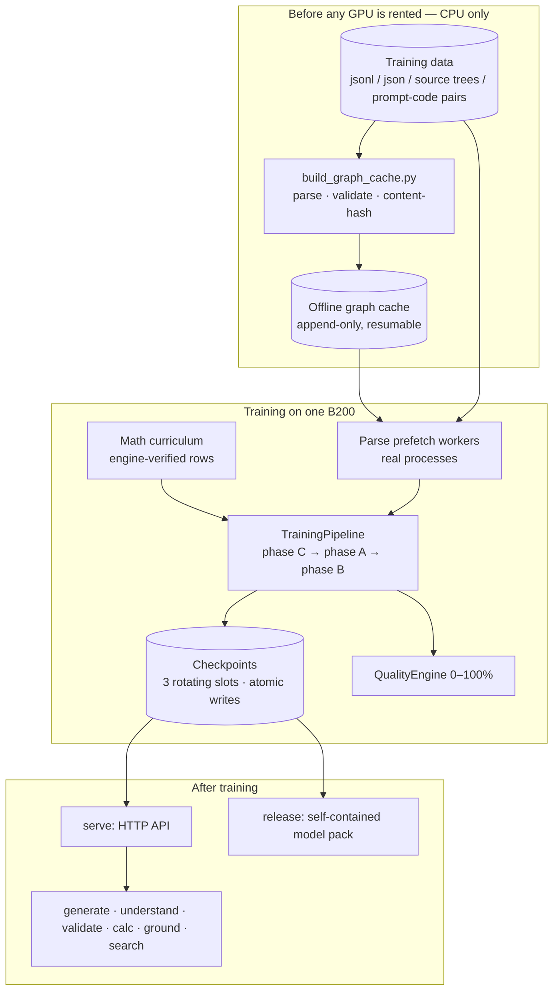
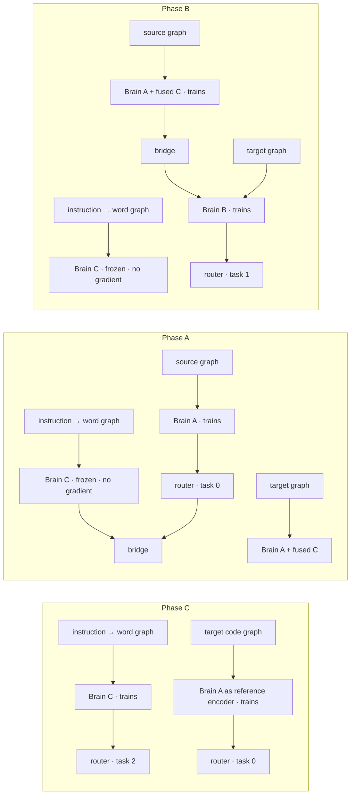
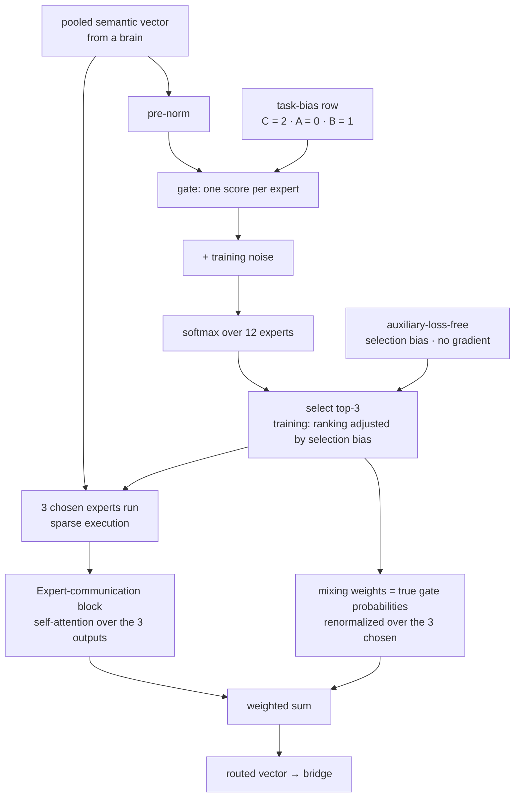
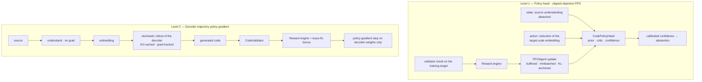

# CodeMind 2.0 — Architecture Overview (Detailed Edition)

**A self-hosted, graph-based system that understands and writes code in 68 languages and reads human language in any language. It is built from three specialized graph-transformer brains, a mixture-of-experts router, a two-level reinforcement-learning system, and a built-in deterministic math and physics core that is part of the learning architecture itself. Target scale: about 6.1 billion parameters, trained on a single NVIDIA B200 (180 GB), with model size set by the measured size of the training data.**

> **Confidentiality & IP Notice**
> Every mechanism in this document was checked against the real implementation (`CodeMind.py`, `codemind_brain_dual.py`, `build_graph_cache.py`, `search.py`, `linguistic_safety.py`; source marker v90). To protect the project's intellectual property, the document explains **what each part does, how the parts fit together and why they were built that way** — but it deliberately contains **no source excerpts, no loss or reward coefficients, no tuned thresholds or learning rates, no regular expressions, no training data and no model weights**. Architecture-scale figures (layer counts, widths, expert counts, context lengths) are included because they are needed to understand the design. The repository, not this document, is the source of truth.

---

## License & Repository

The real license and README live in the repository; they are linked rather than restated so they cannot drift out of sync:

- **Repository:** [FWKTechnologies/CodeMind-Code-Intelligence](https://github.com/FWKTechnologies/CodeMind-Code-Intelligence/tree/main)
- **License:** [LICENSE](https://github.com/FWKTechnologies/CodeMind-Code-Intelligence/tree/main/LICENSE)
- **README:** [README.md](https://github.com/FWKTechnologies/CodeMind-Code-Intelligence/tree/main/README.md)

---

## Table of Contents

**Part I — The whole system**
1. [Executive Summary](#1-executive-summary)
2. [The System at a Glance](#2-the-system-at-a-glance)
3. [What CodeMind Is — and Isn't](#3-what-codemind-is--and-isnt)
4. [Scale, Hardware, Memory and Data-Driven Sizing](#4-scale-hardware-memory-and-data-driven-sizing)

**Part II — Understanding: from text and code to representations**
5. [Input Side: Languages, Parsers, Language Graphs](#5-input-side-languages-parsers-language-graphs)
6. [The Graph Schema](#6-the-graph-schema)
7. [Encoding: Graph to Tensors](#7-encoding-graph-to-tensors)
8. [The HGT Layer and the HGT Brain](#8-the-hgt-layer-and-the-hgt-brain)
9. [The Three-Brain Chain (C → A → B)](#9-the-three-brain-chain-c--a--b)
10. [Mixture-of-Experts Routing (FlyPrompt)](#10-mixture-of-experts-routing-flyprompt)
11. [The Anti-Forget Bridge](#11-the-anti-forget-bridge)
12. [Graph Collapsing](#12-graph-collapsing)

**Part III — Generation, judgement and learning**
13. [Generation: Codec, Decoder, Long Context](#13-generation-codec-decoder-long-context)
14. [Validation and Quality Scoring](#14-validation-and-quality-scoring)
15. [Supervised Learning Objectives](#15-supervised-learning-objectives)
16. [Reinforcement Learning](#16-reinforcement-learning)

**Part IV — Built-in services**
17. [The Math and Physics Core](#17-the-math-and-physics-core)
18. [Linguistic Safety](#18-linguistic-safety)
19. [Web Search Subsystem](#19-web-search-subsystem)

**Part V — Running the system**
20. [Data Pipeline and the Offline Graph Cache](#20-data-pipeline-and-the-offline-graph-cache)
21. [Training Runtime: One Step End to End, Memory, Reliability](#21-training-runtime-one-step-end-to-end-memory-reliability)
22. [Serving, CLI, Packaging, Security](#22-serving-cli-packaging-security)

**Part VI — Reference**
23. [Engineering Notes: Real Bugs, Real Fixes](#23-engineering-notes-real-bugs-real-fixes)
24. [Key Parameters](#24-key-parameters)
25. [Realistic Scope & Open Questions](#25-realistic-scope--open-questions)
26. [Component Index](#26-component-index)

---

# Part I — The whole system

## 1. Executive Summary

CodeMind represents source code as a **typed, heterogeneous graph** — functions, calls, statements, variables, control flow, data flow, dependencies — rather than a flat token sequence, and reasons over that graph with **Heterogeneous Graph Transformer (HGT)** stacks. Human language is handled with the *same* machinery: a sentence becomes a graph of word nodes and is read by the same kind of stack. This single-schema idea runs through the whole design: *everything flows through one graph vocabulary, whether the input is code in any language or text in any language.*

**The core is a chain of three brains** — instances of one HGT class that differ only in depth:

- **Brain C** (17 layers) reads the human-language instruction.
- **Brain A** (8 layers) reads the code graph, informed by what Brain C understood.
- **Brain B** (7 layers) is the edit-oriented brain, informed by what Brain A understood.

They are joined by **one learned anti-forget bridge** and steered by **one mixture-of-experts router** (12 experts, 3 active per decision) that holds a separate routing bias for each brain. A causal transformer, the **CodeDecoder** (9 layers, rotary positions, up to 170,000-position context), turns the fused understanding into a sequence of *structural actions* from a closed vocabulary; a renderer turns them back into source text.

**Learning has three layers.**

1. **Supervised objectives** align instructions, code understanding and code targets, and teach the decoder by teacher forcing.
2. **A two-level reinforcement-learning system.** *Level 1* is a clipped-objective PPO head that learns calibrated confidence and value, so the model knows when to abstain. *Level 2* is a true trajectory-level policy gradient on the decoder, driven by a multi-layer automated validator, which teaches the decoder to produce code that actually validates — something cross-entropy cannot teach.
3. **A math and physics core that lives inside the architecture.** A deterministic engine (exact arithmetic, SI units with dimensional analysis, 45 physics formulas) feeds the model's representations (an adapter), supplies self-computed labels for a dedicated learning head, contributes a verified problem curriculum to the same training stream, scores generated claims in the RL reward, and corrects wrong arithmetic at generation time.

**Around the core** sit a policy-driven linguistic-safety module, a web-search subsystem engineered to never hang, leak or trust what it fetches, and a resumable offline graph-cache builder so paid GPU time is never spent on parsing.

**Scale and hardware.** The architecture arithmetic gives **about 6.08 billion parameters**, inside a 6.0–6.2 B budget, trained on **one NVIDIA B200 (180 GB)**. The model size is not a fixed constant: it is computed from the *measured* size of the training data (currently about 275–285 GB), and Brain C's depth — one layer is ≈168 M parameters — is the knob that moves it.

---

## 2. The System at a Glance

### 2.1 End-to-end lifecycle

```mermaid
flowchart TB
    subgraph PREP[Before any GPU is rented — CPU only]
      D[(Training data<br/>jsonl / json / source trees / prompt-code pairs)] --> BGC[build_graph_cache.py<br/>parse · validate · content-hash]
      BGC --> GC[(Offline graph cache<br/>append-only, resumable)]
    end
    subgraph TRAIN[Training on one B200]
      GC --> PF[Parse prefetch workers<br/>real processes]
      D --> PF
      MC[Math curriculum<br/>engine-verified rows] --> PIPE
      PF --> PIPE[TrainingPipeline<br/>phase C → phase A → phase B]
      PIPE --> CK[(Checkpoints<br/>3 rotating slots · atomic writes)]
      PIPE --> Q[QualityEngine 0–100%]
    end
    subgraph SERVE[After training]
      CK --> API[serve: HTTP API]
      CK --> REL[release: self-contained model pack]
      API --> GEN[generate · understand · validate · calc · ground · search]
    end
```

### 2.2 Runtime data flow for one request

```mermaid
flowchart LR
    T[Instruction text] --> NLD[NLDetector] --> LG[Language graph<br/>word nodes] --> BC[Brain C]
    S[Source code] --> P[Language-specific parser] --> CPG[Code graph<br/>AST·CFG·DFG·PDG·Call·SDG] --> COL[GraphCollapser<br/>≤ 12,288 nodes] --> BA[Brain A]
    BC --> R1[FlyPrompt router<br/>task 2] --> BR1[Anti-forget bridge]
    BR1 --> BA
    BA --> R2[FlyPrompt router<br/>task 0] --> BR2[Anti-forget bridge]
    BR2 --> BB[Brain B]
    BB --> R3[FlyPrompt router<br/>task 1]
    R3 --> MA[Math adapter<br/>only when numbers/units present]
    MA --> DEC[CodeDecoder + GraphActionCodec]
    DEC --> MG[Math guard<br/>fix wrong 'expr = value']
    MG --> REN[GraphRenderer → source text]
    REN --> V[CodeValidator] --> AB{valid and honest?}
    AB -- yes --> OUT[answer]
    AB -- no --> ABS[abstain / report]
```

### 2.3 The five source files

| File | Role |
|---|---|
| `CodeMind.py` | The core: deterministic math engine, language registry, parsers, graph schema, encoder, HGT layers and brains, decoder and action codec, validator, quality engine, PPO and reward engine, loss, data connector, training pipeline, model-sizing advisor, hardware detection, runtime config, HTTP API, CLI, release packaging |
| `codemind_brain_dual.py` | The multi-brain machinery: FlyPrompt router, experts and expert-communication block, anti-forget bridge, graph collapser, the orchestrator that runs phases C/A/B, dual-brain persistence, dataset-size measurement |
| `build_graph_cache.py` | Offline, CPU-only builder of parsed graphs and validator results |
| `search.py` | The web-search and page-retrieval subsystem (kept deliberately neutral) |
| `linguistic_safety.py` | The policy-driven linguistic-safety, PII and secret-detection module |

---

## 3. What CodeMind Is — and Isn't

| It is... | It is not... |
|---|---|
| A graph-based system: code becomes a typed heterogeneous graph; text becomes a word graph | A large language model with a flat token sequence as its primary computation unit |
| Three stacks of **one** HGT class (language, understand, edit) joined by a learned bridge | One shared stack doing everything, or three unrelated models |
| A system whose expert mixture operates on **one pooled vector per graph** | A token-level or node-level sparse MoE inside the transformer layers |
| Trained by supervised objectives **and** reinforcement learning against an automated validator | Trained purely by next-token prediction |
| A model where **RL shapes the decoder and the confidence head** while supervised losses shape the brains | A system where policy-gradient signal reaches every layer |
| A generator restricted to structurally valid actions from a closed vocabulary | A free-form sampler over an open text vocabulary |
| Language-agnostic after parsing: one schema and one set of weights for all 68 code languages and for human text | A family of per-language models |
| Numerically grounded: an exact engine is *inside* the learning loop and checks generated arithmetic | A model that guesses numbers and hopes |
| Honest about uncertainty: it can **abstain** instead of guessing | A system that always answers |
| Policy-driven for safety: *you* define categories, weights and actions | A system with moral judgments hard-coded in source or weights |

---

## 4. Scale, Hardware, Memory and Data-Driven Sizing

### 4.1 Target hardware

CodeMind 2 is built for **one NVIDIA B200 with 180 GB of HBM3e, non-SXM, single GPU**. The whole codebase is single-GPU: there is no NVLink, NCCL, DDP, FSDP or tensor-parallel path anywhere, so the card's form factor changes nothing logically. The only hardware facts the code uses are **VRAM size and compute capability**, both **measured at runtime** (`detect_hardware`, which reads them from the device and reports the compute capability — Blackwell reports 10.0 — instead of trusting a model name) and logged at start-up. A configurable fraction of the card is enforced as the per-process memory cap, leaving headroom for the CUDA context and allocator.

### 4.2 Parameter budget (target ≈ 6.1 B)

Computed analytically from the configuration by the same formulas the code uses (`estimate_model_params`); hidden width is 1,664 throughout. At start-up the code logs the **real** count (every module, with shared weights counted once) next to this estimate and prints the difference.

| Component | Structure | ≈ Parameters |
|---|---|---|
| Brain C | 17 HGT layers | 2.90 B |
| Brain A | 8 HGT layers | 1.39 B |
| Brain B | 7 HGT layers | 1.23 B |
| CodeDecoder | 9 layers, 16 heads, ≈8K closed vocabulary, 8 memory-prefix tokens | 0.33 B |
| FlyPrompt router | 12 experts + expert-communication block | 0.16 B |
| Anti-forget bridge | gated fusion module | 0.02 B |
| Encoder, fusion, policy head, small heads, math core | hashed token encoder, semantic fusion, PPO policy head, appropriateness / masked-word heads, math adapter + head | ≈ 0.06 B |
| **Total** | | **≈ 6.08 B** |

One HGT layer is ≈168 M parameters, almost all of it the **per-node-type** query/key/value/output matrices (15 node types × four 1,664 × 1,664 matrices); the per-relation attention tensors add only ≈1.3 M per layer. Depth is therefore the main size lever: **each layer costs ≈0.17 B**, and Brain C — the newest and least-proven brain — is the one adjusted first.

### 4.3 Memory: static budget and how it changes across phases

Weights, gradients and AdamW state cost **≈16 bytes per parameter**. At 6.08 B parameters that is **≈97 GB** of static memory on a 180 GB card, leaving ≈80 GB for everything that scales with input rather than with model size: decoder activations at very long context, HGT activations over graphs of up to 12,288 nodes, the MoE and PPO buffers, and allocator overhead. The decoder's attention uses a fused flash-style kernel, so its memory is **linear** in context length; compute remains quadratic, an accepted cost.

**Brain C is frozen the moment Phase C ends.** From then on it is used only as a feature extractor (its embedding is computed without gradient in Phases A and B), so keeping its gradient buffers and AdamW moments would be pure waste. At the end of Phase C the pipeline therefore stops requiring gradients on Brain C, **drops its gradient tensors and deletes its optimizer state**, and empties the allocator cache. That releases **12 bytes per parameter ≈ 35 GB** at Brain C's ≈2.9 B parameters, taking the static budget from ≈97 GB to **≈62 GB** for Phases A and B and leaving ≈118 GB for activations and long-context training. The optimizer's parameter list is deliberately left untouched, so the positions of saved momentum state still match across checkpoints and resumes; AdamW simply skips parameters without gradients. If a run is started again in the same process, Brain C is made trainable again for its Phase C.

A second protection — the **VRAM governor** — operates inside every phase and is described in Section 21.3.

### 4.4 Data-driven sizing — model size follows data size

Model size is not hand-set from an old dataset. Two functions tie it to the measured data:

- **`estimate_model_params(config)`** counts parameters analytically for every module, with no model or torch needed.
- **`advise_model_size(dataset_gb, config)`** compares that count with what the data can support and reports a verdict and a recommended Brain C depth.

The reasoning is a Chinchilla-style cross-check with three explicit, adjustable assumptions: source code averages **3.5 bytes per token**; the data counts as **2 effective passes**; and a compute-optimal model wants about **20 tokens per parameter**. (The pipeline actually reads the dataset three times — once per phase — so counting two passes is deliberately conservative.) CodeMind consumes graphs rather than raw token sequences, so the rule is an *anchor, not a law*.

| Unique training data | Effective tokens | Compute-optimal size (20 tokens/param) |
|---|---|---|
| 100 GB | 57 B | ≈ 2.9 B |
| 140 GB | 80 B | ≈ 4.0 B |
| 210 GB | 120 B | ≈ 6.0 B |
| 280 GB | 160 B | ≈ 8.0 B |

**For the current data (≈275–285 GB)** the rule supports roughly 7.9–8.1 B parameters. The configuration deliberately stays below that, inside a **6.0–6.2 B budget** set by the owner (and by VRAM headroom), which puts the 6.08 B model at **≈26 effective tokens per parameter** — comfortably in the "appropriate" band. The advisor's verdicts are: *too little data* below 10 tokens per parameter (undertrained risk), *appropriate* from 10 to 60, and *model smaller than the data supports* above 60. It recommends a Brain C depth within the budget — never exceeding the ceiling, and never going below four layers, where Brain C stops being a language model at all.

The advisor runs **every time data is connected** and logs its verdict. It **reports but never rebuilds**: changing depth after a model has been created or trained would make its checkpoints unloadable, so any resize is a deliberate, between-runs decision. If the dataset changes size, the guidance is simple: add or remove Brain C layers; the other brains stay as proven.

### 4.5 The training plan from real data

The data folder's real size is measured with a fast directory scan (an environment-supplied estimate is used only when nothing can be measured), and the sample count follows from it. Then:

- **Every brain phase reads the full connected dataset once.** With three phases (C, A, B) each sample is seen three times in a run; the data is *not* divided between phases.
- Total sample-exposures equal three times the connected sample count, and the learning-rate schedule is computed against that real total.
- If no data is connected yet, a placeholder size is used only for reporting; it never overrides a measured size.
- Data of any size works — tens of thousands of samples or a hundred million or more produce a correct plan; the plan neither clamps down to an old number nor inflates a small dataset.

---

# Part II — Understanding: from text and code to representations

## 5. Input Side: Languages, Parsers, Language Graphs

### 5.1 The language registry — 68 languages

`LanguageRegistry` resolves a language id, a file extension or a content sniff to a **language spec** and a **language family**; the family decides how strongly the polyglot linker ties two files together. The table is open-ended — adding a language means adding a spec, not writing a parser. The current source registers **68 languages**:

- **General purpose:** Python, JavaScript, TypeScript (with JSX/TSX), Java, Kotlin, Scala, C, C++, C#, Go, Rust, Swift, Objective-C, Dart, Zig, Ruby, PHP, Perl, Lua, R, Julia, Haskell, Elixir, Erlang, Clojure, F#, OCaml, Lisp, Racket, Nim, Crystal, Fortran, Ada, Pascal, VB, MATLAB, D, Groovy, Tcl
- **Data, query and schema:** SQL, GraphQL, Protobuf, JSON, YAML, TOML, XML, Markdown, LaTeX
- **Web and UI:** HTML, CSS, SCSS, Vue, Svelte
- **Infrastructure, build and shell:** Dockerfile, Makefile, CMake, Terraform, HCL, Bash, PowerShell, Batch, AWK
- **Systems and other:** Solidity, WebAssembly, Assembly, GDScript

Detection from raw text scores every language against a per-language evidence table combined with cheap structural signals, and falls back to Python only when there is no evidence at all.

### 5.2 Three graph builders

- **Python (understanding path):** a native walk over the standard-library `ast` module builds every layer — syntax, control flow, data flow, program dependence, calls and system dependence — with real semantic analysis (definition–use chains, control dependence) rather than textual proximity.
- **Languages with a registered grammar:** `TreeSitterASTBuilder`, backed by a real tree-sitter grammar.
- **Everything else:** `GenericASTBuilder`, a family-aware fallback that still produces the full layered schema, so a language with no grammar installed still yields a non-empty structural signal.

**Generation deliberately uses a different path.** The codec that encodes *target* code for the decoder always uses the generic builder — for every language including Python — so all languages are encoded at the same granularity (function, statement and call level) and one decoder can learn from all of them. Understanding (Brains A and B) keeps the richer builders. The two paths do different jobs and never interfere.

### 5.3 Polyglot projects

`PolyglotProject` and `PolyglotLinker` merge the graphs of several languages into **one** graph and add cross-language edges: API routes matched to HTTP clients, `fetch`/`require`/`import` links, shared configuration wiring and same-family hints. `MultiProjectConnector` makes this work on real repositories: it indexes files, groups them into RAM-budgeted batches, parses batch by batch, merges through the linker and collapses before the HGT sees the result, so projects of hundreds to thousands of files never need to be resident at once (small projects take a direct fast path).

### 5.4 Human-language graphs and language detection

Brain C has no tokenizer or vocabulary of its own. `build_language_graph` turns text in **any** human language into a graph of `word` nodes connected by `next` (sequence) and `near` (proximity) edges, and Brain C reads it with exactly the same encoder and HGT class as Brains A and B.

`NLDetector` identifies the human language and script of a text **without a fixed language list**: it returns a language code, a script and a confidence, and reports `und-<Script>` when the script is recognized but the language is not. It is safe to call from many threads and learns language profiles from the labels it sees in real data (bounded, so it cannot grow without limit). It is used to pick the right safety rules per message, to balance the training order across human languages where the data fits in RAM (under-represented languages are pulled forward; nothing is dropped), and by the `langs` command to inspect which human languages the training data actually contains.

---

## 6. The Graph Schema

**15 node types**

| Group | Node types | Meaning |
|---|---|---|
| Program layers | `ast`, `cfg`, `dfg`, `pdg`, `call`, `sdg` | Syntax, control-flow, data-flow, program-dependence, call-graph and system-dependence nodes |
| Code structure | `func`, `block`, `expr`, `stmt`, `token` | Functions, blocks, expressions, statements, lexical tokens |
| Polyglot markers | `lang`, `api`, `config` | Language hosts, API bindings, configuration wiring |
| Human language | `word` | A word in a natural-language graph (Brain C) |

**31 typed relations**, in families:

- **Structure:** syntax child and next-sibling; function *contains* syntax; token *belongs to* syntax.
- **Control flow:** flow and branch edges, including branch → body block.
- **Data and dependence:** data flow; control- and data-dependence.
- **Calls:** call *invokes* function; call *returns*; system-dependence inter-procedural edges and call-site wrapping.
- **Cross-layer mapping:** syntax → control-flow → dependence and data-flow → dependence `maps_to` links, so information can cross layers.
- **Polyglot:** cross-language function links; language *hosts* function/syntax; API *binds* call; configuration *wires* statement; language same-family / coexists; language *wires* configuration.
- **Containment refinements:** expression/statement contains a call; syntax wraps statement.
- **Language:** word `next` word; word `near` word.

Every relation has **its own learned attention weights** in the HGT (Section 8). Because the model learns a different transformation per relation, a *call* edge and a *data-flow* edge are attended to differently — the concrete mechanism behind "typed" reasoning.

---

## 7. Encoding: Graph to Tensors

**`TokenEfficientEncoder`** turns a node's text into a vector with no fitted vocabulary. Each token contributes a hashed-identity embedding and a bucket embedding; a projection combines them; **language** and **language-family** embeddings and a **node-type** embedding are then mixed in through small learned gates. Two order-aware additions sit on top: per-position embeddings and an **attention pooling** with a learnable query, blended in through a gate that starts almost closed, so the encoder begins near a plain average and learns how much word order matters. Because it is hash-based, it needs no fitting and works for every language — which is exactly why Brain C needs no tokenizer. Hash results are memoized, since code repeats a small set of tokens constantly, and whole batches of nodes are embedded in a single tensor operation.

**`GraphTensorizer`** converts a graph into per-type feature tensors and per-relation edge-index tensors. For training it can pack many graphs into one **block-diagonal batch** with per-graph index vectors, so pooling stays per graph; the single-graph inference path is unchanged.

**`SemanticFusion`** combines the token-efficient encoding with the HGT output.

---

## 8. The HGT Layer and the HGT Brain

### 8.1 `HGTLayer`

The layer implements type-specialized attention (Hu et al., WWW 2020):

- Every **node type** has its own query, key, value and output projections, so an `ast` node, a `call` node and a `word` node are transformed by parameters that belong to their type.
- Every **relation** — (source type, relation, destination type) — has its own learned tensor **per attention head**. Before a score is computed, a neighbor's key is transformed through that relation's tensor.
- Attention is normalized **per destination node** across all incoming edges; the attention-weighted messages are aggregated per destination, combined with a skip connection from the node's own input, passed through dropout and layer-normalized **per node type**.
- Key/value projections depend only on the *source* type, which is shared across relations, so each is computed **once per forward pass** and cached — a pure speed-up with identical numbers.
- The per-destination softmax is **fully vectorized** with scatter reductions.

### 8.2 `HGTBrain`

A brain is: a per-type input projection → a stack of HGT layers (with **gradient checkpointing** per layer during training) → **learnable weighted pooling** across node types → a semantic head. The pooling weights per node type start from a prior favoring functions, calls and data-flow over raw syntax and lexical tokens, but they are **trained parameters**, not constants.

Each brain carries task heads on its pooled vector: *understand*, *generate*, a *validity* scalar and a **multi-label issue head** over six categories (syntax, security, safety, undefined variable, unused import, other). The issue head is trained from what the validator actually found, so `understand()` can return a per-category self-check rather than one number.

All three brains share the same width (1,664) and head count (64, exactly 26 dimensions per head); they differ only in depth.

---

## 9. The Three-Brain Chain (C → A → B)

### 9.1 Roles

| Brain | Depth | Reads | Job | Routing task id |
|---|---|---|---|---|
| **C** | 17 layers | Human-language graph (the instruction) | Understand what is being asked, in any language | 2 |
| **A** | 8 layers | Code graph (the source) | Understand code structure, informed by C | 0 |
| **B** | 7 layers | Code graph (the target side of an edit) | Edit-oriented representation, informed by A | 1 |

Brain C is deepest because its job is broadest — every human language, not one code schema. Brain B is one layer shallower than A by intent, but close enough that the anti-forget machinery stays balanced.

### 9.2 What each training phase does

```mermaid
flowchart LR
    subgraph PC[Phase C]
      LG1[instruction → word graph] --> BC1[Brain C · trains]
      TG1[target code graph] --> BA1[Brain A as reference encoder · trains]
      BC1 --> R1[router · task 2]
      BA1 --> R0[router · task 0]
    end
    subgraph PA[Phase A]
      LG2[instruction → word graph] --> BC2[Brain C · frozen · no gradient]
      BC2 --> BRG[bridge]
      SG2[source graph] --> BA2[Brain A · trains]
      BA2 --> RA[router · task 0] --> BRG
      TG2[target graph] --> BA3[Brain A + fused C]
    end
    subgraph PB[Phase B]
      LG3[instruction → word graph] --> BC3[Brain C · frozen · no gradient]
      SG3[source graph] --> BA4[Brain A + fused C · trains]
      BA4 --> BRG2[bridge] --> BB4[Brain B · trains]
      TG3[target graph] --> BB4
      BB4 --> RB[router · task 1]
    end
```

- **Phase C.** The instruction becomes a word graph read by Brain C; its embedding passes through the router with task id 2. The code target is encoded by Brain A as the reference embedding. Two language-only objectives (Section 9.4) are active.
- **Phase A.** Brain C runs **without gradient** and, from this point on, is **frozen with its optimizer state released** (Section 4.3). Its embedding is fused with Brain A's routed output through the bridge. Both the source graph and the target graph go through Brain A.
- **Phase B.** Brain C again runs without gradient. Brain A (with Brain C's embedding fused) encodes the source; its embedding is fused into Brain B's routed output through the same bridge; Brain B encodes the target. The anti-forget penalty (Section 11) is active.

**Everything except Brain C after Phase C stays in one optimizer** with one warm-up-then-cosine learning-rate schedule computed over the whole run. A phase decides *which brain's data path is exercised*; Brain A keeps receiving gradient in Phases B as well, protected by the bridge's anchor and penalty. Each fusion uses the **actual embedding produced for that very sample** (detached from the upstream brain), while a separate slowly-moving **anchor** exists only for the forgetting penalty.

**Why sequential phases.** Training one stack for several jobs at once tends to let one skill erode another over a long run. Sequential emphasis, with an anchor recorded at each phase boundary, lets each brain specialize while staying connected.

**Every planned phase always runs.** Validation quality of one phase is not comparable with the next, because each phase exercises a different brain. A quality-target or patience stop reached at the end of a phase is therefore logged, the patience counter is reset, and the next phase still runs. (The single-epoch mode keeps the classic early stop.)

### 9.3 Train mode versus inference mode

Each brain forward — and the shared router — sets its mode from **whether gradients are enabled**:

- *Gradient enabled* (real training): training mode — dropout on, router noise on, expert and router statistics updating, gradient checkpointing used.
- *Gradient disabled* (inference, or a frozen Brain C feeding Phases A and B): evaluation mode — fully deterministic, no dropout, no router noise, and **no mutation of any persistent state**.

This matters because the experts' temporal averages are saved in checkpoints. Before this rule, every inference call silently forced training mode, which made inference non-deterministic and let inference data contaminate the very statistics training later resumes from. The router is one object shared by all brains, so it follows the same mode.

### 9.4 Replay and anchors

The orchestrator keeps two small replay buffers — language embeddings (Phase C) and code embeddings (Phases A and B), 256 entries each, oldest dropped first. When Phase C ends, the anchor is initialized from the most recent language embeddings; when Phase A ends, it is **blended** with the most recent code embeddings (Section 11 explains why blending, not overwriting).

### 9.5 Brain C's language-specific objectives

- **Masked-word feature objective (`LanguageMaskHead`).** Without it, Brain C would learn only the properties of a prompt that help predict a code embedding. A fraction of the words in each prompt are hidden behind a mask vector, and Brain C must recover the **input features** of the hidden words from context. It needs no per-language vocabulary, works for every language the encoder handles, and **reuses the same forward pass** as the main loss — no extra pass. Its weight is moderate, so code remains the primary goal.
- **`LossBalancer`.** The language term is kept at a target *share* of the total loss by adapting its weight to the measured loss sizes (smoothed, bounded, with a warm-up period). Balancing by loss magnitude stands in for balancing by gradient, at no extra backward cost.
- **`AppropriatenessHead`.** A very small classifier on Brain C's **detached** embedding predicting two independent axes: *severity* (how much care the content needs) and *casualness* (register). No gradient flows from it into any brain; its weights travel in the same model file as everything else, and a checkpoint without it simply starts the head from random values.

The language brain can be disabled, reducing the chain to two phases (A → B) — meant for starting a fresh, smaller model, not for resuming a three-brain checkpoint.

---

## 10. Mixture-of-Experts Routing (FlyPrompt)

### 10.1 What kind of MoE this is — and what it is not

The mixture-of-experts in CodeMind is a **representation mixer applied once per graph, after a brain has pooled its output**. It is *not* a sparse feed-forward layer inside the transformer stack, and it is not routing per node or per token. A brain produces one semantic vector for the whole graph; the FlyPrompt router chooses **3 of 12** experts for that vector; the chosen experts transform it; and the mixed result **replaces** the brain's semantic vector on its way to the bridge and decoder. **One router instance serves all three brains.**

Two consequences are worth stating plainly. First, the MoE is a *small* part of the model (≈0.16 B of ≈6.1 B parameters, ≈2.5%) — it adds specialized, task-conditioned transformations on top of the brains rather than being where the model's capacity lives. Second, only 3 experts run per call, and a call handles a single vector, so its compute cost is negligible next to the brains.

```mermaid
flowchart TB
    X[pooled semantic vector<br/>from a brain] --> N[pre-norm]
    N --> G[gate: one score per expert]
    TB[task-bias row<br/>C = 2 · A = 0 · B = 1] --> G
    G --> NS[+ training noise]
    NS --> SM[softmax over 12 experts]
    SM --> SEL[select top-3<br/>training: ranking adjusted by selection bias]
    RB[auxiliary-loss-free<br/>selection bias · no gradient] --> SEL
    SEL --> RW[mixing weights = true gate probabilities<br/>renormalized over the 3 chosen]
    X --> E[3 chosen experts run<br/>sparse execution]
    SEL --> E
    E --> COM[Expert-communication block<br/>self-attention over the 3 outputs]
    COM --> MIX[weighted sum]
    RW --> MIX
    MIX --> OUT[routed vector → bridge]
```

### 10.2 The routing algorithm, step by step

1. **Pool and normalize.** The input is averaged to one vector and layer-normalized so gate logits stay stable at this width.
2. **Score with task conditioning.** A linear gate scores the 12 experts and a **learned per-task bias row** is added. The bias table has **three rows** — one per brain — indexed by the real task id, so Brain C, Brain A and Brain B can learn *different* expert preferences. The table starts at zero, so all three begin identically and diverge only as training separates them. An out-of-range task id is clamped rather than raising an error. Scores and the softmax are computed in full precision.
3. **Explore.** In training, small Gaussian noise is added to the logits.
4. **Select.** The 3 highest-ranked experts are chosen. **In training the ranking uses the gate probabilities plus a small balancing bias** (Section 10.5); at evaluation it follows the gate alone.
5. **Mix.** The mixing weights come from the **true gate probabilities** of the chosen experts — the selection bias is *not* included, so it can never distort outputs — and are **renormalized to sum to one**, so the output scale does not shrink as experts are added.
6. **Execute sparsely, let them talk, combine.** Only the 3 chosen experts run. Their outputs pass through the expert-communication block and are combined with the mixing weights.

### 10.3 The experts

Each of the 12 experts is a pre-normalized two-layer feed-forward network with an inner width of twice the model width, an inner layer norm and a GELU (≈11 M parameters each). Each expert also carries a **temporal ensemble**: a slowly-moving exponential average of its own recent outputs, updated during training from the batch-mean output and blended back into its output with a small weight once available. The effect is to damp abrupt batch-to-batch swings and help the expert retain older patterns. The "is the average ready yet" check is computed on the device, so there is no hidden host–device synchronization on this hot path. The averages are checkpointed.

### 10.4 The expert-communication block

Without it, the selected experts process the same input in isolation and meet only at the final weighted sum. The communication block treats the 3 selected outputs as a **tiny sequence whose tokens are experts**: one pre-norm self-attention layer (8 heads) followed by a small feed-forward layer mixes information across them, each through a **gated residual whose gate starts almost closed** — not fully closed, so gradient reaches the block from the first step — and opens only if training finds the conversation useful. Early behaviour therefore stays close to a plain weighted sum. The block is a no-op when only one expert is selected, and runs in full precision for stability.

### 10.5 Four mechanisms against expert collapse

A router that sends everything to a few experts wastes the rest. Four cooperating mechanisms prevent it:

1. **Load-balance loss (Switch-Transformer form).** Built from *measured* expert load — a running average across many routing calls — multiplied by the gate's own probabilities, so the gradient pushes down probability on over-loaded experts. (A per-call "make every probability equal" penalty would fight sparse specialization; this form does not.)
2. **Router z-loss.** Penalizes large gate logits so the softmax cannot saturate — the classic cause of unstable routing and NaNs in long MoE runs.
3. **Importance loss.** *Load* counts how often an expert is chosen; *importance* measures how much total gate mass it receives. An expert chosen rarely but always with a large weight (or the reverse) is invisible to load alone. This term penalizes the spread of importance, using a running average blended with the current call so it carries gradient.
4. **Auxiliary-loss-free selection bias.** During training a small, bounded bias nudges *selection* — never the mixing weights — toward under-used experts. An expert that has fallen out of use is therefore not abandoned permanently, and no extra loss term pushes against the main objective. It receives no gradient.

### 10.6 Auxiliary-loss bookkeeping and gradient flow

One router serves three tasks and, in batch mode, is called once per graph. Every call that has gradient contributes its auxiliary loss to a list; the training step **averages all of them once per step** and adds the result to the total loss, so every task and every graph in the batch receives balancing gradient. (An earlier design kept only the last call and silently starved the others.) Calls made outside a training step — generation, validation — are discarded rather than leaking into the next step.

What receives gradient from the main objective: the gate, the task-bias table, the chosen experts and the communication block. What does not: the selection bias and the running statistics. The three running statistics (load, importance, selection bias) are runtime state and are **not checkpointed** — they rebuild within a short stretch of training after a resume — while the experts' temporal averages **are** saved.

### 10.7 Diagnostics

Every routing call reports routing entropy, the maximum expert load (near one-twelfth means balanced; near 1.0 means collapse), the balance and z-loss values, and which experts were chosen. These flow into the training log so collapse is visible early. A healthy run shows maximum load staying near the balanced value and the three tasks choosing visibly different expert sets over time.

### 10.8 Execution details

The router runs eagerly by design: expert selection depends on tensor values, which would force compiler graph breaks on every call. The bridge — pure matrix arithmetic — is compiled instead; if compilation fails on first real use, it permanently falls back to eager execution without failing the run. In batch mode the brains run batched while the router is called once per graph in a loop (pooling per graph has already happened inside the brain), so per-graph results equal what single-graph routing would produce.

---

## 11. The Anti-Forget Bridge

One `AntiForgetBridge` joins **both** hand-offs — C → A and A → B — and does three jobs:

1. **Gated fusion.** Upstream and downstream vectors are each projected; a learned sigmoid gate decides, per sample, how much of the result leans on the upstream brain versus a joint projection of both; a final layer norm keeps scales comparable when the two sides differ.
2. **An EWC-lite penalty.** A diagonal, Fisher-style approximation of Elastic Weight Consolidation penalizes the upstream embedding for drifting away from a stored anchor, weighted per dimension by how much each dimension mattered — without a full Fisher pass. In the pipeline it is applied in **Phase B**, scaled down and capped relative to the main loss so it can regularize but never dominate.
3. **A bridge reward.** The cosine similarity between the upstream embedding and the fused output, mapped to [0, 1] and smoothed. High values mean upstream knowledge survived fusion; very low values mean drift. It feeds the PPO reward through the feedback-learning path (Section 16.6).

**Anchor maintenance — online-EWC style.** At the end of Phase C and again at the end of Phase A, the anchor and per-dimension importance are updated from the recent replay embeddings. They are **blended with exponential decay** (mostly history, partly the latest) rather than overwritten, so after several phases and rounds the anchor still carries traces of earlier learning instead of protecting only the most recent stretch. The very first update initializes directly.

---

## 12. Graph Collapsing

`GraphCollapser` shrinks a graph toward the node budget before the HGT sees it. The budget in training and serving is the configured **`max_nodes` = 12,288**; graphs already under it are returned untouched. Stages:

1. **Exact-duplicate merge** by node type and label, in linear time, except for a protected set of structurally load-bearing types.
2. **Edge remap and de-duplication** after the merge.
3. **Linear-chain bypass:** a low-importance node with exactly one predecessor and one successor is bypassed (A → B → C becomes A → C) unless it is an *anchor* type (function, call, data-flow, system-dependence) or carries an entry-point-like name (main, init, handler, router, …). Dangling edges left by the bypass are cleaned up.
4. **Importance trimming**, only if still over budget, using degree, type and keyword weights. Entry, call and data-flow structure is never cut.

`CollapseStats` records nodes and edges before and after, duplicates merged and chains collapsed, so the step is inspectable. The budget is a trade-off: a larger budget loses less structure at roughly *linear* extra memory (unlike the decoder's context, which costs quadratic compute).

---

# Part III — Generation, judgement and learning

## 13. Generation: Codec, Decoder, Long Context

### 13.1 The action codec

`GraphActionCodec` is the single codec for the whole system. It walks a target graph's *generatable* nodes in a defined order and emits a sequence of **structural actions** from a **closed vocabulary** of about 8,000 entries (line-level labels for functions, statements and calls plus structural markers). The vocabulary is fitted once from your own corpus (`fit_generator_tokenizer`) and saved as `gen_codec.json`, a required companion to the weights. `GraphRenderer` turns an action sequence back into formatted source text per language family.

The trade-off is stated plainly: because no language is special-cased on this path, there is no guarantee-by-construction of syntax validity such as a language's own unparser would give. One decoder learning from all 68 languages, disciplined by the validator and the RL loop, is the intended alternative.

### 13.2 The decoder

`CodeDecoder` is a decoder-only transformer — 9 layers, 16 heads, width matching the brains — in which every step depends on what has actually been generated. The fused brain embedding is injected as **eight memory-prefix tokens** that every position can attend to, so generation is conditioned on the graph itself, not on metadata appended to a prompt. The output embedding and output projection share weights.

- **Positions:** rotary position embeddings (RoPE). If inference meets a length beyond what was trained, a minimal automatic scaling is applied instead of failing — graceful degradation, not a recommended mode.
- **Long context:** a **170,000-position ceiling** and a **140,000-position training length**, reached through a **length curriculum** — training starts near 4,096 positions and rises over the first quarter of the run, so the most expensive lengths are not forced when they help least. A small fraction of samples are assembled as deliberately long contexts, and positional-offset augmentation exposes the model to varied absolute positions.
- **Structural ceiling vs. service limit.** The position ceiling belongs to the weights. Any operator-facing output limit lives in a separate runtime config (Section 22.3) and defaults to unlimited; natural stopping comes from the model's end signal and a repeat-cycle guard.
- **Incremental decoding.** Generation reuses cached keys and values. If the context reaches the ceiling, the window slides and the cache is rebuilt with slack, so the rebuild happens once every several steps instead of every step.

### 13.3 Decoding behaviour

The production decoder is **deterministic greedy** with an anti-cycle guard that blocks repeating patterns. A temperature divides the logits before the argmax, which cannot change which action wins — repeated calls return the same answer, right for one final answer but making naive best-of-N produce N identical candidates. CodeMind therefore provides:

- **`generate_rl`** — a genuinely stochastic, gradient-tracking sampler used by reinforcement learning (Section 16.2).
- **`generate_best_of`** — draws diverse candidates and **re-ranks them with the validator**, for callers who want to spend more compute on one final answer.
- **Abstention** — if validation says the output is unsafe to ship (a cheating pattern, hollow code that does not run, demonstrably wrong behaviour, too many errors), `generate()` **abstains** unless the caller passes `force`.
- **Math guard** — before validation, wrong arithmetic claims in the output are corrected by the deterministic engine (Section 17.6).

### 13.4 Large code

`LargeCodeHandler` edits or generates code from 10,000 to 500,000+ lines by chunking at function and class boundaries (never mid-function), processing chunk by chunk, carrying a **semantic context embedding** from one chunk to the next in addition to textual tail context, and stitching outputs back with indentation preserved. It streams, so the whole file is never resident at once.

---

## 14. Validation and Quality Scoring

`CodeValidator` layers independent checks, combined so a single failure cannot be hidden by strength elsewhere:

1. **`StaticAnalyzer`** — language-aware syntax, undefined names and unused imports where a real parser exists, plus a **safety** check for dangerous constructs (careful but non-blocking, so learning is not stopped).
2. **`IntegrityChecker`** — catches *cheating*: hollow stubs, prompt echoes, prose mixed with code.
3. **`CodePurityChecker`** — how much of the output is actually code versus noise.
4. **Optional execution** — for Python, in an isolated subprocess, skipped automatically when a dangerous pattern was found. When a reference is supplied, a behaviour comparison checks that the code is *behaviourally right*, not merely that it ran.
5. **Structural similarity** — with a reference graph, a data-flow / control-flow similarity check works **without execution**, for any language.
6. **Project validation** — `validate_project` scores a polyglot project file by file against each file's own language rules.

The result (`ValidationResult`) carries validity, a score in [-1, 1], issues, feedback, execution status, integrity, safety, purity, a cheating flag, abstain advice and — when evidence exists — a logic score and behaviour match.

**`QualityEngine`** turns this into a 0–100 **model quality** score along six dimensions — syntax, static checks, graph coverage, semantic similarity, execution and *mastery* (how well the model already knows this kind of code). It is deliberately multi-dimensional: a low loss with hollow outputs should not look like quality. `run_quality_audit` and `verify_ai_spec` self-check the loss/quality pipeline and confirm the system matches its intended specification, before or after training.

---

## 15. Supervised Learning Objectives

`CodeMindLoss` combines six objectives:

- **Contrastive alignment** between source and target embeddings. Because training processes one (source, target) pair per step, the similarity matrix would be 1×1 and its softmax trivially one; a small **bank of recent target embeddings** supplies genuine negatives at almost no cost.
- **Semantic** objective on the fused understanding.
- **Validity** prediction against the validator.
- **Graph-structure** objective.
- **Policy** term, reporting the PPO head's loss (a logging term — see Section 16.3).
- **Issue-type** multi-label objective trained from real validator findings.

Phase-specific and auxiliary terms are added on top:

| Term | Where it applies |
|---|---|
| Anti-forget penalty (capped) | Phase B |
| Router balancing loss, averaged over all calls in the step | all phases |
| Masked-word loss (balanced by `LossBalancer`) and appropriateness loss | Phase C |
| **Math head loss** (Section 17.4) | any batch that contains rows with engine-computed labels |

The **decoder is trained inline** with the main step, from the source embedding already computed, using teacher-forced cross-entropy — no second forward pass and no separate decoder stage. Its cross-entropy gradient flows back into the brains through the fused embedding, which is how generation quality shapes understanding. Gradient accumulation gives an effective batch of roughly a thousand samples per optimizer update.

---

## 16. Reinforcement Learning

### 16.1 Two levels, two jobs — and what RL does and does not train

CodeMind's RL is deliberately split, because one mechanism cannot do both jobs well:

```mermaid
flowchart TB
    subgraph L1[Level 1 — Policy head · clipped-objective PPO]
      S1[state: source understanding<br/>detached] --> PH[CodePolicyHead<br/>actor · critic · confidence]
      A1[action: reduction of the<br/>target-code embedding] --> PH
      VR1[validator result on the training target] --> RE[Reward engine]
      RE --> PPO1[PPOAgent update<br/>buffered · minibatched · KL-anchored]
      PPO1 --> PH
      PH --> CONF[calibrated confidence → abstention]
    end
    subgraph L2[Level 2 — Decoder trajectory policy gradient]
      SRC[source] --> U[understand · no grad]
      U --> EMB[embedding]
      EMB --> RO[stochastic rollout of the decoder<br/>KV-cached · grad-tracked]
      RO --> CODE[generated code]
      CODE --> VAL[CodeValidator] --> RE2[Reward engine + issue-fix bonus]
      RE2 --> PG[policy-gradient step on decoder weights only]
    end
```

| | Level 1 — policy head | Level 2 — decoder RL |
|---|---|---|
| Nature | Single-step (contextual bandit) on the pooled understanding | Sequential decisions: each generated action is one step of a genuine MDP |
| What it trains | The small `CodePolicyHead` (actor, critic, confidence) | The **decoder's own weights** |
| Reward source | Validator result on the **training target**, through the reward engine | Validator result on the **model's own generation**, through the same engine |
| Main purpose | **Calibrated confidence** — knowing when to abstain | **Behaviour shaping** — producing code that validates, which cross-entropy cannot teach |
| Cadence | Buffered; updates when its replay buffer is full | Every few training steps (six by default; one environment variable) |
| Reaches the brains? | No — states are detached | No — `understand()` runs without gradient |

**An important and honest consequence:** neither RL level sends gradient into the three brains. The brains are shaped by the supervised objectives (including the decoder's cross-entropy, which does flow back through the fused embedding); RL shapes the **decoder** and the **confidence head**. That is a design choice — the brains' representations stay anchored by supervised signal while RL tunes behaviour where a non-differentiable outcome actually matters.

### 16.2 Level 2 — decoder trajectory RL

Teacher-forced cross-entropy teaches the decoder to imitate the next action of a target. It can never teach "the code I generated on my own actually works", because that signal is a non-differentiable outcome at the end of a whole generation. Policy gradient exists for exactly that.

Every few steps the training loop performs one **rollout**:

1. `understand()` embeds the source in inference mode — so this step trains the **decoder only**.
2. The decoder **samples** a full action sequence stochastically, with the anti-cycle guard applied as a probability mask rather than hard removal. The rollout is capped in length to bound cost and uses the same **grad-enabled KV-cache** as inference — linear, not quadratic, in length, and inference and training share one compute path.
3. If the structure breaks (the rollout hit its cap before a proper end), the sample still yields a **negative reward** — a bad rollout teaches as much as a good one, so it is not discarded.
4. Otherwise the generated code goes through the full `CodeValidator`. With the execution-test flag on, the code is compared against the training target's **real behaviour** and **data-flow/control-flow structure**, so `sorted(x)` and `sorted(x, reverse=True)` no longer earn the same reward merely because both run.
5. The reward engine scores it, with the model treated as *committing* to its answer (full confidence), so the calibration term penalizes confident wrongness. An **issue-fix bonus** is added in proportion to how many of the source's statically detected issues the generated code no longer has — tying *detection* and *repair* to one signal.
6. The advantage is the reward minus a **running baseline** — a single smoothed scalar, so there is no extra value network and no extra parameters. The update is the **sum of the trajectory's log-probabilities times the advantage**, with gradient clipping, through the decoder's own optimizer and scheduler.

Because each rollout is used for exactly one on-policy update, the importance ratio is exactly one and a clipped surrogate would add nothing; Level 2 is therefore a baseline-subtracted policy gradient rather than clipped PPO. The whole step is wrapped so any failure is logged once and never interrupts the main training step, and a rolling trend (average, worst, best reward over a window) is logged so improvement is visible despite the high variance of single rollouts.

### 16.3 Level 1 — the policy head and its PPO machinery

The head takes the pooled understanding of the source as its **state** (after the math adapter, Section 17.3, so it can see quantities) and, as its **action**, a deterministic reduction of the encoder's embedding of the target code onto a 1,024-way discrete space. It has three outputs: an **actor** (action log-probabilities), a **critic** (value) and a **confidence head** trained to match reality rather than to be optimistic. Because each sample is a complete one-step episode, generalized advantage estimation collapses to *reward minus value*. Since the action is a reduction of the target rather than a free choice, Level 1 should be read as **a calibrated value-and-confidence learner with real PPO mechanics**, not as a generative policy — behaviour shaping belongs to Level 2. Its loss is reported into the main loss as a constant for logging; the head is trained by its own optimizer.

The PPO machinery, in full, without coefficients:

- **Buffered updates.** Experiences accumulate until the buffer is full enough; single-sample updates are too noisy. A final flush handles the tail at the end of a pass.
- **Reward normalization.** Rewards are standardized with a running (Welford-style, group-merged) mean and variance that persists across updates, then clipped to a bounded range.
- **Advantages** are computed with GAE and standardized within the batch.
- **Minibatched epochs** with a fresh shuffle each epoch — a **clipped surrogate objective** for the policy, a **clipped value loss** for the critic, and an **entropy bonus** annealed from its starting value down to a small **non-zero floor**, so the policy never collapses into brittle determinism.
- **KL anchoring.** A frozen **reference copy** of the policy is kept; a KL penalty toward it is added, and **its coefficient adapts automatically** — raised when the policy drifts beyond a target, lowered when it is held too tightly.
- **Early stopping** of the update epochs when the policy moves too far from the behaviour policy within one update.
- **Stability:** gradient clipping, automatic skipping of any non-finite step, a learning-rate warm-up followed by cosine decay with restarts, and mixed-precision execution through the shared precision manager.
- **Diagnostics** with every update: loss components, approximate KL to the old and the reference policy, clip fraction, explained variance of the critic, the current KL and entropy coefficients, learning rate and the latest reward breakdown.

**Confidence and abstention.** The confidence head is what makes *"not confident, so don't answer instead of cheating"* an actual mechanism. Abstention is governed by both the confidence head and the validator's own advice (Section 13.3).

### 16.4 The reward engine

`CuriosityPPOReward` assembles the reward from separate, visible dimensions, each of which appears in the logs:

| Dimension | What it rewards or penalizes |
|---|---|
| **Correctness** | The validator's score, mapped to [0, 1]; the largest primary term |
| **Curiosity** | Novelty of the input, scaled by integrity so novelty of garbage earns nothing |
| **Calibration** | Confidence should match reality: over-confidence is penalized in proportion to the gap; appropriate humility is rewarded |
| **Honesty** | Abstaining when invalid is rewarded; cheating is penalized heavily; valid, non-abstained output earns a little |
| **Integrity** | Real code, no hollow stubs, no prose; an additional penalty when cheating is detected |
| **Safety** | How safe the code is |
| **Logic** | Real behavioural or structural evidence of correctness — zero when no reference exists |
| **Bridge retention** | Upstream knowledge surviving fusion (small bonus or penalty, only at the extremes) |
| **Linguistic safety** | *Auxiliary.* A small penalty proportional to the severity of the text's content |
| **Conversational register** | *Auxiliary.* A very small bonus for natural, casual register |
| **Math correctness** | *Auxiliary.* Arithmetic claims "expression = value" in the output are recomputed by the engine; correct claims earn a little, wrong ones cost a little |

The total is **clamped to a bounded range** so no single term can run away. **Primary terms dominate by design; the three auxiliary terms are deliberately small.** A separate **trust score** (0–100, `TrustTracker`) moves with outcomes — confident errors and cheating cost a lot, valid high-integrity output earns, calibrated abstention earns a little.

**Which terms are live where.** In Level 1 the reward is computed on the *training target* and the input text, so the math term is inactive there (there is no model output to check) and the linguistic terms look at the instruction. In Level 2 and in feedback learning the reward is computed on the model's **own generated code**, so every term — including math verification — is live. The model's arithmetic is therefore rewarded exactly where it produces arithmetic.

### 16.5 Keeping the reward honest

A learned reward is an invitation to be gamed, so three safeguards are built in:

- **`RewardWeightAdapter`** tunes *only* the three auxiliary terms (curiosity, math, linguistic/register), each within a hard range, smoothly, every few hundred samples, from **real measurements that do not pass through the reward itself**: the validator pass rate, the measured rate of wrong arithmetic claims, and the measured severity rate of text. It never touches correctness, honesty, integrity, safety, logic or the cheating penalty.
- **Hack detector.** If the average reward climbs while the *real* validator pass rate does not move, the adapter pulls every multiplier back toward neutral and raises a `hack_suspect` flag that appears in the PPO metrics.
- **Why the weights are not learned by gradient.** Letting the policy learn its own reward weights would teach it to find shortcuts to high reward; fixed primaries plus measured, bounded auxiliaries close that door.

Curiosity is backed by `CuriosityMemory`, a hashed memory of patterns already seen (bounded, persisted on disk); an input is only marked "seen" when its integrity was acceptable.

### 16.6 Mastery, skipping, and where the bridge reward enters

`ExperienceBank` remembers how well each kind of code is already mastered. A bounded, least-recently-used hot cache in RAM sits in front of a persistent on-disk store, so memory stays flat over very long runs. Training can **skip re-learning mastered code** and **prioritize low-mastery samples**.

The **bridge reward** reaches the PPO reward through the feedback-learning path (`train_from_feedback`: validate → curiosity reward → calibration → trust update → PPO). In the main training step the bridge term is left neutral; the bridge's effect there comes through the fusion itself and the anti-forget penalty.

---

# Part IV — Built-in services

## 17. The Math and Physics Core

Language models do arithmetic unreliably, and a model that sees numbers only as text cannot learn what a quantity *is*. CodeMind therefore carries a deterministic engine that needs no model and no torch — and, new in 2.0, wires it into **four layers of the learning system** so it is part of the architecture, not a tool beside it.

### 17.1 The engine

- **Exact arithmetic:** integers and fractions stay exact (`1/3 + 1/6 = 1/2`, `2**100` is the exact big integer); only genuinely irrational results become floating point. Division by zero, enormous powers and unknown functions are rejected, not approximated.
- **Units and dimensions:** every value is stored in SI with a 7-component dimension vector (metre, kilogram, second, ampere, kelvin, mole, candela). **69 units** (length, mass, time, energy, power, pressure, frequency, electrical, volume, angle and more) and **28 physical and mathematical constants** (c, h, ħ, e, k_B, N_A, G, g, ε₀, μ₀, particle masses, solar and terrestrial constants, and so on). Mismatched dimensions are *errors*: `1 m + 1 s` is rejected, as is `sin` of a length or a dimensioned exponent. Results can be converted (`to="MeV"`, `"km/h"`).
- **Safe evaluation:** a restricted expression language with no imports, no attribute access and no calls beyond a whitelist of mathematical functions.
- **45 physics formulas** across mechanics, fluids and thermodynamics, electricity, waves/optics/quantum, relativity and more (kinetic and potential energy, orbital and escape velocity, pendulum and spring periods, ideal gas, Stefan–Boltzmann, Ohm and Coulomb, photon energy, de Broglie, Bohr levels, Lorentz factor, Schwarzschild radius, RC time constant, and others). **Every formula carries an automatic dimensional self-check** that runs in the self-test, and the numbers were checked against hand calculation before inclusion.
- **Numerical tools:** exact rational linear-system solving (Gauss–Jordan with pivoting on fractions), Brent root finding (requires a bracketing sign change), adaptive Gauss–Kronrod integration, higher-order derivatives with Richardson extrapolation, and an adaptive Dormand–Prince Runge–Kutta integrator for simple physical simulation.
- **Claim verification:** `verify_text` scans "expression = value" statements in text, recomputes them and returns a verdict. A self-test of dozens of cases (including the rejections above) runs from the command line.

### 17.2 `MathPhysicsService` — one object, four roles

All uses go through one thread-safe service object: it serves as a **tool** (`calc`, `formula`), as a **feature and label generator** for the learning loop, as a **curriculum source**, and as a **checker and corrector**. It scans each text for two things — *claims* ("12 × 12 = 144") and *quantities* ("2 kg", "3 m/s") — and is protected against pathological input: texts are length-capped, over-long lines are skipped, each scan has a time budget and returns what it has when the budget runs out, and results are cached by content hash in a bounded least-recently-used map.

### 17.3 Layer 1 — Feature: the model *sees* quantities

For any text, the service produces a **16-dimensional, bounded feature vector**: whether the text contains math at all; how many claims it makes and what fraction of them are right or wrong; how many unit-bearing quantities it contains; the average sign and magnitude (order of magnitude) of the values; the **average SI dimension vector** of the quantities (so the model can tell energy from velocity); and the fraction of exact (rational) results. Plain code and ordinary prose produce an all-zero vector.

`MathPhysicsAdapter` — a small learned module that is part of the model — turns the features into an additive correction to the instruction's semantic embedding **before** that embedding reaches the loss, the decoder and the PPO head. It is built to be harmless by construction: its last layer starts at **zero**, and its output is multiplied by the "has math" feature, so text without numbers or units gets **exactly zero** change regardless of what the weights learn. The computation is skipped entirely for such text, and the same function runs at training and at inference, so the two always agree.

### 17.4 Layer 2 — Label: the model learns from engine-computed answers

`MathPhysicsHead` is a small head trained with **labels the engine computes itself**, not labels it reads from data:

- the **SI dimension of the answer** (seven exponents) predicted from the problem's embedding — "this asks for a speed" vs. "this asks for an energy";
- the **order of magnitude of the answer** predicted from the problem's embedding;
- **claim correctness** — whether the arithmetic claims in a target are all right — predicted from the target's embedding.

A label that is absent simply does not enter the loss, so ordinary samples are not disturbed, while curriculum rows carry all three. The loss is a small fixed-weight term in the **same total loss** as everything else. This is what teaches the *relationship between a problem and the kind of answer it needs*, rather than letting the model memorize answer code.

### 17.5 Layer 3 — Data: a verified curriculum in the same stream

The service generates problems from **eight templates** whose answers the engine computes and verifies — kinetic energy, escape velocity, pendulum period, Ohm's law, quadratic equations, linear systems, the Lorentz factor and photon energy — in both English and Thai, each row carrying the answer's dimension and magnitude. A **configurable fraction** of the training stream (a small, untuned default) is replaced by curriculum rows, drawn into the *same* loop as real data, not a separate phase. Generation is deterministic and reseeded from the number of steps already trained, so a resumed run does not replay the same problems from the start. The same generator powers the `mathgen` command.

### 17.6 Layer 4 — Reward and guard: verification and correction

- **Reward:** `verify_text` feeds the auxiliary math term of the RL reward (Section 16.4), live wherever the model produces its own output.
- **Math guard:** at generation time, before validation, the service **corrects** any "expression = value" whose value is wrong, replacing it with the engine's result. It is deliberately conservative: it edits only plain `=` statements whose left side is dimensionless arithmetic; it never touches `==` comparisons, `≈` approximations, or any line containing `assert` (a deliberately-wrong negative test must stay wrong); and it skips non-integer fractions rather than guess a decimal format. Every correction is logged.

### 17.7 Grounding: `ground()` and `/ground`

For any question — from CodeMind or from an external model — `ground()` decides what to *do* about numbers and facts: **pure arithmetic or physics → the engine** (exact, instant, free, never touches the web); **external facts → `search.py`** (which stays neutral and unchanged); or **nothing to ground**. It also scans the question itself for wrong "expression = value" statements and reports them as computed, not guessed. The result is a ready-to-insert context block in one format for any model. Web use can be switched off by the caller, in which case only the engine's part is answered.

### 17.8 Footprint and persistence

The adapter and head together are under a million parameters. They sit in **the same optimizer** (appended last, so saved momentum positions stay compatible), **the same checkpoint file** (a checkpoint without them loads with a warning and starts them from their initial values — which, for the zero-initialized adapter, means no change in behaviour), and the same parameter count. The engine itself is also exposed as the `/calc` endpoint and the `calc`, `mathgen` and `mathtest` commands, and works without loading any model.

---

## 18. Linguistic Safety

The module's founding principle: **there is no fixed, built-in definition of "right" and "wrong" in the source.** Category names, weights, thresholds and actions (block, flag, ignore) come from **your own policy file**; the wordlists shipped in the source are only mild examples. The code provides the *mechanism*, not the judgment.

### 18.1 Policy model

A policy holds named categories, each with a weight, an action and an optional per-category block threshold; a default block threshold; whether "natural deflection" replies are enabled; which categories count as casual register; and whether a sarcasm marker may lift a block (off by default). A report returns the hits, severity (0–1), a blocked flag, the reasons, a register label, a neutral deflection sentence (available in 16 languages and never quoting the flagged content), any evasion signals and masked PII/secret hits.

### 18.2 Matching — engineered against concrete failures

- **Word-boundary matching** for space-delimited scripts, so short risky strings do not match inside innocent words or code identifiers, with combining marks of Indic, Thai and Arabic scripts counted as part of the word. **Substring matching plus an editable "safe words" list** for scripts written without spaces (Thai, Chinese, Japanese, Lao, Khmer, Burmese), so ordinary words that merely contain a risky fragment are not blocked.
- **A multi-pattern (Aho–Corasick) matcher** compiled per language and cached by wordlist version, so cost does not grow with wordlist size on every message. Wordlist infrastructure covers **44 languages**.
- **Targeted obfuscation handling:** digit-for-letter substitution is undone only inside tokens that mix letters and digits (so version numbers and laughter such as "555" are not mangled); repeated-letter stretching; separator tricks; invisible characters (zero-width, bidirectional controls, tag characters); look-alike Cyrillic/Greek letters inside Latin words; stacked combining marks used as noise — all without damaging scripts where combining marks carry meaning.
- **Sarcasm markers** lower the *severity score* used by the reward but **cannot unblock** a message unless the policy explicitly allows it, so appending "just kidding" cannot launder content.
- **A threshold of zero means "block immediately"**, not "unset".
- **Multi-language analysis:** code-switched text is checked against its primary and secondary languages; unknown languages are checked against every available wordlist; codes such as `zh-CN` and `th_TH` are accepted.

### 18.3 PII and secrets

**23 detector kinds**, including cloud, API and token formats (AWS, GitHub, Slack, Stripe, Google, npm, OpenAI-style keys, JWTs, bearer tokens, private-key headers), connection strings with embedded passwords, e-mail, phone, IP, IBAN, card, Thai national ID, US SSN, passports, and proprietary-license markers (for catching code that should not be reproduced), plus a high-entropy string check. Detection uses **real validation**: Luhn for cards, the Thai national-ID check digit and IBAN mod-97 replace naive digit counting, so timestamps and order numbers are not reported as card numbers. **Reports store only masked values**, so a secret is never copied into a log.

### 18.4 Performance and robustness

PII is scanned **once** per message and shared between redaction and reporting; repeated reward-side analysis of the same text is memoized; redaction is linear-time; e-mail and connection-string patterns are length-bounded so adversarial inputs cannot cause quadratic slowdowns. Over-long messages are analysed at both head and tail — where content is usually hidden — and flagged `scan_clipped`, so the caller can choose to reject abnormal lengths.

### 18.5 Where it is used

Inside CodeMind this module contributes **small auxiliary reward terms** (severity and register), supplies training data for the appropriateness head, and — when a policy file is configured — screens incoming API requests before they are processed. It never decides whether code is valid; that is the validator's job.

---

## 19. Web Search Subsystem

`search.py` provides search and page retrieval with one priority above all: **never hang, never stall the server, never leak, never trust.** It is intentionally **neutral**: the math core's `ground()` decides *whether* to call it, but its own behaviour does not change for CodeMind.

### 19.1 Reliability

- One shared worker pool and a **per-request overall deadline**; when time runs out the system returns what it has, and it returns immediately once the primary backend answers, waiting only briefly for the others.
- HTTP calls have a true **total-time ceiling**, not just a per-read timeout, so a server dripping bytes cannot stall a worker.
- **Circuit breakers** per backend in half-open mode (one probe at a time, exponential rest period with a cap); rate-limit and authentication responses are handled at once without retry storms.
- **Single-flight** for identical concurrent queries (one backend call) and a **cap on concurrent searches** instead of an unbounded queue.
- A **cache with stale-if-error** (a down backend is answered from cache entries up to a day old rather than with nothing), debounced disk writes from a separate thread, and thread-local status.

### 19.2 Search quality

- **Backends.** Keyless: Wikipedia (language chosen from the query's script), StackExchange and GitHub (programming queries only), arXiv and PubMed (research and health queries). Optional keyed: Brave, SearXNG (self-hosted), Google Custom Search, SerpAPI — each with safe-search forced on. Without a keyed backend, general web search is limited to the keyless sources.
- A curated **catalog of 589 official and reputable domains** worldwide in **21 categories** — governments (national, international, Thai), central banks and statistics offices, science agencies, standards bodies, security advisories, health and legal sources, open data, AI-vendor and developer documentation, academic research, programming Q&A, and general reference and news. An **official-only** mode queries them in grouped `site:` batches, selected round-robin across categories and ordered by trust, rather than one query per domain.
- **Freshness** filters (day, week, month, year), automatic detection of "latest"/"today"-style queries, and a recency boost.
- **Result fusion** by Reciprocal Rank Fusion, then ranking by trust, recency and a **relevance score weighted by term rarity within the result set** (rare query terms count more than generic ones). **Per-registrable-domain caps** (correct for multi-part suffixes such as `.co.uk` and `.go.th`) and **de-duplication of identical titles** from mirrors keep the top results diverse.
- **Deep search:** expands the query into variants (heuristic, no model call), fuses results, fetches the top pages, extracts the **most query-relevant passage** (scored by term coverage and saturating frequency, weighted by term specificity, starting at a clean boundary) and assembles one numbered context. The character budget per page is **rank-weighted** — rank 1 receives the most — which keeps prompts compact.
- **One context format for any model:** results render the same way whether the consumer is CodeMind or an external model.

### 19.3 Security

- **SSRF protection:** only public addresses are allowed; private, loopback, link-local, carrier-grade NAT, multicast, unique-local and IPv4-mapped or embedded-IPv4 forms are refused, and unusual numeric encodings (decimal, hex, octal, short forms) are normalized before checking. Connections are **pinned to the validated address**, so a hostname cannot resolve to something different between the check and the connection.
- **robots.txt is respected** for general page fetches (cached, with the conservative interpretation: unreachable or forbidden means not allowed). A polite, identifiable user agent is sent.
- **Hard blocks** for dangerous or illegal domains and paths, and soft screening of snippets; tracking parameters are stripped from URLs.
- **Queries are guarded:** a query containing a secret or credential is **not sent** to an external engine.
- **Fetched text is untrusted data.** It is scanned for prompt-injection phrasing in many languages (21 pattern families), offending lines can be neutralized, secrets are masked, and content is wrapped in an explicit untrusted-content envelope whose closing tag cannot be forged in any capitalization or spacing.
- Limits are configurable through environment variables (deadline, concurrency, pool size, keyless toggle).

Inside CodeMind it is exposed as `web_search` and `deep_web_search`, the `/search` and `/search/health` endpoints, the `/ground` routing described in Section 17.7, and the `search` test command.

---

# Part V — Running the system

## 20. Data Pipeline and the Offline Graph Cache

### 20.1 Data connection

`DataConnector` attaches to the data folder and **streams** training data without loading it all: line-delimited JSON, JSON, folders of source files, and paired prompt/code data. Large files are read through a windowed shuffle buffer that caps RAM use. It keeps an SSD **shard cache** with a size cap and least-recently-used pruning, so the cache cannot grow without bound over long runs. When the data fits in RAM (up to a few hundred thousand samples), training order is weighted so under-represented human languages are pulled forward — no sample is dropped, only the order changes; in streaming mode the shuffle window plays that role. A held-out validation slice is excluded from training.

### 20.2 The training plan from real data

As described in Section 4.5, the plan follows the **measured** size of the connected data: every brain phase reads the full dataset once, and total sample-exposures are the dataset count times the number of phases. Connecting data also triggers the model-size advisor of Section 4.4.

### 20.3 Parallel, cached parsing

Parsing is deterministic CPU work. `_ParsePrefetcher` parses upcoming samples ahead of the GPU on **real separate processes** (threads would still be serialized by Python's interpreter lock), sized from the machine's actual CPU count. `_GraphCache` stores parsed graphs and validator results keyed by a **content-derived sample id plus the execution-test flag**, so every pass after the first reuses the work. It stores plain JSON — never pickle — because nothing in a graph is a tensor.

### 20.4 Offline pre-building (`build_graph_cache.py`)

Because parsing needs no GPU, the script does it once, on ordinary CPU hardware, **before any GPU is rented**. It imports the *same* parser, worker function, validator and connector from the core module — no graph-building logic is duplicated, so a pre-built graph is byte-identical to one training would compute itself. Its properties:

- **Resumable and append-only:** finished keys are skipped on restart, including when new training data is added later.
- **Crash-tolerant:** results are flushed and synced periodically; corrupt or half-written trailing lines are detected and truncated on resume; a last record lacking its terminating newline is repaired so the next record cannot fuse with it.
- **No duplicates:** repeated sample ids within one input are suppressed rather than written twice.
- **Key-compatible:** the execution-test flag must match training's setting exactly, or the keys will not match and the bundle will not be used.

---

## 21. Training Runtime: One Step End to End, Memory, Reliability

### 21.1 One training sample, end to end

In the order the pipeline performs it (batched mode does the same work over a mini-batch, per item after one batched forward):

1. **Stream.** The next real sample arrives; with the configured probability a math-curriculum row is inserted ahead of it (Section 17.5).
2. **Parse and collapse.** The source and target are parsed (or fetched from the graph cache) and collapsed to the node budget.
3. **Encode and forward.** According to the phase: Phase C builds the word graph and runs Brain C (with the masked-word objective) plus Brain A on the target; Phase A runs Brain C frozen, then Brain A on source and target with C fused; Phase B runs Brain C frozen, Brain A on the source, Brain B on the target with A fused. Each pass goes through the router with its task id.
4. **Math adapter.** The instruction's semantic embedding receives the quantity-feature correction (zero for text without numbers).
5. **Validate and label.** The validator scores the target; its findings become issue labels; a quality report and a source–target similarity are computed.
6. **Decoder step.** The decoder is trained inline by teacher-forced cross-entropy on the target actions.
7. **Policy head step.** State, action and reward are stored; the PPO head updates when its buffer is full.
8. **Loss assembly.** The six supervised terms, plus the phase-specific terms (anti-forget in B, masked-word and appropriateness in C), the step-averaged router balancing loss, and the math-head loss when labels exist.
9. **Backward and update.** Gradients accumulate over the configured number of micro-steps; at the boundary the optimizer applies a clipped update, skipping any non-finite step.
10. **Every few steps:** one **decoder RL rollout** (Section 16.2); periodically a checkpoint, a validation/quality pass, and a VRAM-governor check.

### 21.2 Optimizer and schedule

Every trainable module — the three brains (Brain C only while it is trainable), encoder, fusion, bridge, router, the small heads, and the math adapter and head — sits in a **single AdamW optimizer** with warm-up followed by cosine decay, **computed against the real total step count across all phases**. Biases, normalization parameters and embeddings are excluded from weight decay. Optimizer momentum is restored on resume and the schedule resumes from where it stopped rather than replaying warm-up.

### 21.3 Memory and VRAM management

- **BF16 autocast** with TF32 enabled; a precision manager can downgrade under memory pressure but is locked during training. (FP8 was removed after analysis showed it never changed what was stored or computed.)
- **Gradient checkpointing** in the brains and decoder.
- **Brain C release** after Phase C (Section 4.3) — ≈35 GB back for activations.
- **VRAM governor.** A proactive controller reads the real peak memory of the previous mini-batch against the allowed cap and **shrinks the micro-batch before an out-of-memory error happens**, growing it back slowly after a sustained calm period. Graph sizes vary widely, so peaks jump from batch to batch; reducing in advance is cheaper than losing a half-computed step to an OOM. It is a no-op on CPU, and it complements — rather than replaces — the OOM-recovery path that halves the batch on failure.
- **`torch.compile`** on the bridge with a **runtime fallback**: compilation is lazy, so a failure on first real use permanently switches to eager mode for the session instead of failing every step.
- **CUDA allocator tuning** (expandable segments, with split-size and garbage-collection thresholds as a fallback where expandable segments are unavailable), because apparent VRAM growth in long runs was fragmentation, not a Python leak.
- **Per-layer NaN/Inf guards** (enabled by default) and non-finite-step skipping in PPO.
- **Bounded RAM:** hot caches (mastery, curiosity, math scans) are bounded least-recently-used maps backed by disk where relevant; the spill cache uses `safetensors` and JSON only and has a size cap.
- **Preflight memory report:** before training, the system prints the static weights-plus-optimizer figure, the saving from freezing Brain C, an estimate of decoder activation at the training context length, and the remaining headroom — flagging real out-of-memory risk and naming the first thing to reduce (the decoder's training length, not its ceiling).

### 21.4 Checkpoints and recovery

- **One `.safetensors` file for the whole model** — all three brains, bridge, router, encoder, fusion, decoder, policy head, the appropriateness and masked-word heads, and the math adapter and head — plus a JSON metadata file. A component missing from an older checkpoint starts from its initial values with a warning instead of making the whole file unusable. Loaders try **`weights_only`** mode first and fall back, with a warning, only for legacy files.
- **Three rotating slots**, saved at a fixed step interval; writes go to a temporary file and are **atomically renamed with retry and back-off**. The slot counter is re-derived from disk on start so rotation survives restarts.
- **Graceful shutdown:** `SIGTERM`/`SIGINT` set a flag checked at a safe point, triggering an orderly save instead of losing up to one interval on every restart.
- **Preflight** checks the configuration against any checkpoint it is meant to resume (a changed width would otherwise fail at load and silently restart from step zero) and that there is enough disk to save.
- **All planned phases complete** in dual-brain mode (Section 9.2).

---

## 22. Serving, CLI, Packaging, Security

### 22.1 Command line

| Command | Purpose |
|---|---|
| `train` | Connect data and train |
| `serve` | Start the HTTP API for IDE/web integration |
| `project` | Recursively read and understand a whole directory |
| `status` | Model, data, sizing and checkpoint status |
| `cache` | View or clear the SSD shard cache |
| `release` | Export a distributable release pack |
| `demo` | Auto-detect + polyglot + train demonstration |
| `calc`, `mathgen`, `mathtest` | Math engine (no model load) |
| `langs` | Inspect human languages present in data |
| `graphcheck` | Validate code and language graphs on real data; confirm tree-sitter availability |
| `search` | Test the search system |

Running with no subcommand prints help and concrete examples.

### 22.2 HTTP API

| Endpoint | Purpose |
|---|---|
| `GET /health`, `GET /status` | Liveness and full system status (including the math core's counters and the model-sizing verdict) |
| `GET /docs` | Machine-readable API description, generated from the same single endpoint table used for documentation, so they cannot disagree |
| `POST /generate` | Generate code (abstains unless forced; math guard applies) |
| `POST /understand` | Deep understanding of code |
| `POST /validate` | Run the validator |
| `POST /calc` | Deterministic math and physics |
| `POST /ground` | Route a question to the engine, to web search, or to neither, and return a ready-to-use context |
| `POST /search`, `GET /search/health` | Web search and its health |

The server uses **one thread per request**. Inputs are type-checked (the prompt or query must be a non-empty string; temperature must be a number in a sane range), request bodies and inputs are size-capped, requests pass the linguistic-safety screen when a policy is configured, and an **API key** may be required (compared in constant time). Starting a server that accepts outside connections with no API key prints a prominent warning.

### 22.3 Service-side ceilings

`RuntimeConfig`, read from a separate JSON file at start-up, holds **serving** limits — maximum output, lines, input size, generation deadline, request-body size and the API key. **Every limit defaults to unlimited.** This is deliberate: acceptable length is a property of *the operator's service*, not of the model, so nothing about it is baked into the weights. A missing or malformed file means "no limits", never a crash.

### 22.4 Release pack

`export_release` writes a self-contained folder: the weights (optionally down-cast to bf16 for roughly half the size) and their metadata; the **action codec** (required at inference); a **sanitized config** with machine-specific paths removed; **README / MODEL_CARD / API** documents generated from the real model at export time (never hand-written and stale, and including the real parameter count and per-component breakdown, math core included); and a **manifest of SHA-256 hashes** for integrity. **No source files are included** — the pack is a model, not a codebase. `from_pretrained` loads it in one line. `export_brain_pack` produces structured context for external tools such as IDEs.

### 22.5 Security posture

- No pickle in caches or checkpoints; `safetensors` plus JSON; `weights_only` loading.
- Constant-time API-key comparison; size-capped bodies; validated inputs; a warning for open-network binds.
- Code execution (validator) is isolated and skipped for dangerous patterns; see Section 25 for the operational requirement.
- Web content is untrusted data; secrets are never sent out in queries or copied into logs; SSRF is closed with address pinning.
- Regular-expression hot paths were audited against adversarial long inputs, and the math scanner is time-boxed.

---

# Part VI — Reference

## 23. Engineering Notes: Real Bugs, Real Fixes

These come from the source's own dated change markers and from the hardening passes — not generic lessons.

**Model and training**

- **Dead contrastive term.** One-pair-per-step training made the largest alignment term exactly zero; a detached bank of recent targets supplied real negatives.
- **Router ignored its task id.** One shared bias served every brain; it is now a per-brain table, which also made adding experts meaningful.
- **Load-balance formulation.** A per-call "equalize all probabilities" penalty worked against sparse specialization; it was replaced by the measured-load form plus z-loss, importance loss and selection bias. Auxiliary losses from **every** router call in a step are now averaged (formerly only the last call received gradient).
- **Bridge anchor amnesia.** Anchors were overwritten each phase; they are now blended with exponential decay.
- **Inference silently ran in training mode (v90).** Every brain forward forced train mode, so inference used dropout and router noise and wrote inference data into the persistent expert averages. Mode now follows whether gradients are enabled.
- **Collapser dangling edges.** After a chain bypass, edges could still point at deleted nodes; this appears only on large graphs, so it had been silent.
- **Edge-softmax fast path never ran.** A guard matched only 1-D scores while the real caller always passed 2-D — every call silently used the slow loop. Throughput, not numbers, was affected.
- **Eight undeclared relations.** Created by the builders for the file's whole life but missing from the schema, so they had no attention weights of their own.
- **Untrained long-context positions.** Led to a separate train length versus ceiling, position-offset augmentation and the move to rotary positions.
- **Wasted decode compute.** The cache was rebuilt every step once the ceiling was hit; it is now amortized across many steps.
- **Parameter count under-reported (v90).** The start-up log omitted Brain C, the policy head and the small heads and double-counted shared weights; it now counts every module once and prints the analytic estimate beside it.
- **Optimizer state wasted on a frozen brain (v90).** Brain C's gradients and AdamW moments stayed allocated through Phases A and B; they are now released (≈35 GB).
- **Dual-brain mode stopped all remaining phases** when one phase met a quality target; every phase now completes.
- **`max_tokens` accepted but unused** — now wired through. **Inference built autograd graphs** — fixed with inference mode. **Hidden host–device synchronizations** and **unbounded RAM dictionaries** — removed.

**Reliability and operations**

- **Graceful shutdown**, **CUDA allocator fragmentation**, **compiled-bridge runtime fallback**, **empty CLI invocation** — each fixed.
- **Pickle in caches and checkpoints** replaced by safetensors and JSON; legacy loading guarded.
- **Generation ceiling coupled to serving limits** — separated (Sections 13.2 and 22.3).
- **Checkpoint rotation reset on restart** — the slot counter is now rebuilt from disk.
- **Optimizer momentum lost on resume** — now restored.
- **Out-of-memory handled only after the fact** — a proactive VRAM governor now shrinks the micro-batch first.

**Hardening pass**

- **Quadratic-time regular expressions** in prompt-injection scanning, e-mail and connection-string detection, and graph-building patterns were bounded; verified with adversarial-input timing. The math scanner avoids the engine's own quadratic claim pattern by scanning one short line at a time under a time budget.
- **Scan-window evasion** in linguistic safety closed (head-and-tail scanning, `scan_clipped` flag).
- **Untrusted-content envelope** made un-forgeable across capitalization and spacing.
- **Offline cache:** torn-write repair and duplicate suppression.
- **API:** input validation, open-bind warning, `weights_only` loading, atomic head saves.
- **Search:** rarity-weighted relevance, mirror-title de-duplication, rank-weighted page budgets, better passage selection.

---

## 24. Key Parameters

*(Architecture scale only. Training hyperparameters, loss weights, learning rates and reward coefficients are intentionally not published.)*

| Parameter | Value |
|---|---|
| **Target total parameters** | **≈ 6.1 B** (analytic estimate 6.08 B; budget 6.0–6.2 B; authoritative count logged at start-up and in the model card) |
| **Target hardware** | **One NVIDIA B200, 180 GB HBM3e (non-SXM), single GPU** |
| Static training memory | ≈ 16 bytes per parameter (≈ 97 GB at 6.08 B); ≈ 62 GB after Brain C is frozen |
| Hidden width | 1,664 (brains, decoder, router, bridge) |
| Attention heads | 64 in brains (26 dims each); 16 in decoder |
| Brain depths | C = 17, A = 8, B = 7 HGT layers (≈ 168 M parameters per layer) |
| Node / relation types | 15 / 31 |
| Registered code languages | 68 |
| Routing | 12 experts, top-3; 3 task-bias rows (C = 2, A = 0, B = 1); one router, one bridge; experts ≈ 11 M parameters each |
| Expert communication | one self-attention layer (8 heads) over the 3 selected experts, gated residual |
| Decoder | 9 layers, closed vocabulary ≈ 8,000, 8 memory-prefix tokens, rotary positions |
| Decoder context | 170,000 positions ceiling; 140,000 training length; curriculum from ≈ 4,096 over the first quarter of the run |
| Graph budget | 12,288 nodes after collapse |
| Replay buffers | 256 entries each (language, code); anchors from the latest 32 |
| PPO | policy head with 1,024-way action space; buffer of 32; decoder RL every few steps (six by default) |
| Math core | 69 units, 28 constants, 45 formulas, 8 curriculum templates, 16-dimensional feature vector, < 1 M learned parameters |
| Search catalog | 589 trusted domains in 21 categories |
| Safety | wordlist infrastructure for 44 languages; deflection in 16; 23 PII/secret detector kinds |
| Checkpoints | 3 rotating slots, fixed-interval saves, atomic writes |
| Precision | BF16 autocast, TF32 |
| Training plan | each of the 3 phases reads the full connected dataset once |
| Current data | ≈ 275–285 GB; ≈ 26 effective tokens per parameter at 6.08 B (sizing assumptions: 3.5 bytes/token, 2 effective passes, 20 tokens/parameter target) |

---

## 25. Realistic Scope & Open Questions

- **A solo, actively evolving system.** The dated change markers in the source show a system that has been run, broken and fixed repeatedly. That is real evidence of engineering care, but a different kind of evidence from an external benchmark.
- **The 6.1 B configuration has not been validated end to end.** The parameter count is an analytic estimate until measured on the real model (the start-up log compares the two). Brain C's contribution to code quality, the expert-communication block, the new router losses and the math core each need ablations on real runs.
- **Model size follows data size — and the rule is an anchor.** At 275–285 GB the 20-tokens-per-parameter rule supports about 8 B; the 6.1 B model sits below that by design (owner budget and VRAM headroom). The rule was designed for token sequences; CodeMind trains on graphs, so treat the ratio as a planning cross-check, not a guarantee.
- **RL does not reach the brains.** Level 1 trains the confidence head on detached states; Level 2 trains the decoder only. If it turns out that policy-gradient signal should also refine understanding, that would be a deliberate architectural change, not something the current system does.
- **Level 1 is a confidence learner, not a generative policy.** Its action is a reduction of the target embedding, so it learns calibration and value; the high-variance behaviour shaping comes from Level 2, whose single-rollout variance is why trends are logged over windows.
- **The math curriculum's mixing fraction and head weight are untuned defaults.** They are chosen so the head receives labels without crowding out real data; their effect should be read from the math head's loss in the logs and adjusted.
- **Internal validator scores are a strong in-distribution proxy**, because several independent checks combine so one failure cannot be hidden. How that transfers to unfamiliar codebases is a separate question only external benchmarking can settle.
- **Reward hacking is a bounded, real risk** in any RL-from-a-learned-validator loop. Fixed primary terms, small bounded auxiliary terms, real-measurement-driven adaptation and the hack detector reduce — but do not remove — the incentive to game the validator.
- **Execution-based validation needs genuine sandboxing** as an operational requirement whenever it is enabled. Running untrusted candidate code always does.
- **Long-context cost is real.** A 140,000-position training length is feasible through linear-memory attention, but compute still grows quadratically; the curriculum mitigates this, it does not remove it.
- **Generated code has no built-in syntax guarantee.** Validity comes from the validator, the RL loop and abstention, not from a per-language unparser. The math guard corrects arithmetic only, not logic.
- **Safety is policy-driven by design.** The module does exactly what the supplied policy says — and nothing if the policy is empty. Choosing the policy is the operator's responsibility.
- **Search depends on configuration.** Without a keyed backend, general web search is limited to the keyless sources.

The honest summary: the mechanisms described here are real, were checked against the implementation, and interoperate as described. That is a stronger claim than "the architecture sounds plausible", but it is not the same claim as "independently benchmarked", which remains open.

---

## 26. Component Index

| Concept | Main components | File |
|---|---|---|
| Language table and detection | `LanguageRegistry`, `LanguageSpec` | CodeMind.py |
| Parsers | `MultiLanguageParser`, `CPGBuilder` (Python `ast` path), `TreeSitterASTBuilder`, `GenericASTBuilder` | CodeMind.py |
| Polyglot | `PolyglotProject`, `PolyglotLinker`, `MultiProjectConnector` | CodeMind.py |
| Human-language graphs | `build_language_graph`, `NLDetector` | CodeMind.py |
| Encoding | `TokenEfficientEncoder`, `GraphTensorizer`, `SemanticFusion` | CodeMind.py |
| HGT | `HGTLayer`, `HGTBrain` | CodeMind.py |
| Three-brain orchestration | `DualBrainOrchestrator`, `DualBrainState` | codemind_brain_dual.py |
| MoE routing | `FlyPromptRouter`, `TemporalEnsembleExpert`, `ExpertCommsBlock` | codemind_brain_dual.py |
| Bridge | `AntiForgetBridge` | codemind_brain_dual.py |
| Graph collapsing | `GraphCollapser`, `CollapseStats` | codemind_brain_dual.py |
| Generation | `GraphActionCodec`, `CodeDecoder`, `GraphRenderer`, `LargeCodeHandler` | CodeMind.py |
| Validation | `CodeValidator`, `StaticAnalyzer`, `IntegrityChecker`, `CodePurityChecker`, `QualityEngine` | CodeMind.py |
| Supervised losses | `CodeMindLoss`, `LanguageMaskHead`, `LossBalancer`, `AppropriatenessHead` | CodeMind.py |
| RL — policy head | `CodePolicyHead`, `PPOAgent` | CodeMind.py |
| RL — decoder | `generate_rl`, `_decoder_rl_step`, `RunningBaseline` | CodeMind.py |
| RL — reward | `CuriosityPPOReward`, `PPORewardBreakdown`, `RewardWeightAdapter`, `CuriosityMemory`, `TrustTracker`, `ExperienceBank` | CodeMind.py |
| Math engine | `evaluate`, `calc`, `Quantity`, `FORMULAS`, `solve_linear_exact`, `find_root`, `integrate`, `derivative`, `ode_rk45`, `verify_text`, `generate_samples` | CodeMind.py |
| Math in the learning system | `MathPhysicsService`, `MathPhysicsAdapter`, `MathPhysicsHead`, `ground()` | CodeMind.py |
| Model sizing and hardware | `estimate_model_params`, `advise_model_size`, `detect_hardware`, `_set_brain_c_trainable`, `_vram_governor` | CodeMind.py |
| Data | `DataConnector`, `compute_training_plan`, `_ParsePrefetcher`, `_GraphCache` | CodeMind.py |
| Offline cache | `build_graph_cache.py` | build_graph_cache.py |
| Training | `TrainingPipeline`, `TrainConfig`, `PrecisionManager`, `SSDCache` | CodeMind.py |
| Serving and packaging | `RuntimeConfig`, `ApiEndpoint`, `export_release`, `from_pretrained` | CodeMind.py |
| Safety | `LinguisticSafety`, `SafetyPolicy`, PII and secret scanners | linguistic_safety.py |
| Search | `SearchSystem`, backends, trust catalog, `SafeHTTP`, `deep_search` | search.py |
